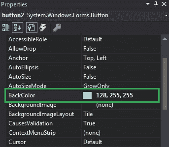
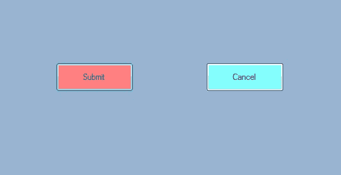
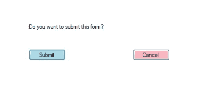

# 如何在 C# 中设置按钮的背景色？

> 原文:[https://www . geeksforgeeks . org/如何设置 c-sharp 中按钮的背景颜色/](https://www.geeksforgeeks.org/how-to-set-the-background-color-of-the-button-in-c-sharp/)

按钮是应用程序、软件或网页的重要组成部分。它允许用户与应用程序或软件交互。在 Windows 窗体中，允许借助 **BackColor 属性**设置按钮的背景色。这个属性由 Button 类提供，帮助程序员在表单中创建更多好看的按钮。您可以在两种不同的方法中使用此属性:

**1。设计时:**设置按钮背景色是最简单的方法。使用以下步骤，您将设置按钮的背景颜色:

*   **第一步:**创建如下图所示的窗口表单:
    **Visual Studio->File->New->Project->windows formpp**
    
*   **步骤 2:** 从工具箱中拖动按钮控件，并将其放到窗口窗体上。您可以根据需要将按钮控件放置在窗口窗体的任何位置。
    T3】
*   **Step 3:** After drag and drop you will go to the properties of the Button control to set the BackColor property of the Button.
    

    **输出:**
    

**2。运行时:**比上面的方法稍微复杂一点。在此方法中，您可以借助给定的语法以编程方式设置按钮的 BackColor 属性:

```cs
public override System.Drawing.Color BackColor { get; set; }
```

这里，颜色表示按钮的背景颜色。以下步骤用于设置按钮的背景色属性:

*   **步骤 1:** 使用 button 类提供的 Button()构造函数创建按钮。

    ```cs
    // Creating Button using Button class
    Button MyButton = new Button();

    ```

*   **步骤 2:** 创建按钮后，设置按钮类提供的按钮的 BackColor 属性。

    ```cs
    // Set the BackColor property of the button
    Mybutton.BackColor = Color.LightBlue;

    ```

*   **Step 3:** And last add this button control to from using Add() method.

    ```cs
    // Add this Button to form
    this.Controls.Add(Mybutton);

    ```

    **示例:**

    ```cs
    using System;
    using System.Collections.Generic;
    using System.ComponentModel;
    using System.Data;
    using System.Drawing;
    using System.Linq;
    using System.Text;
    using System.Threading.Tasks;
    using System.Windows.Forms;

    namespace WindowsFormsApp8 {

    public partial class Form1 : Form {

        public Form1()
        {
            InitializeComponent();
        }

        private void Form1_Load(object sender, EventArgs e)
        {

            // Creating and setting the properties of label
            Label l = new Label();
            l.AutoSize = true;
            l.Text = "Do you want to submit this form?";
            l.Location = new Point(222, 145);

            // Adding this label to form
            this.Controls.Add(l);

            // Creating and setting the properties of Button
            Button Mybutton = new Button();
            Mybutton.Location = new Point(225, 198);
            Mybutton.Text = "Submit";
            Mybutton.AutoSize = true;
            Mybutton.BackColor = Color.LightBlue;

            // Adding this button to form
            this.Controls.Add(Mybutton);

            // Creating and setting the properties of Button
            Button Mybutton1 = new Button();
            Mybutton1.Location = new Point(438, 198);
            Mybutton1.Text = "Cancel";
            Mybutton1.AutoSize = true;
            Mybutton1.BackColor = Color.LightPink;

            // Adding this button to form
            this.Controls.Add(Mybutton1);
        }
    }
    }
    ```

    **输出:**
    