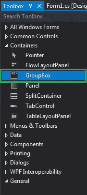
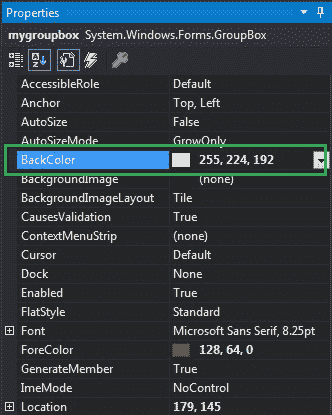
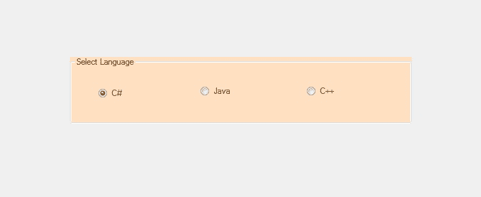
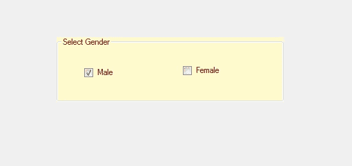

# 如何在 C#中设置 GroupBox 的背景色？

> 原文:[https://www . geeksforgeeks . org/如何设置 c-sharp 中 groupbox 的背景颜色/](https://www.geeksforgeeks.org/how-to-set-the-background-color-of-the-groupbox-in-c-sharp/)

在 Windows 窗体中，GroupBox 是一个容器，其中包含多个控件，并且这些控件相互关联。或者换句话说，GroupBox 是一组控件周围的框架显示，带有合适的可选标题。或者使用一个组框对一个组中的相关控件进行分类。在组框中，可以使用**背景色属性**设置表单中组框的背景色。此属性是环境属性。您可以通过两种不同的方式设置此属性:

**1。设计时:**设置 GroupBox 背景色最简单的方法，如下图步骤所示:

*   **第一步:**创建如下图所示的窗口表单:
    **Visual Studio->File->New->Project->windows formpp**
    
*   **Step 2:** Next, drag and drop the GroupBox from the toolbox to the form as shown in the below image:

    

*   **Step 3:** After drag and drop you will go to the properties of the GroupBox and set the background color of the GroupBox as shown in the below image:

    

    **输出:**

    

**2。运行时:**比上面的方法稍微复杂一点。在此方法中，您可以在给定语法的帮助下以编程方式设置 GroupBox 的背景色:

```cs
public virtual System.Drawing.Color BackColor { get; set; }
```

这里，颜色表示组框的背景颜色。以下步骤显示了如何动态设置组框的背景色:

*   **步骤 1:** 使用 GroupBox 类提供的 GroupBox()构造函数创建一个 GroupBox。

    ```cs
    // Creating a GroupBox
    GroupBox gbox = new GroupBox(); 

    ```

*   **第二步:**创建完 GroupBox 后，设置 GroupBox 类提供的 GroupBox 的 BackColor 属性。

    ```cs
    // Setting the background color
    gbox.BackColor = Color.LemonChiffon;

    ```

*   **Step 3:** And last add this GroupBox control to the form and also add other controls on the GroupBox using the following statements:

    ```cs
    // Adding groupbox in the form
    this.Controls.Add(gbox);

    and 

    // Adding this control 
    // to the GroupBox
    gbox.Controls.Add(c2);

    ```

    **示例:**

    ```cs
    using System;
    using System.Collections.Generic;
    using System.ComponentModel;
    using System.Data;
    using System.Drawing;
    using System.Linq;
    using System.Text;
    using System.Threading.Tasks;
    using System.Windows.Forms;

    namespace WindowsFormsApp45 {

    public partial class Form1 : Form {

        public Form1()
        {
            InitializeComponent();
        }

        private void Form1_Load(object sender, EventArgs e)
        {
            // Creating and setting 
            // properties of the GroupBox
            GroupBox gbox = new GroupBox();
            gbox.Location = new Point(179, 145);
            gbox.Size = new Size(329, 94);
            gbox.Text = "Select Gender";
            gbox.Name = "Mybox";
            gbox.BackColor = Color.LemonChiffon;
            gbox.ForeColor = Color.Maroon;

            // Adding groupbox in the form
            this.Controls.Add(gbox);

            // Creating and setting
            // properties of the CheckBox
            CheckBox c1 = new CheckBox();
            c1.Location = new Point(40, 42);
            c1.Size = new Size(49, 20);
            c1.Text = "Male";

            // Adding this control 
            // to the GroupBox
            gbox.Controls.Add(c1);

            // Creating and setting properties
            // of the CheckBox
            CheckBox c2 = new CheckBox();
            c2.Location = new Point(183, 39);
            c2.Size = new Size(69, 20);
            c2.Text = "Female";

            // Adding this control
            // to the GroupBox
            gbox.Controls.Add(c2);
        }
    }
    }
    ```

    **输出:**

    