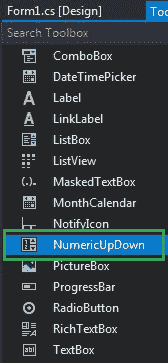

# 如何在 C# 中设置 NumericUpDown 中的小数位数？

> 原文:[https://www . geeksforgeeks . org/如何设置 c-sharp 中的小数位数/](https://www.geeksforgeeks.org/how-to-set-the-decimal-places-in-the-numericupdown-in-c-sharp/)

在 Windows 窗体中，NumericUpDown 控件用于提供显示数值的 Windows 旋转框或上下控件。或者换句话说，NumericUpDown 控件提供了一个使用上下箭头移动并保存一些预定义数值的界面。在 NumericUpDown 控件中，您可以使用**十进制位置属性**设置将在上下控件中显示的小数位数。此属性的默认值为 0。您可以通过两种不同的方式设置此属性:

**1。设计时间:**最简单的方法是在 NumericUpDown 中设置小数位数，如下步骤所示:

*   **第一步:**创建如下图所示的窗口表单:
    **Visual Studio->File->New->Project->windows formpp**
    
*   **Step 2:** Next, drag and drop the NumericUpDown control from the toolbox on the form as shown in the below image:

    

*   **Step 3:** After drag and drop you will go to the properties of the NumericUpDown and set the decimal places in the NumericUpDown as shown in the below image:

    

    **输出:**
    

**2。运行时:**比上面的方法稍微复杂一点。在此方法中，您可以在给定语法的帮助下，以编程方式设置将显示在 NumericUpDown 控件中的小数位数:

```cs
public int DecimalPlaces { get; set; }
```

该属性的值为*系统。Int32* 类型，表示上下控件中显示的小数位数。如果该属性的值小于 0 或大于 99，它将抛出*argumentout of range exception*。以下步骤显示了如何动态设置 NumericUpDown 中的小数位数:

*   **步骤 1:** 使用 numericpdown()构造函数创建 numericpdown，该构造函数由 numericpdown 类提供。

    ```cs
    // Creating a NumericUpDown
    NumericUpDown n = new NumericUpDown();

    ```

*   **第 2 步:**创建 numericpdown 后，设置 numericpdown 类提供的 numericpdown 的 DecimalPlaces 属性。

    ```cs
    // Setting the Decimal Places
    n.DecimalPlaces = 2;

    ```

*   **Step 3:** And last add this NumericUpDown control to the form using the following statement:

    ```cs
    // Adding NumericUpDown 
    // control on the form
    this.Controls.Add(n);

    ```

    **示例:**

    ```cs
    using System;
    using System.Collections.Generic;
    using System.ComponentModel;
    using System.Data;
    using System.Drawing;
    using System.Linq;
    using System.Text;
    using System.Threading.Tasks;
    using System.Windows.Forms;

    namespace WindowsFormsApp44 {

    public partial class Form1 : Form {

        public Form1()
        {
            InitializeComponent();
        }

        private void Form1_Load(object sender, EventArgs e)
        {

            // Creating and setting the
            // properties of the labels
            Label l1 = new Label();
            l1.Location = new Point(348, 61);
            l1.Size = new Size(215, 25);
            l1.Text = "Example";
            l1.Font = new Font("Bodoni MT", 16);
            this.Controls.Add(l1);

            Label l2 = new Label();
            l2.Location = new Point(242, 136);
            l2.Size = new Size(103, 20);
            l2.Text = "Select value:";
            l2.Font = new Font("Bodoni MT", 12);
            this.Controls.Add(l2);

            // Creating and setting the
            // properties of NumericUpDown
            NumericUpDown n = new NumericUpDown();
            n.Location = new Point(386, 130);
            n.Size = new Size(126, 26);
            n.Font = new Font("Bodoni MT", 12);
            n.Minimum = 1800;
            n.Maximum = 3000;
            n.Increment = 1;
            n.DecimalPlaces = 2;

            // Adding this control
            // to the form
            this.Controls.Add(n);
        }
    }
    }
    ```

    **输出:**

    