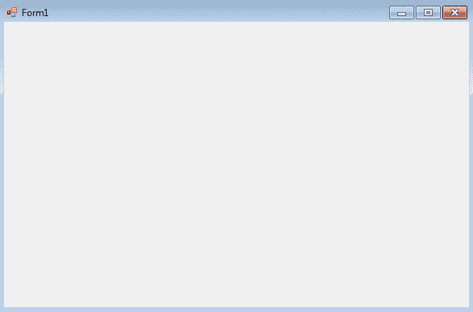
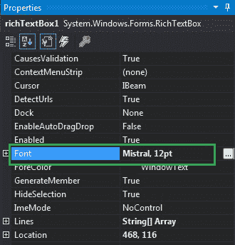
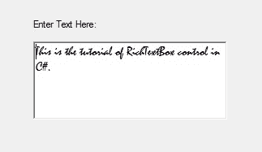
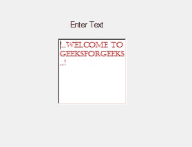

# 如何在 C# 中设置 RichTextBox 中出现的内容的字体？

> 原文:[https://www . geeksforgeeks . org/如何设置 c-sharp 中 richtextbox-present 的内容字体/](https://www.geeksforgeeks.org/how-to-set-the-font-of-the-content-present-in-the-richtextbox-in-c-sharp/)

在 C# 中，RichTextBox 控件是一个文本框，它为您提供富文本编辑控件和高级格式功能，还包括加载富文本格式(RTF)文件。或者换句话说，RichTextBox 控件允许您显示或编辑流内容，包括段落、图像、表格等。在 RichTextBox 中，您可以设置 RichTextBox 控件中内容的字体。您可以通过两种不同的方式设置此属性:

**1。设计时:**设置 RichTextBox 中显示的内容的字体是最简单的方法，如以下步骤所示:

*   **第一步:**创建如下图所示的窗口表单:
    **Visual Studio->File->New->Project->windows formpp**
    
*   **第 2 步:**从工具箱中拖动 RichTextBox 控件，并将其放到窗口窗体上。根据您的需要，您可以将 RichTextBox 控件放置在 windows 窗体上的任何位置。
    T3】
*   **Step 3:** After drag and drop you will go to the properties of the RichTextBox control set the font of the content present in the RichTextBox control.
    

    **输出:**
    

**2。运行时:**比上面的方法稍微复杂一点。在此方法中，您可以在给定语法的帮助下，以编程方式设置 RichTextBox 控件中显示的内容的字体:

```cs
public virtual System.Drawing.Font Font { get; set; }
```

这里，字体是应用于 RichTextBox 内容的字体类型。以下步骤显示了如何动态设置 RichTextBox 的字体属性:

*   **步骤 1:** 使用 RichTextBox()构造函数创建一个 RichTextBox，该构造函数由 RichTextBox 类提供。

    ```cs
    // Creating RichTextBox using RichTextBox class constructor
    RichTextBox rbox = new RichTextBox();

    ```

*   **步骤 2:** 创建 RichTextBox 后，设置 RichTextBox 类提供的 RichTextBox 的 Font 属性。

    ```cs
    // Setting the font
    rbox.Font = new Font("Castellar", 8);

    ```

*   **Step 3:** And last add this RichTextBox control to the form using Add() method.

    ```cs
    // Add this RichTextBox to the form
    this.Controls.Add(rbox);

    ```

    **示例:**

    ```cs
    using System;
    using System.Collections.Generic;
    using System.ComponentModel;
    using System.Data;
    using System.Drawing;
    using System.Linq;
    using System.Text;
    using System.Threading.Tasks;
    using System.Windows.Forms;

    namespace WindowsFormsApp30 {

    public partial class Form1 : Form {

        public Form1()
        {
            InitializeComponent();
        }

        private void Form1_Load(object sender, EventArgs e)
        {
            // Creating and setting the 
            // properties of the label
            Label lb = new Label();
            lb.Location = new Point(251, 70);
            lb.Text = "Enter Text";

            // Adding this label in the form
            this.Controls.Add(lb);

            // Creating and setting the 
            // properties of the RichTextBox
            RichTextBox rbox = new RichTextBox();
            rbox.Location = new Point(236, 97);
            rbox.ForeColor = Color.Red;
            rbox.Font = new Font("Castellar", 8);
            rbox.Text = "!..Welcome to GeeksforGeeks..!";

            // Adding this RichTextBox in the form
            this.Controls.Add(rbox);
        }
    }
    }
    ```

    **输出:**

    