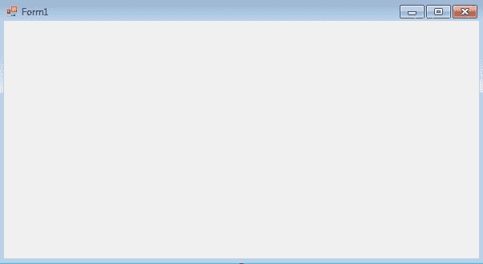
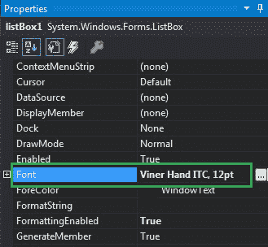
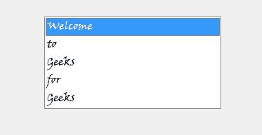
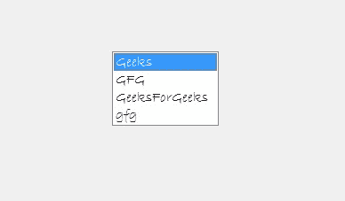

# 如何在 C#中设置列表框的字体？

> 原文:[https://www . geeksforgeeks . org/如何设置 c-sharp 列表框字体/](https://www.geeksforgeeks.org/how-to-set-the-font-of-the-listbox-in-c-sharp/)

在 Windows 窗体中，ListBox 控件用于显示列表中的多个元素，用户可以从中选择一个或多个元素，这些元素通常显示在多个列中。在列表框中，您可以使用列表框的**字体属性**来设置列表框中显示的内容的字体，这使得您的列表框更有吸引力。您可以通过两种不同的方式设置此属性:

**1。设计时:**设置列表框中显示的内容的字体是最简单的方法，如以下步骤所示:

*   **第一步:**创建如下图所示的窗口表单:
    **Visual Studio->File->New->Project->windows formpp**
    
*   **步骤 2:** 从工具箱中拖动 ListBox 控件，并将其放到 windows 窗体上。根据您的需要，您可以将列表框控件放在窗口窗体的任何位置。
    T3】
*   **Step 3:** After drag and drop you will go to the properties of the ListBox control to set the font of the content present in the ListBox.
    

    **输出:**
    

**2。RunTime:** 比上面的方法稍微复杂一点。在此方法中，您可以借助给定的语法，以编程方式设置 ListBox 控件中显示的内容的字体:

```
public override System.Drawing.Font Font { get; set; }
```

这里，字体表示应用于列表框显示的内容的字体。以下步骤显示了如何动态设置列表框中内容的字体:

*   **步骤 1:** 使用 list box 类提供的 ListBox()构造函数创建列表框。

    ```
    // Creating ListBox using ListBox class constructor
    ListBox mylist = new ListBox();

    ```

*   **步骤 2:** 创建 ListBox 后，设置 ListBox 类提供的 ListBox 的字体属性。

    ```
    // Setting the font of the ListBox
    mylist.Font = new Font("Bradley Hand ITC", 12);

    ```

*   **Step 3:** And last add this ListBox control to the form using Add() method.

    ```
    // Add this ListBox to the form
    this.Controls.Add(mylist);

    ```

    **示例:**

    ```
    using System;
    using System.Collections.Generic;
    using System.ComponentModel;
    using System.Data;
    using System.Drawing;
    using System.Linq;
    using System.Text;
    using System.Threading.Tasks;
    using System.Windows.Forms;

    namespace WindowsFormsApp26 {

    public partial class Form1 : Form {

        public Form1()
        {
            InitializeComponent();
        }

        private void Form1_Load(object sender, EventArgs e)
        {
            // Creating and setting the
            // properties of ListBox
            ListBox mylist = new ListBox();
            mylist.Location = new Point(287, 109);
            mylist.Size = new Size(120, 95);
            mylist.Font = new Font("Bradley Hand ITC", 12);
            mylist.Items.Add("Geeks");
            mylist.Items.Add("GFG");
            mylist.Items.Add("GeeksForGeeks");
            mylist.Items.Add("gfg");

            // Adding ListBox control to the form
            this.Controls.Add(mylist);
        }
    }
    }
    ```

    **输出:**

    