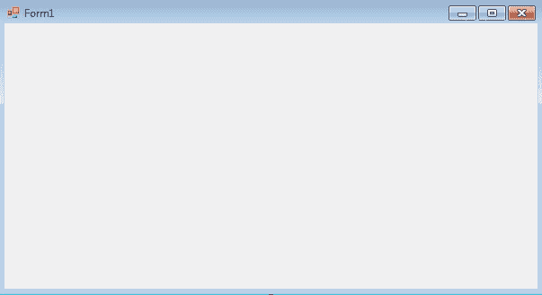
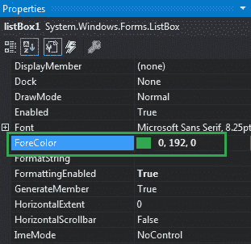
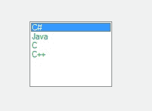

# 如何在 C# 中设置列表框的前景色？

> 原文:[https://www . geeksforgeeks . org/如何设置 c-sharp 列表框的前景色/](https://www.geeksforgeeks.org/how-to-set-the-foreground-color-of-a-listbox-in-c-sharp/)

在 Windows 窗体中，ListBox 控件用于显示列表中的多个元素，用户可以从中选择一个或多个元素，这些元素通常显示在多个列中。在列表框中，您可以使用列表框的**前颜色属性**来设置列表框的前景色，这将使您的列表框更有吸引力。您可以通过两种不同的方式设置此属性:

**1。设计时:**设置列表框前景色最简单的方法，如下步骤所示:

*   **第一步:**创建如下图所示的窗口表单:
    **Visual Studio->File->New->Project->windows formpp**
    
*   **步骤 2:** 从工具箱中拖动 ListBox 控件，并将其放到 windows 窗体上。根据您的需要，您可以将列表框控件放在窗口窗体的任何位置。
    T3】
*   **Step 3:** After drag and drop you will go to the properties of the ListBox control to set the foreground color of the ListBox.
    

    **输出:**
    

**2。RunTime:** 比上面的方法稍微复杂一点。在此方法中，您可以借助给定的语法以编程方式设置 ListBox 控件的前景色:

```cs
public override System.Drawing.Color ForeColor { get; set; }
```

这里，颜色表示列表框的前景色。以下步骤显示了如何动态设置列表框的前景色:

*   **步骤 1:** 使用 list box 类提供的 ListBox()构造函数创建列表框。

    ```cs
    // Creating ListBox using ListBox class constructor
    ListBox mylist = new ListBox();

    ```

*   **步骤 2:** 创建 ListBox 后，设置 ListBox 类提供的 ListBox 的 ForeColor 属性。

    ```cs
    // Setting the foreground color
    mylist.ForeColor = Color.Purple;

    ```

*   **Step 3:** And last add this ListBox control to the form using Add() method.

    ```cs
    // Add this ListBox to the form
    this.Controls.Add(mylist);

    ```

    **示例:**

    ```cs
    using System;
    using System.Collections.Generic;
    using System.ComponentModel;
    using System.Data;
    using System.Drawing;
    using System.Linq;
    using System.Text;
    using System.Threading.Tasks;
    using System.Windows.Forms;

    namespace WindowsFormsApp25 {

    public partial class Form1 : Form {

        public Form1()
        {
            InitializeComponent();
        }

        private void Form1_Load(object sender,
                                 EventArgs e)
        {

            // Creating and setting 
            // the properties of ListBox
            ListBox mylist = new ListBox();
            mylist.Location = new Point(287, 109);
            mylist.Size = new Size(120, 95);
            mylist.ForeColor = Color.Purple;
            mylist.Items.Add(123);
            mylist.Items.Add(456);
            mylist.Items.Add(789);

            // Adding ListBox control to the form
            this.Controls.Add(mylist);
        }
    }
    }
    ```

    **输出:**
    