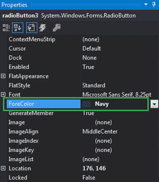
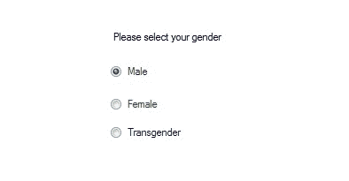
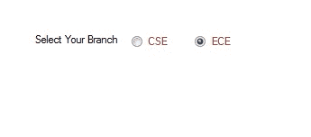

# 如何在 C#中设置单选按钮的前景色？

> 原文:[https://www . geeksforgeeks . org/如何设置 c-sharp 中 radiobutton 的前景色/](https://www.geeksforgeeks.org/how-to-set-the-foreground-color-of-the-radiobutton-in-c-sharp/)

在 Windows 窗体中，单选按钮控件用于从选项组中选择一个选项。例如，从给定的列表中选择您的性别，因此您将在三个选项中仅选择一个选项，如男性或女性或变性者。在 Windows 窗体中，您可以使用单选按钮的**前颜色属性**来调整单选按钮的前景色，这将使您的单选按钮更有吸引力。此属性是环境属性。您可以通过两种不同的方式设置此属性:

**1。设计时:**设置单选按钮的前景色最简单的方法，如下步骤所示:

*   **第一步:**创建如下图所示的窗口表单:
    **Visual Studio->File->New->Project->windows formpp**
    
*   **步骤 2:** 从工具箱中拖动 RadioButton 控件，并将其放到 windows 窗体上。您可以根据需要在 windows 窗体上的任何位置放置一个 RadioButton 控件。
    T3】
*   **Step 3:** After drag and drop you will go to the properties of the RadioButton control to set the foreground color of the RadioButton.
    

    **输出:**
    

**2。运行时:**比上面的方法稍微复杂一点。在此方法中，您可以借助给定的语法以编程方式设置单选按钮控件的前景色:

```cs
public override System.Drawing.Color ForeColor { get; set; }
```

这里，颜色表示单选按钮的前景色。以下步骤显示了如何动态设置单选按钮的前景色:

*   **步骤 1:** 使用 RadioButton 类提供的 radio button()构造函数创建单选按钮。

    ```cs
    // Creating radio button
    RadioButton r1 = new RadioButton();

    ```

*   **步骤 2:** 创建完 RadioButton 后，设置 RadioButton 类提供的 RadioButton 的 ForeColor 属性。

    ```cs
    // Setting the foreground color of the radio button
    r1.ForeColor = Color.Brown;

    ```

*   **Step 3:** And last add this RadioButton control to the form using Add() method.

    ```cs
    // Add this radio button to the form
    this.Controls.Add(r1);

    ```

    **示例:**

    ```cs
    using System;
    using System.Collections.Generic;
    using System.ComponentModel;
    using System.Data;
    using System.Drawing;
    using System.Linq;
    using System.Text;
    using System.Threading.Tasks;
    using System.Windows.Forms;

    namespace WindowsFormsApp20 {

    public partial class Form1 : Form {

        public Form1()
        {
            InitializeComponent();
        }

        private void RadioButton2_CheckedChanged(object sender,
                                                  EventArgs e)
        {
        }

        private void Form1_Load(object sender, EventArgs e)
        {
            // Creating and setting label
            Label l = new Label();
            l.AutoSize = true;
            l.Location = new Point(176, 40);
            l.Text = "Select Your Branch";

            // Adding this label to the form
            this.Controls.Add(l);

            // Creating and setting the
            // properties of the RadioButton
            RadioButton r1 = new RadioButton();
            r1.AutoSize = true;
            r1.Text = "CSE";
            r1.Location = new Point(286, 40);
            r1.ForeColor = Color.Brown;

            // Adding this label to the form
            this.Controls.Add(r1);

            // Creating and setting the 
            // properties of the RadioButton
            RadioButton r2 = new RadioButton();
            r2.AutoSize = true;
            r2.Text = "ECE";
            r2.Location = new Point(356, 40);
            r2.ForeColor = Color.Brown;

            // Adding this label to the form
            this.Controls.Add(r2);
        }
    }
    }
    ```

    **输出:**

    