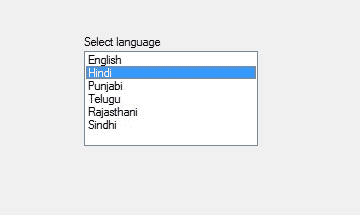
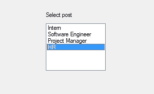

# 如何在 C# 中设置列表框中出现的元素的高度？

> 原文:[https://www . geeksforgeeks . org/如何设置 c-sharp 列表框中元素的高度/](https://www.geeksforgeeks.org/how-to-set-the-height-of-the-elements-present-in-the-listbox-in-c-sharp/)

在 Windows 窗体中，ListBox 控件用于显示列表中的多个元素，用户可以从中选择一个或多个元素，这些元素通常显示在多个列中。在列表框中，可以使用列表框的**项目高度属性**设置列表框中元素的高度。列表框项目的最大高度为 255 像素。您可以通过两种不同的方式设置此属性:

**1。设计时:**最简单的方法是设置列表框中元素的高度，如下步骤所示:

*   **第一步:**创建如下图所示的窗口表单:
    **Visual Studio->File->New->Project->windows formpp**
    
*   **步骤 2:** 从工具箱中拖动 ListBox 控件，并将其放到 windows 窗体上。根据您的需要，您可以将列表框控件放在窗口窗体的任何位置。
    T3】
*   **Step 3:** After drag and drop you will go to the properties of the ListBox control to set the height of the elements present in the ListBox.
    

    **输出:**
    

**2。运行时:**比上面的方法稍微复杂一点。在此方法中，您可以借助给定的语法以编程方式设置 ListBox 控件中元素的高度:

```cs
public virtual int ItemHeight { get; set; }
```

这里，该属性的值为*系统。Int32* 型。元素的高度总是以像素为单位。如果该属性的值设置为小于 0 或大于 255 像素，它将抛出*argumentout of range exception*。以下步骤显示了如何动态设置列表框中元素的高度:

*   **步骤 1:** 使用 list box 类提供的 ListBox()构造函数创建列表框。

    ```cs
    // Creating ListBox using ListBox class constructor
    ListBox lstbox = new ListBox();

    ```

*   **第二步:**创建 ListBox 后，设置 ListBox 类提供的 ListBox 的 *ItemHeight 属性*。

    ```cs
    // Setting the height of the items
    lstbox.ItemHeight = 13;
    ```

*   **Step 3:** And last add this ListBox control to the form using Add() method.

    ```cs
    // Add this ListBox to the form
    this.Controls.Add(lstbox);

    ```

    **示例:**

    ```cs
    using System;
    using System.Collections.Generic;
    using System.ComponentModel;
    using System.Data;
    using System.Drawing;
    using System.Linq;
    using System.Text;
    using System.Threading.Tasks;
    using System.Windows.Forms;

    namespace WindowsFormsApp28 {

    public partial class Form1 : Form {

        public Form1()
        {
            InitializeComponent();
        }

        private void Form1_Load(object sender, EventArgs e)
        {
            // Creating and setting the
            // properties of the label
            Label lb = new Label();
            lb.Location = new Point(243, 80);
            lb.Text = "Select post";

            // Adding label control to the form
            this.Controls.Add(lb);

            // Creating and setting the
            // properties of ListBox
            ListBox lstbox = new ListBox();
            lstbox.Location = new Point(246, 104);
            lstbox.ItemHeight = 13;
            lstbox.Items.Add("Intern");
            lstbox.Items.Add("Software Engineer");
            lstbox.Items.Add("Project Manager");
            lstbox.Items.Add("HR");

            // Adding listbox control to the form
            this.Controls.Add(lstbox);
        }
    }
    }
    ```

    **输出:**
    