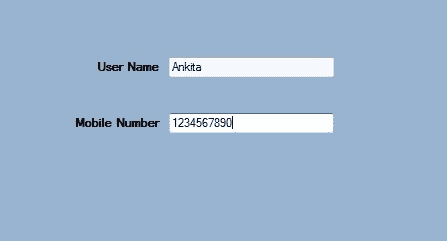

# 如何在 C#中设置文本框中字符的长度？

> 原文:[https://www . geesforgeks . org/如何设置 c-sharp 文本框中的字符长度/](https://www.geeksforgeeks.org/how-to-set-the-length-of-the-characters-in-textbox-in-c-sharp/)

在 Windows 窗体中，文本框扮演着重要的角色。在文本框的帮助下，用户可以在应用程序中输入数据，可以是单行的，也可以是多行的。在文本框中，您可以借助 **MaxLength 属性**设置用户可以键入、粘贴或输入文本框的最大字符数。该房产的默认值为 *32767* 。您可以在表单中使用此属性，在表单中，您被限制输入一定数量的字符，如电话号码、邮政编码等。在 Windows 窗体中，可以通过两种不同的方式设置此属性:

**1。设计时:**设置文本框的 MaxLength 属性是最简单的方法，如下步骤所示:

*   **第一步:**创建如下图所示的窗口表单:
    **Visual Studio->File->New->Project->windows formpp**
    
*   **步骤 2:** 从工具箱中拖动文本框控件，并将其放到窗口窗体上。您可以根据需要将文本框放置在 windows 窗体上的任何位置。如下图所示:
    
*   **Step 3:** After drag and drop you will go to the properties of the TextBox control to set the MaxLength property of the TextBox. As shown in the below image:

    

    **输出:**
    

**2。运行时:**比上面的方法稍微复杂一点。在此方法中，您可以借助给定的语法以编程方式设置文本框的 MaxLength 属性:

```cs
public virtual int MaxLength { get; set; }
```

这里，该属性的值为*系统。Int32* 型。如果分配给属性的值小于 0，它将抛出*argumentout of range exception*。以下步骤用于设置文本框的最大长度属性:

*   **步骤 1 :** 使用 textbox 类提供的 TextBox()构造函数创建一个 TextBox。

    ```cs
    // Creating textbox
    TextBox Mytextbox = new TextBox();

    ```

*   **第二步:**创建文本框后，设置文本框类提供的文本框的 MaxLength 属性。

    ```cs
    // Set MaxLength property
    Mytextbox2.MaxLength = 6;

    ```

*   **Step 3 :** And last add this textbox control to from using Add() method.

    ```cs
    // Add this textbox to form
    this.Controls.Add(Mytextbox1);

    ```

    **示例:**

    ```cs
    using System;
    using System.Collections.Generic;
    using System.ComponentModel;
    using System.Data;
    using System.Drawing;
    using System.Linq;
    using System.Text;
    using System.Threading.Tasks;
    using System.Windows.Forms;

    namespace my {

    public partial class Form1 : Form {

        public Form1()
        {
            InitializeComponent();
        }

        private void Form1_Load(object sender, EventArgs e)
        {
            // Creating and setting the properties of Lable1
            Label Mylablel1 = new Label();
            Mylablel1.Location = new Point(96, 54);
            Mylablel1.Text = "Enter Name";
            Mylablel1.AutoSize = true;
            Mylablel1.BackColor = Color.LightGray;

            // Add this label to form
            this.Controls.Add(Mylablel1);

            // Creating and setting the properties of TextBox1
            TextBox Mytextbox1 = new TextBox();
            Mytextbox1.Location = new Point(187, 51);
            Mytextbox1.BackColor = Color.LightGray;
            Mytextbox1.AutoSize = true;
            Mytextbox1.Name = "text_box1";

            // Add this textbox to form
            this.Controls.Add(Mytextbox1);

            // Creating and setting the properties of Lable1
            Label Mylablel2 = new Label();
            Mylablel2.Location = new Point(96, 102);
            Mylablel2.Text = "Enter Pincode";
            Mylablel2.AutoSize = true;
            Mylablel2.BackColor = Color.LightGray;

            // Add this label to form
            this.Controls.Add(Mylablel2);

            // Creating and setting the properties of TextBox2
            TextBox Mytextbox2 = new TextBox();
            Mytextbox2.Location = new Point(187, 99);
            Mytextbox2.BackColor = Color.LightGray;
            Mytextbox2.AutoSize = true;
            Mytextbox2.MaxLength = 6;
            Mytextbox2.Name = "text_box2";

            // Add this textbox to form
            this.Controls.Add(Mytextbox2);
        }
    }
    }
    ```

    **输出:**

    