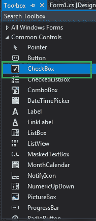
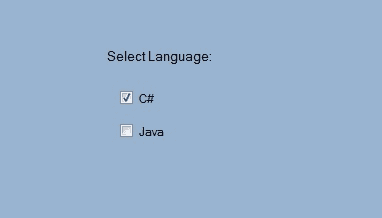

# 如何在 C#中设置 CheckBox 控件之间的边距？

> 原文:[https://www . geeksforgeeks . org/如何设置 c-sharp 控件中复选框的边距/](https://www.geeksforgeeks.org/how-to-set-the-margin-between-the-checkbox-controls-in-c-sharp/)

CheckBox 控件是 windows 窗体的一部分，用于接受用户的输入。或者换句话说，CheckBox 控件允许我们从给定的列表中选择单个或多个元素。在 CheckBox 中，您可以使用 CheckBox 的**边距属性**设置两个或多个 CheckBox 控件之间的间距。这会让你的 CheckBox 更有吸引力。在 Windows 窗体中，可以通过两种不同的方式设置此属性:

**1。设计时:**使用以下步骤设置复选框的边距属性是最简单的方法:

*   **第一步:**创建如下图所示的窗口表单:
    T3】Visual Studio->File->New->Project->windows formapp


*   **步骤 2:** 从工具箱中拖动 CheckBox 控件，并将其放到窗口窗体上。您可以根据需要将 CheckBox 放在 windows 窗体上的任何位置。



*   **步骤 3:** 拖放后，您将转到 CheckBox 控件的属性，使用 Margin 属性设置两个或多个 CheckBox 控件之间的间距。


**输出:**



**2。运行时:**比上面的方法稍微复杂一点。在此方法中，您可以使用以下语法以编程方式设置 CheckBox 的 Margin 属性:

```
public System.Windows.Forms.Padding Margin { get; set; }
```

这里，填充用于表示 CheckBox 控件之间的空间。以下步骤用于设置复选框的“边距”属性:

*   **步骤 1:** 使用 checkbox 类提供的 CheckBox()构造函数创建一个 CheckBox。

```
// Creating checkbox
CheckBox Mycheckbox = new CheckBox();
```

*   **步骤 2:** 创建 CheckBox 后，设置 CheckBox 类提供的 CheckBox 的 Margin 属性。

```
// Set the Margin property of the CheckBox
Mycheckbox.Margin = new Padding(6, 6, 6, 6);
```

*   **第 3 步:**最后使用 add()方法将该复选框控件添加到表单中。

```
// Add this checkbox to form
this.Controls.Add(Mycheckbox);
```

**示例:**

## C#

```
using System;
using System.Collections.Generic;
using System.ComponentModel;
using System.Data;
using System.Drawing;
using System.Linq;
using System.Text;
using System.Threading.Tasks;
using System.Windows.Forms;

namespace WindowsFormsApp5 {

public partial class Form1 : Form {

    public Form1()
    {
        InitializeComponent();
    }

    private void Form1_Load(object sender, EventArgs e)
    {
        // Creating and setting the properties of label
        Label l = new Label();
        l.Text = "Select Gender:";
        l.Location = new Point(233, 111);

        // Adding label to form
        this.Controls.Add(l);

        // Creating and setting the properties of CheckBox
        CheckBox Mycheckbox = new CheckBox();
        Mycheckbox.Height = 50;
        Mycheckbox.Width = 100;
        Mycheckbox.Location = new Point(229, 136);
        Mycheckbox.Text = "Male";
        Mycheckbox.Margin = new Padding(6, 6, 6, 6);

        // Adding checkbox to form
        this.Controls.Add(Mycheckbox);

        // Creating and setting the properties of CheckBox
        CheckBox Mycheckbox1 = new CheckBox();
        Mycheckbox1.Height = 50;
        Mycheckbox1.Width = 100;
        Mycheckbox1.Location = new Point(230, 174);
        Mycheckbox1.Text = "Female";

        // Adding checkbox to form
        this.Controls.Add(Mycheckbox1);
    }
}
}
```

**输出:**

