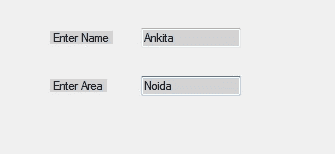

# 如何在 C# 中设置文本框控件之间的边距？

> 原文:[https://www . geeksforgeeks . org/如何设置 c-sharp 中文本框控件之间的边距/](https://www.geeksforgeeks.org/how-to-set-the-margin-between-the-textbox-controls-in-c-sharp/)

在 Windows 窗体中，文本框扮演着重要的角色。在文本框的帮助下，用户可以在应用程序中输入数据，可以是单行的，也可以是多行的。在文本框中，可以借助**边距属性**设置两个或多个文本框控件之间的间距。在 Windows 窗体中，可以通过两种不同的方式设置此属性:

**1。设计时:**最简单的方法是设置文本框的 Margin 属性，如下步骤所示:

*   **步骤 1:** 创建窗口表单。
    **Visual Studio - >文件- >新建- >项目- >窗口形式程序**
    T6】
*   **步骤 2:** 从工具箱中拖动 TextBox 控件，并将其放到窗口窗体上。您可以根据需要将文本框放置在 windows 窗体上的任何位置。
    T3】
*   **Step 3:** After drag and drop you will go to the properties of the TextBox control to set the Margin property of the TextBox.
    

    **输出:**
    

**2。运行时:**比上面的方法稍微复杂一点。在此方法中，您可以借助给定的语法以编程方式设置文本框的 Margin 属性:

```cs
public System.Windows.Forms.Padding Margin { get; set; }
```

这里，填充用于表示文本框控件之间的空间。以下步骤用于设置文本框的边距属性:

*   **步骤 1 :** 使用 textbox 类提供的 TextBox()构造函数创建一个 TextBox。

    ```cs
    // Creating textbox
    TextBox Mytextbox = new TextBox();

    ```

*   **步骤 2 :** 创建文本框后，设置文本框类提供的文本框的 Margin 属性。

    ```cs
    // Set Margin property
    Mytextbox1.Margin = new Padding(5, 5, 5, 5);

    ```

*   **Step 3 :** And last add this textbox control to from using Add() method.

    ```cs
    // Add this textbox to form
    this.Controls.Add(Mytextbox1);

    ```

    **示例:**

    ```cs
    using System;
    using System.Collections.Generic;
    using System.ComponentModel;
    using System.Data;
    using System.Drawing;
    using System.Linq;
    using System.Text;
    using System.Threading.Tasks;
    using System.Windows.Forms;

    namespace my {

    public partial class Form1 : Form {

        public Form1()
        {
            InitializeComponent();
        }

        private void Form1_Load(object sender, EventArgs e)
        {

            // Creating and setting the properties of Lable1
            Label Mylablel1 = new Label();
            Mylablel1.Location = new Point(96, 54);
            Mylablel1.Text = "Enter Name";
            Mylablel1.AutoSize = true;
            Mylablel1.BackColor = Color.LightGray;

            // Add this label to form
            this.Controls.Add(Mylablel1);

            // Creating and setting the properties of TextBox1
            TextBox Mytextbox1 = new TextBox();
            Mytextbox1.Location = new Point(187, 51);
            Mytextbox1.BackColor = Color.LightGray;
            Mytextbox1.AutoSize = true;
            Mytextbox1.Name = "text_box1";
            Mytextbox1.Margin = new Padding(5, 5, 5, 5);

            // Add this textbox to form
            this.Controls.Add(Mytextbox1);

            // Creating and setting the properties of Lable1
            Label Mylablel2 = new Label();
            Mylablel2.Location = new Point(96, 102);
            Mylablel2.Text = "Enter Area";
            Mylablel2.AutoSize = true;
            Mylablel2.BackColor = Color.LightGray;

            // Add this label to form
            this.Controls.Add(Mylablel2);

            // Creating and setting the properties of TextBox2
            TextBox Mytextbox2 = new TextBox();
            Mytextbox2.Location = new Point(187, 99);
            Mytextbox2.BackColor = Color.LightGray;
            Mytextbox2.AutoSize = true;
            Mytextbox2.Name = "text_box2";

            // Add this textbox to form
            this.Controls.Add(Mytextbox2);
        }
    }
    }
    ```

    **输出:**
    