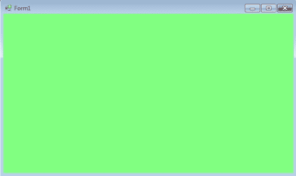
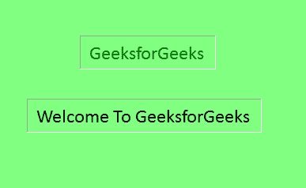

# 如何在 C# 中设置标签的填充？

> 原文:[https://www . geeksforgeeks . org/如何设置 c-sharp 中标签的填充符/](https://www.geeksforgeeks.org/how-to-set-the-padding-of-the-label-in-c-sharp/)

在 Windows 窗体中，Label 控件用于在窗体上显示文本，它不参与用户输入或鼠标或键盘事件。您可以使用窗口表单中的**填充属性**设置标签控件的内容和边界之间的间距。您可以使用两种不同的方法设置此属性:

**1。设计时:**使用以下步骤设置 Label 控件的 Padding 属性是最简单的方法:

*   **第一步:**创建如下图所示的窗口表单:
    **Visual Studio->File->New->Project->windows formpp**
    
*   **步骤 2:** 从工具箱中拖动标签控件，并将其放到窗口窗体上。您可以根据需要在 windows 窗体上的任何位置放置一个 Label 控件。
    T3】
*   **Step 3:** After drag and drop you will go to the properties of the Label control to set the Padding property of the Label.
    

    **输出:**
    

**2。运行时:**比上面的方法稍微复杂一点。在此方法中，您可以在给定语法的帮助下，以编程方式设置 windows 窗体中文本和标签边界之间的填充:

```cs
public System.Windows.Forms.Padding Padding { get; set; }
```

这里，填充表示标签控件的内部间距特征。以下步骤用于设置标签的“填充”属性:

*   **步骤 1:** 使用标签类提供的标签()构造函数创建标签。

    ```cs
    // Creating label using Label class
    Label mylab = new Label();

    ```

*   **步骤 2:** 创建标签后，设置标签类提供的标签的填充属性。

    ```cs
    // Set Padding property of the label
    mylab.Padding = new Padding(6);

    ```

*   **Step 3:** And last add this Label control to form using Add() method.

    ```cs
    // Add this label to the form
    this.Controls.Add(mylab);

    ```

    **示例:**

    ```cs
    using System;
    using System.Collections.Generic;
    using System.ComponentModel;
    using System.Data;
    using System.Drawing;
    using System.Linq;
    using System.Text;
    using System.Threading.Tasks;
    using System.Windows.Forms;

    namespace WindowsFormsApp16 {

    public partial class Form1 : Form {

        public Form1()
        {
            InitializeComponent();
        }

        private void Form1_Load(object sender, EventArgs e)
        {
            // Creating and setting the label
            Label mylab = new Label();
            mylab.Text = "GeeksforGeeks";
            mylab.Location = new Point(222, 90);
            mylab.AutoSize = true;
            mylab.Font = new Font("Calibri", 18);
            mylab.BorderStyle = BorderStyle.Fixed3D;
            mylab.ForeColor = Color.Green;
            mylab.Padding = new Padding(6);

            // Adding this control to the form
            this.Controls.Add(mylab);

            // Creating and setting the label
            Label mylab1 = new Label();
            mylab1.Text = "Welcome To GeeksforGeeks";
            mylab1.Location = new Point(155, 170);
            mylab1.AutoSize = true;
            mylab1.BorderStyle = BorderStyle.Fixed3D;
            mylab1.Font = new Font("Calibri", 18);
            mylab1.Padding = new Padding(6);

            // Adding this control to the form
            this.Controls.Add(mylab1);
        }
    }
    }
    ```

    **输出:**

    设置填充前:
    

    设置填充后:
    