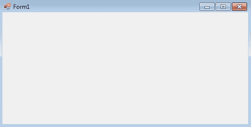
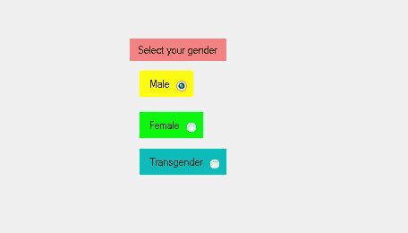

# 如何在 C#中将单选按钮设置为选中状态？

> 原文:[https://www . geeksforgeeks . org/如何将 radiobutton 设置为 c-sharp 中的选中状态/](https://www.geeksforgeeks.org/how-to-set-the-radiobutton-to-checked-state-in-c-sharp/)

在 Windows 窗体中，单选按钮控件用于从选项组中选择一个选项。例如，从给定的列表中选择您的性别，因此您将在三个选项中仅选择一个选项，如男性或女性或变性者。在 Windows 窗体中，您可以设置一个值，该值表示使用单选按钮的**选中属性**来选中单选按钮控件。
如果该属性的值设置为真，则选中单选按钮，如果该属性的值设置为假，则不选中单选按钮。此属性的默认值为 false。您可以通过两种不同的方式设置此属性:

**1。设计时:**最简单的方法是设置一个值，该值代表单选按钮被选中，如以下步骤所示:

*   **第一步:**创建如下图所示的窗口表单:
    **Visual Studio->File->New->Project->windows formpp**
    
*   **步骤 2:** 从工具箱中拖动 RadioButton 控件，并将其放到 windows 窗体上。您可以根据需要在 windows 窗体上的任何位置放置一个 RadioButton 控件。
    T3】
*   **Step 3:** After drag and drop you will go to the properties of the RadioButton control to set a value which represents the RadioButton control is checked.
    

    **输出:**
    

**2。运行时:**比上面的方法稍微复杂一点。在此方法中，您可以设置一个值，该值表示在给定语法的帮助下以编程方式检查单选按钮控件:

```cs
public bool Checked { get; set; }
```

该属性的值为*系统。布尔*类型。以下步骤显示了如何动态设置单选按钮的“选中”属性:

*   **步骤 1:** 使用 RadioButton 类提供的 radio button()构造函数创建单选按钮。

    ```cs
    // Creating radio button
    RadioButton r1 = new RadioButton();

    ```

*   **步骤 2:** 创建单选按钮后，设置单选按钮类提供的单选按钮的 Checked 属性。

    ```cs
    // Setting the Checked property of the radio button
    r1.Checked = true;

    ```

*   **Step 3:** And last add this RadioButton control to the form using Add() method.

    ```cs
    // Add this radio button to the form
    this.Controls.Add(r1);

    ```

    **示例:**

    ```cs
    using System;
    using System.Collections.Generic;
    using System.ComponentModel;
    using System.Data;
    using System.Drawing;
    using System.Linq;
    using System.Text;
    using System.Threading.Tasks;
    using System.Windows.Forms;

    namespace WindowsFormsApp24 {

    public partial class Form1 : Form {

        public Form1()
        {
            InitializeComponent();
        }

        private void RadioButton2_CheckedChanged(object sender, 
                                                   EventArgs e)
        {
        }

        private void Form1_Load(object sender, EventArgs e)
        {
            // Creating and setting label
            Label l = new Label();
            l.AutoSize = true;
            l.Location = new Point(176, 40);
            l.Text = "Select Post";

            // Adding this label to the form
            this.Controls.Add(l);

            // Creating and setting the 
            // properties of the RadioButton
            RadioButton r1 = new RadioButton();
            r1.AutoSize = true;
            r1.Text = "Intern";
            r1.Location = new Point(286, 40);
            r1.Checked = true;

            // Adding this label to the form
            this.Controls.Add(r1);

            // Creating and setting the
            // properties of the RadioButton
            RadioButton r2 = new RadioButton();
            r2.AutoSize = true;
            r2.Text = "Team Leader";
            r2.Location = new Point(356, 40);
            r2.Checked = false;

            // Adding this label to the form
            this.Controls.Add(r2);

            // Creating and setting the 
            // properties of the RadioButton
            RadioButton r3 = new RadioButton();
            r3.AutoSize = true;
            r3.Text = "Software Engineer";
            r3.Location = new Point(470, 40);
            r3.Checked = true;

            // Adding this label to the form
            this.Controls.Add(r3);
        }
    }
    }
    ```

    **输出:**

    在设置“已检查”属性之前:

    

    设置“已检查”属性后:

    