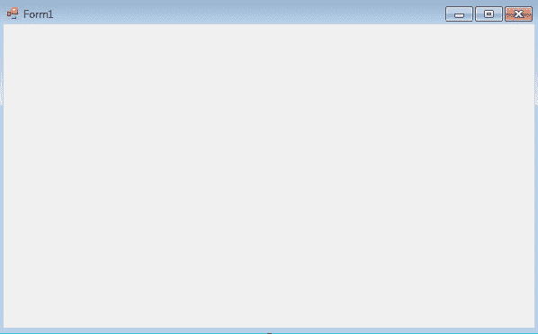
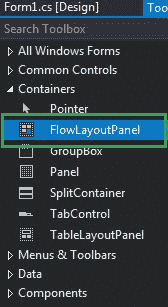
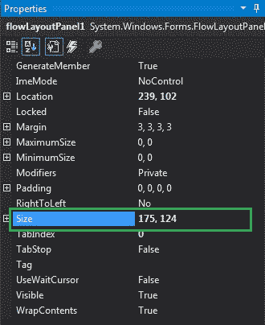
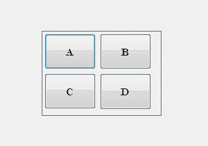
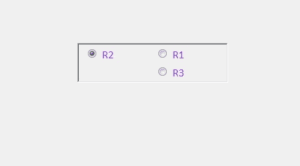

# 如何在 C#中设置 FlowLayoutPanel 的大小？

> 原文:[https://www . geeksforgeeks . org/如何设置 c-sharp 中的 flowlayoutpanel 的大小/](https://www.geeksforgeeks.org/how-to-set-the-size-of-the-flowlayoutpanel-in-c-sharp/)

在 Windows 窗体中，FlowLayoutPanel 控件用于在水平或垂直流动方向上排列其子控件。或者换句话说，FlowLayoutPanel 是一个容器，用于在其中水平或垂直组织不同或相同类型的控件。在 FlowLayoutPanel 控件中，可以使用**大小属性**设置表单中控件的大小。借助此属性，您可以以像素为单位设置控件的高度和宽度。您可以通过两种不同的方式设置此属性:

**1。设计时:**设置 FlowLayoutPanel 的大小是最简单的方法，如以下步骤所示:

*   **第一步:**创建如下图所示的窗口表单:
    **Visual Studio->File->New->Project->windows formpp**
    
*   **Step 2:** Next, drag and drop the FlowLayoutPanel control from the toolbox to the form as shown in the below image:

    

*   **Step 3:** After drag and drop you will go to the properties of the FlowLayoutPanel and set the size of the FlowLayoutPanel as shown in the below image:

    

    **输出:**
    

**2。运行时:**比上面的方法稍微复杂一点。在此方法中，您可以借助给定的语法以编程方式设置 FlowLayoutPanel 控件的大小:

```
public System.Drawing.Size Size { get; set; }
```

以下步骤显示了如何动态设置 FlowLayoutPanel 的大小:

*   **步骤 1:** 使用 FlowLayoutPanel()构造函数创建一个 FlowLayoutPanel，该构造函数由 FlowLayoutPanel 类提供。

    ```
    // Creating a FlowLayoutPanel
    FlowLayoutPanel f = new FlowLayoutPanel();

    ```

*   **步骤 2:** 创建完 FlowLayoutPanel 后，设置 FlowLayoutPanel 类提供的 FlowLayoutPanel 的 Size 属性。

    ```
    // Setting the size
    f.Size = new Size(216, 57);

    ```

*   **第 3 步:**最后将此 FlowLayoutPanel 控件添加到表单中，并使用以下语句在 FlowLayoutPanel 中添加子控件:

    ```
    // Adding a FlowLayoutPanel 
    // control to the form
    this.Controls.Add(f);

    and 

    // Adding child controls to 
    // the FlowLayoutPanel
    f.Controls.Add(r1);

    ```

**示例:**

```
using System;
using System.Collections.Generic;
using System.ComponentModel;
using System.Data;
using System.Drawing;
using System.Linq;
using System.Text;
using System.Threading.Tasks;
using System.Windows.Forms;

namespace WindowsFormsApp50 {

public partial class Form1 : Form {

    public Form1()
    {
        InitializeComponent();
    }

    private void Form1_Load(object sender, EventArgs e)
    {
        // Creating and setting the 
        // properties of FlowLayoutPanel
        FlowLayoutPanel f = new FlowLayoutPanel();
        f.Location = new Point(380, 124);
        f.Size = new Size(216, 57);
        f.Name = "Mycontainer";
        f.Font = new Font("Calibri", 12);
        f.FlowDirection = FlowDirection.RightToLeft;
        f.BorderStyle = BorderStyle.Fixed3D;
        f.ForeColor = Color.BlueViolet;
        f.Visible = true;

        // Adding this control to the form
        this.Controls.Add(f);

        // Creating and setting the 
        // properties of radio buttons
        RadioButton r1 = new RadioButton();
        r1.Location = new Point(3, 3);
        r1.Size = new Size(95, 20);
        r1.Text = "R1";

        // Adding this control 
        // to the FlowLayoutPanel
        f.Controls.Add(r1);

        RadioButton r2 = new RadioButton();
        r2.Location = new Point(94, 3);
        r2.Size = new Size(95, 20);
        r2.Text = "R2";

        // Adding this control to
        // the FlowLayoutPanel
        f.Controls.Add(r2);

        RadioButton r3 = new RadioButton();
        r3.Location = new Point(3, 26);
        r3.Size = new Size(95, 20);
        r3.Text = "R3";

        // Adding this control to
        // the FlowLayoutPanel
        f.Controls.Add(r3);
    }
}
}
```

**输出:**

