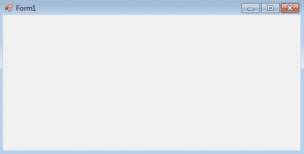
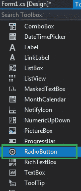
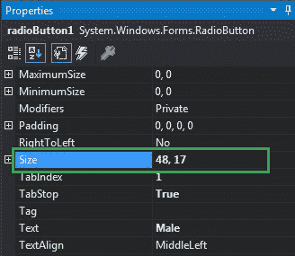
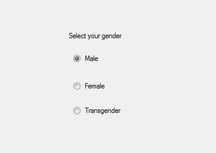

# 如何在 C#中设置单选按钮的大小？

> 原文:[https://www . geeksforgeeks . org/如何设置 c-sharp 中 radiobutton 的大小/](https://www.geeksforgeeks.org/how-to-set-the-size-of-the-radiobutton-in-c-sharp/)

在 Windows 窗体中，单选按钮控件用于从选项组中选择一个选项。例如，从给定的列表中选择您的性别，因此您将在三个选项中仅选择一个选项，如男性或女性或变性者。
在 Windows 窗体中，您可以使用单选按钮的**大小属性**来调整单选按钮的大小。此属性以像素为单位表示单选按钮的高度和宽度。您可以通过两种不同的方式设置此属性:

**1。设计时间:**按照以下步骤调整单选按钮的大小是最简单的方法:

*   **第一步:**创建如下图所示的窗口表单:
    **Visual Studio->File->New->Project->windows formpp**
    
*   **Step 2:** Drag the RadioButton control from the ToolBox and drop it on the windows form. You are allowed to place a RadioButton control anywhere on the windows form according to your need.

    

*   **Step 3:** After drag and drop you will go to the properties of the RadioButton control to adjust the size of RadioButton.
    

    **输出:**
    

**2。运行时:**比上面的方法稍微复杂一点。在此方法中，您可以借助给定的语法以编程方式调整单选按钮控件的大小:

```cs
public System.Drawing.Size Size { get; set; }
```

这里，大小以像素为单位表示高度和宽度。以下步骤显示了如何动态调整单选按钮的大小:

*   **步骤 1:** 使用 RadioButton 类提供的 radio button()构造函数创建单选按钮。

    ```cs
    // Creating radio button
    RadioButton r1 = new RadioButton();

    ```

*   **步骤 2:** 创建单选按钮后，设置单选按钮类提供的单选按钮的大小属性。

    ```cs
    // Setting the size of the radio button
     r1.Size = new Size(100, 40);

    ```

*   **Step 3:** And last add this RadioButton control to the form using Add() method.

    ```cs
    // Add this radio button to the form
    this.Controls.Add(r1);

    ```

    **示例:**

    ```cs
    using System;
    using System.Collections.Generic;
    using System.ComponentModel;
    using System.Data;
    using System.Drawing;
    using System.Linq;
    using System.Text;
    using System.Threading.Tasks;
    using System.Windows.Forms;

    namespace WindowsFormsApp23 {

    public partial class Form1 : Form {

        public Form1()
        {
            InitializeComponent();
        }

        private void Form1_Load(object sender, EventArgs e)
        {
            // Creating and setting label
            Label l = new Label();
            l.AutoSize = true;
            l.Location = new Point(176, 40);
            l.Text = "Select Post";

            // Adding this label to the form
            this.Controls.Add(l);

            // Creating and setting the 
            // properties of the RadioButton
            RadioButton r1 = new RadioButton();
            r1.Size = new Size(100, 40);
            r1.Text = "Intern";
            r1.Location = new Point(286, 40);
            r1.TextAlign = ContentAlignment.MiddleLeft;

            // Adding this label to the form
            this.Controls.Add(r1);

            // Creating and setting the 
            // properties of the RadioButton
            RadioButton r2 = new RadioButton();
            r2.Text = "Team Leader";
            r2.Location = new Point(450, 40);
            r2.TextAlign = ContentAlignment.MiddleLeft;
            r2.Size = new Size(100, 40);

            // Adding this label to the form
            this.Controls.Add(r2);
        }
    }
    }
    ```

    **输出:**

    