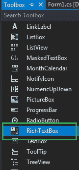
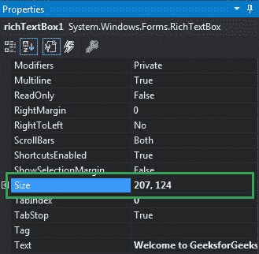
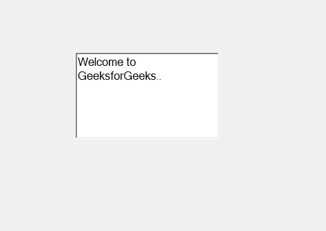

# 如何在 C#中设置 RichTextBox 的大小？

> 原文:[https://www . geeksforgeeks . org/如何设置 c-sharp 中 richtextbox 的大小/](https://www.geeksforgeeks.org/how-to-set-the-size-of-the-richtextbox-in-c-sharp/)

在 C#中，RichTextBox 控件是一个文本框，它为您提供富文本编辑控件和高级格式功能，还包括加载富文本格式(RTF)文件。或者换句话说，RichTextBox 控件允许您显示或编辑流内容，包括段落、图像、表格等。在 RichTextBox 中，使用**大小属性**设置 RichTextBox 控件的大小。在这个属性的帮助下，您可以以像素为单位设置 RichTextBox 的高度和宽度。您可以通过两种不同的方式设置此属性:

**1。设计时:**设置 RichTextBox 的大小是最简单的方法，如下步骤所示:

*   **第一步:**创建如下图所示的窗口表单:
    **Visual Studio->File->New->Project->windows formpp**
    
*   **Step 2:** Next, drag and drop the RichTextBox control from the toolbox to the form as shown in the below image:

    

*   **Step 3:** After drag and drop you will go to the properties of the RichTextBox and set the size of the RichTextBox as shown in the below image:

    

    **输出:**

    

**2。运行时:**比上面的方法稍微复杂一点。在此方法中，您可以借助给定的语法以编程方式设置 RichTextBox 控件的大小:

```cs
public System.Drawing.Size Size { get; set; }
```

这里，“大小”以像素为单位表示高度和宽度。以下步骤显示了如何动态设置 RichTextBox 的大小:

*   **步骤 1:** 使用 RichTextBox()构造函数创建一个 RichTextBox，该构造函数由 RichTextBox 类提供。

    ```cs
    // Creating a RichTextBox
    RichTextBox rbox = new RichTextBox();

    ```

*   **步骤 2:** 创建 RichTextBox 后，设置由 the RichTextBox 类提供的 RichTextBox 的 Size 属性。

    ```cs
    // Setting the size
    rbox.Size = new Size(278, 115);

    ```

*   **第 3 步:**最后使用以下语句将这个 RichTextBox 控件添加到表单中:

    ```cs
    // Adding this control to the form
    this.Controls.Add(rbox);

    ```

**示例:**

```cs
using System;
using System.Collections.Generic;
using System.ComponentModel;
using System.Data;
using System.Drawing;
using System.Linq;
using System.Text;
using System.Threading.Tasks;
using System.Windows.Forms;

namespace WindowsFormsApp51 {

public partial class Form1 : Form {

    public Form1()
    {
        InitializeComponent();
    }

    private void Form1_Load(object sender, EventArgs e)
    {
        // Creating and setting the
        // properties of the label
        Label lb = new Label();
        lb.Location = new Point(251, 70);
        lb.Text = "Enter Introduction";

        // Adding this label in the form
        this.Controls.Add(lb);

        // Creating and setting the
        // properties of RichTextBox
        RichTextBox rbox = new RichTextBox();
        rbox.Location = new Point(236, 97);
        rbox.Size = new Size(278, 115);
        rbox.BorderStyle = BorderStyle.FixedSingle;
        rbox.ForeColor = Color.Green;
        rbox.Text = "Welcome to GeeksforGeeks Portal";

        // Adding this RichTextBox
        // in the form
        this.Controls.Add(rbox);
    }
}
}
```

**输出:**

