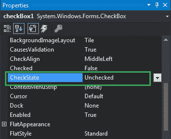
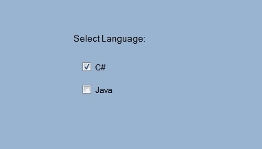
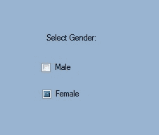

# 如何在 C# 中设置 CheckBox 的状态？

> 原文:[https://www . geeksforgeeks . org/如何设置 c-sharp 中复选框的状态/](https://www.geeksforgeeks.org/how-to-set-the-state-of-the-checkbox-in-c-sharp/)

CheckBox 控件是 windows 窗体中用于接收用户输入的部分。或者换句话说，CheckBox 控件允许我们从给定的列表中选择单个或多个元素。在复选框中，您可以使用复选框的**检查状态属性**来获取或设置复选框的状态。在 CheckBox 中，有三种不同类型的状态可用:

<figure class="table">

| 检查状态 | 对于正常外观 | 对于按钮外观 |
| --- | --- | --- |
| 检查 | 复选框显示一个复选标记。 | 控件看起来凹陷了。 |
| 未加抑制的 | 复选框是空的。 | 控件看起来已被提升。 |
| 模糊的 | 复选框显示一个复选标记，并带有阴影。 | 控件看起来很平。 |

</figure>

CheckState 属性的默认值为*未选中*。在 Windows 窗体中，可以通过两种不同的方式设置此属性:

**1。设计时:**使用以下步骤设置 CheckBox 的 CheckState 属性是最简单的方法:

*   **第一步:**创建如下图所示的窗口表单:
    T3】Visual Studio->File->New->Project->windows formapp


*   **步骤 2:** 从工具箱中拖动 CheckBox 控件，并将其放到窗口窗体上。您可以根据需要将 CheckBox 放在 windows 窗体上的任何位置。


*   **步骤 3:** 拖放后，您将转到 CheckBox 控件的属性，使用 CheckState 属性设置 CheckBox 的状态。



**输出:**



**2。运行时:**比上面的方法稍微复杂一点。在此方法中，可以使用以下语法以编程方式设置 CheckBox 的 CheckState 属性:

```cs
public System.Windows.Forms.CheckState CheckState { get; set; }
```

这里，检查状态用于表示检查状态枚举值。如果分配给 CheckState 属性的值不属于 CheckState 枚举值，它还会引发*InvalidEnumArgumentException*。以下步骤用于设置复选框的检查状态属性:

*   **步骤 1:** 使用 checkbox 类提供的 CheckBox()构造函数创建一个 CheckBox。

```cs
// Creating checkbox
CheckBox Mycheckbox = new CheckBox();
```

*   **步骤 2:** 创建 CheckBox 后，设置 CheckBox 类提供的 CheckBox 的 CheckState 属性。

```cs
// Set the CheckState property of the CheckBox
Mycheckbox1.CheckState = CheckState.Indeterminate;
```

*   **第 3 步:**最后使用 add()方法将该复选框控件添加到表单中。

```cs
// Add this checkbox to form
this.Controls.Add(Mycheckbox);
```

**示例:**

## C#

```cs
using System;
using System.Collections.Generic;
using System.ComponentModel;
using System.Data;
using System.Drawing;
using System.Linq;
using System.Text;
using System.Threading.Tasks;
using System.Windows.Forms;

namespace WindowsFormsApp5 {

public partial class Form1 : Form {

    public Form1()
    {
        InitializeComponent();
    }

    private void Form1_Load(object sender, EventArgs e)
    {
        // Creating and setting the properties of label
        Label l = new Label();
        l.Text = "Select Gender:";
        l.Location = new Point(233, 111);

        // Adding label to form
        this.Controls.Add(l);

        // Creating and setting the properties of CheckBox
        CheckBox Mycheckbox = new CheckBox();
        Mycheckbox.Height = 50;
        Mycheckbox.Width = 100;
        Mycheckbox.Location = new Point(229, 136);
        Mycheckbox.Text = "Male";
        Mycheckbox.CheckState = CheckState.Unchecked;

        // Adding checkbox to form
        this.Controls.Add(Mycheckbox);

        // Creating and setting the properties of CheckBox
        CheckBox Mycheckbox1 = new CheckBox();
        Mycheckbox1.Height = 50;
        Mycheckbox1.Width = 100;
        Mycheckbox1.Location = new Point(230, 174);
        Mycheckbox1.Text = "Female";
        Mycheckbox1.CheckState = CheckState.Indeterminate;

        // Adding checkbox to form
        this.Controls.Add(Mycheckbox1);
    }
}
}
```

**输出:**

