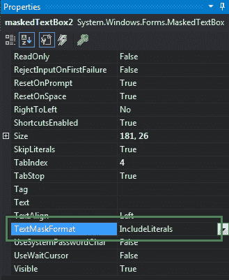
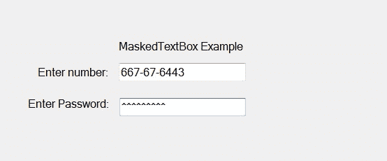
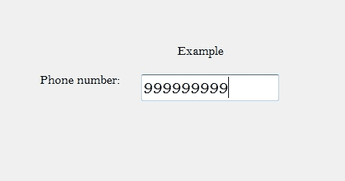

# 如何在 C#中设置掩码文本框的文本掩码格式？

> 原文:[https://www . geeksforgeeks . org/如何设置 c-sharp 中 maskedtextbox 的文本掩码格式/](https://www.geeksforgeeks.org/how-to-set-the-text-mask-format-of-the-maskedtextbox-in-c-sharp/)

在 C#中，MaskedTextBox 控件为表单上的用户输入(如日期、电话号码等)提供了一个验证过程。或者换句话说，它被用来提供区分正确和不正确用户输入的屏蔽。在掩码文本框控件中，使用掩码文本框控件提供的**文本掩码格式属性**，设置一个值，该值指示文本和提示字符包含在掩码文本框中的格式化字符串中。这个属性有四个值，这些值是在 MaskFormat 枚举下定义的，这些值是:

*   ExcludePromptAndLiterals 值返回用户提供的文本输入。
*   IncludeLiterals 值返回用户提供的文本输入和掩码中定义的文字字符。
*   IncludePrompt 值返回用户提供的文本输入和提示字符的实例。
*   IncludePromptAndLiterals 值提供用户给出的文本输入、掩码中定义的文字字符以及提示字符的实例。

此属性的默认值为 IncludeLiterals。您可以通过两种不同的方式设置此属性:

**1。设计时:**最简单的方法是设置 MaskedTextBox 控件的 TextMaskFormat 属性的值，如下步骤所示:

*   **Step 1:** Create a windows form as shown in the below image:

    **Visual Studio - >文件- >新建- >项目->window formapp**

    

*   **Step 2:** Next, drag and drop the MaskedTextBox control from the toolbox on the form. As shown in the below image:

    

*   **Step 3:** After drag and drop you will go to the properties of the MaskedTextBox and set the value of TextMaskFormat property of MaskedTextBox control as shown in the below image:

    

    **输出:**

    

**2。运行时:**比上面的方法稍微复杂一点。在此方法中，您可以在给定语法的帮助下，以编程方式设置 MaskedTextBox 控件的 TextMaskFormat 属性的值:

```
public System.Windows.Forms.MaskFormat TextMaskFormat { get; set; }
```

这里，掩码格式保存 TextMaskFormat 属性的值。如果这个属性的值不属于 MaskFormat 枚举，那么它将抛出一个*InvalidEnumArgumentException*。以下步骤显示如何动态设置掩码文本框控件的 TextMaskFormat 属性的值:

*   **步骤 1:** 使用 masketextbox()构造函数创建一个 masketextbox，该构造函数由 masketextbox 类提供。

    ```
    // Creating a MaskedTextBox
    MaskedTextBox m = new MaskedTextBox();

    ```

*   **第 2 步:**创建 masketextbox 后，设置 masketextbox 类提供的 masketextbox 的 TextMaskFormat 属性。

    ```
    // Setting the TextMaskFormat property
    m.TextMaskFormat = MaskFormat.IncludeLiterals;

    ```

*   **Step 3:** And last add this MaskedTextBox control to the form using the following statement:

    ```
    // Adding MaskedTextBox control on the form
    this.Controls.Add(m);

    ```

    **示例:**

    ```
    using System;
    using System.Collections.Generic;
    using System.ComponentModel;
    using System.Data;
    using System.Drawing;
    using System.Linq;
    using System.Text;
    using System.Threading.Tasks;
    using System.Windows.Forms;

    namespace WindowsFormsApp39 {

    public partial class Form1 : Form {

        public Form1()
        {
            InitializeComponent();
        }

        private void Form1_Load(object sender, EventArgs e)
        {

            // Creating and setting the 
            // properties of the Label
            Label l1 = new Label();
            l1.Location = new Point(413, 98);
            l1.Size = new Size(176, 20);
            l1.Text = " Example";
            l1.Font = new Font("Bell MT", 12);

            // Adding label on the form
            this.Controls.Add(l1);

            // Creating and setting the
            // properties of Label
            Label l2 = new Label();
            l2.Location = new Point(242, 135);
            l2.Size = new Size(126, 20);
            l2.Text = "Phone number:";
            l2.Font = new Font("Bell MT", 12);

            // Adding label on the form
            this.Controls.Add(l2);

            // Creating and setting the 
            // properties of MaskedTextBox
            MaskedTextBox m = new MaskedTextBox();
            m.Location = new Point(374, 137);
            m.Mask = "000000000";
            m.Size = new Size(176, 20);
            m.Name = "MyBox";
            m.BorderStyle = BorderStyle.Fixed3D;
            m.TextMaskFormat = MaskFormat.IncludeLiterals;
            m.Font = new Font("Bell MT", 18);

            // Adding MaskedTextBox
            // control on the form
            this.Controls.Add(m);
        }
    }
    }
    ```

    **输出:**

    