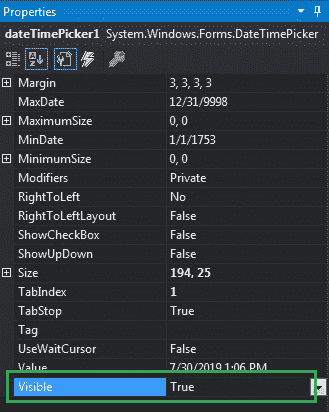

# 如何在 C#中设置 DateTimePicker 的可见性？

> 原文:[https://www . geeksforgeeks . org/如何设置 c-sharp 中 datetimepicker 的可见性/](https://www.geeksforgeeks.org/how-to-set-the-visibility-of-datetimepicker-in-c-sharp/)

在 Windows 窗体中，DateTimePicker 控件用于选择和显示窗体中特定格式的日期/时间。在 DateTimePicker 控件中，可以使用**可见属性**设置该控件的可见性。如果此属性的值设置为真，则屏幕上将显示日期时间选择器控件。如果此属性的值设置为 false，则 DateTimePicker 控件不会显示在屏幕上。此属性的默认值为真。您可以通过两种不同的方式设置此属性:

**1。设计时:**设置日期时间选择器的可见性是最简单的方法，如以下步骤所示:

*   **Step 1:** Create a windows form as shown in the below image:

    **Visual Studio->File->New->Project->window formapp**
    

*   **Step 2:** Next, drag and drop the DateTimePicker control from the toolbox to the form as shown in the below image:

    

*   **Step 3:** After drag and drop you will go to the properties of the DateTimePicker and set the visibility of the DateTimePicker as shown in the below image:

    

    **输出:**
    

**2。运行时:**比上面的方法稍微复杂一点。在此方法中，您可以借助给定的语法以编程方式设置 DateTimePicker 控件的可见性:

```
public bool Visible { get; set; }
```

该属性的值为**系统。布尔**类型，非真即假。以下步骤显示了如何动态设置日期时间选择器的可见性:

*   **步骤 1:** 使用 DateTimePicker 类提供的 DateTimePicker()构造函数创建一个 DateTimePicker。

    ```
    // Creating a DateTimePicker
    DateTimePicker dt = new DateTimePicker();

    ```

*   **步骤 2:** 创建日期选择器后，设置由日期选择器类提供的日期选择器的可见属性。

    ```
    // Setting the visibility
    dt.Visible = false;

    ```

*   **Step 3:** And last add this DateTimePicker control to the form using the following statement:

    ```
    // Adding this control to the form
    this.Controls.Add(dt);

    ```

    **示例:**

    ```
    using System;
    using System.Collections.Generic;
    using System.ComponentModel;
    using System.Data;
    using System.Drawing;
    using System.Linq;
    using System.Text;
    using System.Threading.Tasks;
    using System.Windows.Forms;

    namespace WindowsFormsApp48 {

    public partial class Form1 : Form {

        public Form1()
        {
            InitializeComponent();
        }

        private void Form1_Load(object sender, EventArgs e)
        {

            // Creating and setting the 
            // properties of the Label
            Label lab = new Label();
            lab.Location = new Point(183, 162);
            lab.Size = new Size(172, 20);
            lab.Text = "Select Date and Time";
            lab.Font = new Font("Comic Sans MS", 12);

            // Adding this control to the form
            this.Controls.Add(lab);

            // Creating and setting the
            // properties of the DateTimePicker
            DateTimePicker dt = new DateTimePicker();
            dt.Location = new Point(360, 162);
            dt.Size = new Size(292, 26);
            dt.MaxDate = new DateTime(2500, 12, 20);
            dt.MinDate = new DateTime(1753, 1, 1);
            dt.Format = DateTimePickerFormat.Long;
            dt.Name = "MyPicker";
            dt.Font = new Font("Comic Sans MS", 12);
            dt.Visible = false;
            dt.Value = DateTime.Today;

            // Adding this 
            // control to the form
            this.Controls.Add(dt);
        }
    }
    }
    ```

    **输出:**

    在将“可见”属性设置为 false 之前:

    

    将“可见”属性设置为 false 后:

    