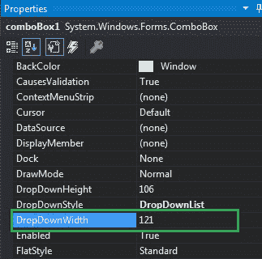
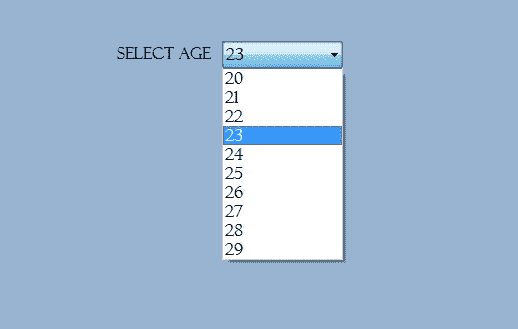

# 如何在 C#中设置组合框中下拉列表的宽度？

> 原文:[https://www . geesforgeks . org/如何设置 c-sharp 中的下拉列表宽度/](https://www.geeksforgeeks.org/how-to-set-the-width-of-the-drop-down-list-in-the-combobox-in-c-sharp/)

在 Windows 窗体中，组合框在单个控件中提供了两种不同的功能，这意味着组合框同时作为文本框和列表框工作。在组合框中，一次只显示一个项目，其余项目出现在下拉菜单中。您可以使用**下拉宽度属性**在组合框中设置下拉列表的宽度(以像素为单位)。您可以使用两种不同的方法设置此属性:

**1。设计时:**使用以下步骤设置组合框控件的 DropDownWidth 属性是最简单的方法:

*   **第一步:**创建如下图所示的窗口表单:
    **Visual Studio->File->New->Project->windows formpp**
    
*   **第 2 步:**从工具箱中拖动组合框控件，并将其放到窗口窗体上。根据您的需要，您可以将组合框控件放在窗口窗体的任何位置。
    T3】
*   **Step 3:** After drag and drop you will go to the properties of the ComboBox control to set the DropDownWidth property of the ComboBox.
    

    **输出:**
    

**2。运行时:**比上面的方法稍微复杂一点。在此方法中，您可以在给定语法的帮助下，以编程方式设置组合框中下拉列表的宽度:

```cs
public int DropDownWidth { get; set; }
```

这里，该属性的值为*系统。Int32* 型。如果该属性的值小于 1，它将引发*参数异常*。以下步骤用于设置组合框元素的下拉宽度属性:

*   **步骤 1:** 使用组合框类提供的组合框()构造函数创建组合框。

    ```cs
    // Creating ComboBox using ComboBox class
    ComboBox mybox = new ComboBox();

    ```

*   **步骤 2:** 创建组合框后，设置组合框类提供的组合框的 DropDownWidth 属性。

    ```cs
    // Set DropDownWidth property of the combobox
    mybox.DropDownWidth = 216;

    ```

*   **Step 3:** And last add this combobox control to form using Add() method.

    ```cs
    // Add this ComboBox to form
    this.Controls.Add(mybox);

    ```

    **示例:**

    ```cs
    using System;
    using System.Collections.Generic;
    using System.ComponentModel;
    using System.Data;
    using System.Drawing;
    using System.Linq;
    using System.Text;
    using System.Threading.Tasks;
    using System.Windows.Forms;

    namespace WindowsFormsApp14 {

    public partial class Form1 : Form {

        public Form1()
        {
            InitializeComponent();
        }

        private void Form1_Load(object sender, EventArgs e)
        {
            // Creating and setting the properties of label
            Label l = new Label();
            l.Location = new Point(222, 80);
            l.Size = new Size(99, 18);
            l.Text = "Select Id";

            // Adding this label to the form
            this.Controls.Add(l);

            // Creating and setting the properties of comboBox
            ComboBox mybox = new ComboBox();
            mybox.Location = new Point(327, 77);
            mybox.Size = new Size(216, 26);
            mybox.MaxLength = 3;
            mybox.DropDownStyle = ComboBoxStyle.DropDown;
            mybox.DropDownWidth = 216;
            mybox.Items.Add(240);
            mybox.Items.Add(241);
            mybox.Items.Add(242);
            mybox.Items.Add(243);
            mybox.Items.Add(244);

            // Adding this ComboBox to the form
            this.Controls.Add(mybox);
        }
    }
    }
    ```

    **输出:**
    