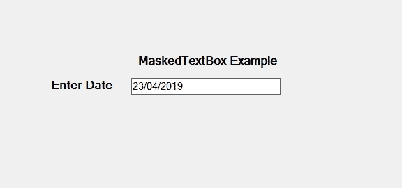

# 如何在 C#中设置 MaskedTextBox 的边框样式？

> 原文:[https://www . geeksforgeeks . org/how-style-of-the-maskedtxbox-in-c-sharp/](https://www.geeksforgeeks.org/how-to-style-the-border-of-the-maskedtextbox-in-c-sharp/)

在 C#中，MaskedTextBox 控件为表单上的用户输入(如日期、电话号码等)提供了一个验证过程。或者换句话说，它被用来提供区分正确和不正确用户输入的屏蔽。在掩码文本框控件中，可以使用**边框样式属性**设置掩码文本框的边框样式。此属性有三个不同的值，在 BorderStyle 枚举下定义，这些值是:

*   无值表示无边框。
*   三维边框的固定三维值。
*   单行边框的固定单一值。

此属性的默认值为固定 3D。您可以通过两种不同的方式设置此属性:

**1。设计时:**最简单的方法是设置掩码文本框的边框样式，如以下步骤所示:

*   **第一步:**创建如下图所示的窗口表单:
    **Visual Studio->File->New->Project->windows formpp**
    
*   **Step 2:** Next, drag and drop the MaskedTextBox control from the toolbox on the form as shown in the below screenshot:

    

*   **Step 3:** After drag and drop you will go to the properties of the MaskedTextBox and set the border style of the MaskedTextBox as shown in the below image:

    

    **输出:**
    

**2。运行时:**比上面的方法稍微复杂一点。在此方法中，您可以在给定语法的帮助下，以编程方式设置 MaskedTextBox 控件的边框样式:

```cs
public System.Windows.Forms.BorderStyle BorderStyle { get; set; }
```

这里，BorderStyle 表示 MaskedTextBox 控件的边框类型。如果此属性的值不属于 BorderStyle 属性，它将引发*InvalidEnumArgumentException*。下面的步骤展示了如何动态设置掩码文本框的边框样式:

*   **步骤 1:** 使用 masketextbox()构造函数创建一个 masketextbox，该构造函数由 masketextbox 类提供。

    ```cs
    // Creating a MaskedTextBox
    MaskedTextBox m = new MaskedTextBox();

    ```

*   **步骤 2:** 创建 masketextbox 后，设置 masketextbox 类提供的 masketextbox 的 BorderStyle 属性。

    ```cs
    // Setting the BorderStyle
    m.BorderStyle = BorderStyle.Fixed3D;

    ```

*   **Step 3:** And last add this MaskedTextBox control to the form using the following statement:

    ```cs
    // Adding MaskedTextBox control on the form
    this.Controls.Add(m);

    ```

    **示例:**

    ```cs
    using System;
    using System.Collections.Generic;
    using System.ComponentModel;
    using System.Data;
    using System.Drawing;
    using System.Linq;
    using System.Text;
    using System.Threading.Tasks;
    using System.Windows.Forms;

    namespace WindowsFormsApp36 {

    public partial class Form1 : Form {

        public Form1()
        {
            InitializeComponent();
        }

        private void Form1_Load(object sender, EventArgs e)
        {
            // Creating and setting the 
            // properties of the Label
            Label l1 = new Label();
            l1.Location = new Point(413, 98);
            l1.Size = new Size(176, 20);
            l1.Text = " Example";
            l1.Font = new Font("Bauhaus 93", 12);

            // Adding label on the form
            this.Controls.Add(l1);

            // Creating and setting the
            // properties of Label
            Label l2 = new Label();
            l2.Location = new Point(242, 135);
            l2.Size = new Size(126, 20);
            l2.Text = "Phone number:";
            l2.Font = new Font("Bauhaus 93", 12);

            // Adding label on the form
            this.Controls.Add(l2);

            // Creating and setting the 
            // properties of the MaskedTextBox
            MaskedTextBox m = new MaskedTextBox();
            m.Location = new Point(374, 137);
            m.Mask = "000000000";
            m.Size = new Size(176, 20);
            m.Name = "MyBox";
            m.BorderStyle = BorderStyle.Fixed3D;
            m.Font = new Font("Bauhaus 93", 18);

            // Adding MaskedTextBox 
            // control on the form
            this.Controls.Add(m);
        }
    }
    }
    ```

    **输出:**

    