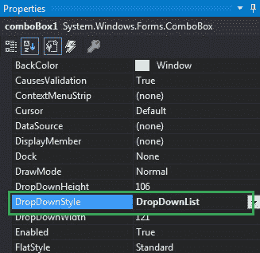
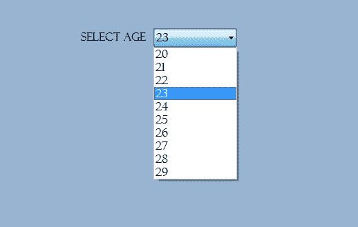
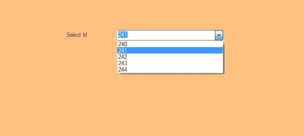

# 如何在 C#的 ComboBox 中设置下拉列表的样式？

> 原文:[https://www . geesforgeks . org/how-to-style-the-下拉列表-in-combobox-in-c-sharp/](https://www.geeksforgeeks.org/how-to-style-the-drop-down-list-in-combobox-in-c-sharp/)

在 Windows 窗体中，组合框在单个控件中提供了两种不同的功能，这意味着组合框同时作为文本框和列表框工作。在组合框中，一次只显示一个项目，其余项目出现在下拉菜单中。您可以使用**下拉列表属性**在组合框中设置下拉列表的样式。该属性的值由 ComboBoxStyle 枚举提供，值为:

*   **简单:**在此样式中，列表可见，文本可编辑。
*   **下拉菜单:**在这种样式中，当你点击下拉箭头时，列表是可见的，并且列表是可编辑的。
*   **DropDownList:** 在这种风格下，点击下拉箭头就可以看到列表，列表是不可编辑的。

该属性的默认值是 DrOp。您可以使用两种不同的方法设置此属性:

**1。设计时:**使用以下步骤设置组合框控件的 DropDownStyle 属性是最简单的方法:

*   **第一步:**创建如下图所示的窗口表单:
    **Visual Studio->File->New->Project->windows formpp**
    
*   **第 2 步:**从工具箱中拖动组合框控件，并将其放到窗口窗体上。根据您的需要，您可以将组合框控件放在窗口窗体的任何位置。
    T3】
*   **Step 3:** After drag and drop you will go to the properties of the ComboBox control to set the DropDownStyle property of the ComboBox.
    

    **输出:**
    

**2。运行时:**比上面的方法稍微复杂一点。在此方法中，您可以在给定语法的帮助下，以编程方式设置组合框中下拉列表的样式:

```
public System.Windows.Forms.ComboBoxStyle DropDownStyle { get; set; }
```

这里，样式值由 ComboBoxStyle 提供。如果分配给该属性的值不属于 ComboBoxStyle，它将引发*InvalidEnumArgumentException*。以下步骤用于设置组合框元素的 DropDownStyle 属性:

*   **步骤 1:** 使用组合框类提供的组合框()构造函数创建组合框。

    ```
    // Creating ComboBox using ComboBox class
    ComboBox mybox = new ComboBox();

    ```

*   **第二步:**创建组合框后，设置组合框类提供的组合框的 DropDownStyle 属性。

    ```
    // Set DropDownStyle property of the combobox
     mybox.DropDownStyle = ComboBoxStyle.DropDown;

    ```

*   **Step 3:** And last add this combobox control to form using Add() method.

    ```
    // Add this ComboBox to form
    this.Controls.Add(mybox);

    ```

    **示例:**

    ```
    using System;
    using System.Collections.Generic;
    using System.ComponentModel;
    using System.Data;
    using System.Drawing;
    using System.Linq;
    using System.Text;
    using System.Threading.Tasks;
    using System.Windows.Forms;

    namespace WindowsFormsApp14 {

    public partial class Form1 : Form {

        public Form1()
        {
            InitializeComponent();
        }

        private void Form1_Load(object sender, EventArgs e)
        {
            // Creating and setting the properties of label
            Label l = new Label();
            l.Location = new Point(222, 80);
            l.Size = new Size(99, 18);
            l.Text = "Select Id";

            // Adding this label to the form
            this.Controls.Add(l);

            // Creating and setting the properties of comboBox
            ComboBox mybox = new ComboBox();
            mybox.Location = new Point(327, 77);
            mybox.Size = new Size(216, 26);
            mybox.MaxLength = 3;
            mybox.DropDownStyle = ComboBoxStyle.DropDown;
            mybox.Items.Add(240);
            mybox.Items.Add(241);
            mybox.Items.Add(242);
            mybox.Items.Add(243);
            mybox.Items.Add(244);

            // Adding this ComboBox to the form
            this.Controls.Add(mybox);
        }
    }
    }
    ```

    **输出:**
    