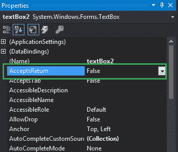
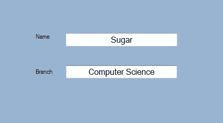
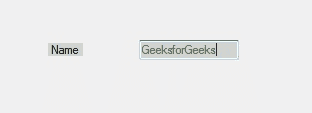

# 如何在 C# 中使用 TextBox 的 AcceptsReturn 属性？

> 原文:[https://www . geeksforgeeks . org/how-用法-accepts return-property-of-textbox-in-c-sharp/](https://www.geeksforgeeks.org/how-to-use-acceptsreturn-property-of-textbox-in-c-sharp/)

在文本框中，您可以设置一个值，该值显示在多行文本框控件中按回车键是在文本框控件中创建新的文本行，还是使用 **AcceptsReturn 属性**激活表单的默认按钮。
如果该属性的值设置为真，则回车键在多行文本框控件中创建新的文本行，如果该属性的值设置为假，则回车键激活表单的默认按钮。此属性的默认值为 false。在 Windows 窗体中，可以通过两种不同的方式设置此属性:

**1。设计时:**设置文本框的 AcceptsReturn 属性是最简单的方法，如下步骤所示:

*   **步骤 1:** 创建窗口表单。
    **Visual Studio - >文件- >新建- >项目- >窗口形式程序**
    T6】
*   **步骤 2:** 从工具箱中拖动 TextBox 控件，并将其放到窗口窗体上。您可以根据需要将文本框控件放置在 windows 窗体上的任何位置。
    T3】
*   **Step 3:** After drag and drop you will go to the properties of the TextBox control to set the AcceptsReturn property of the TextBox.
    

    **输出:**
    

**运行时间:**比之前的方法稍微复杂一点。在此方法中，您可以在给定语法的帮助下，以编程方式设置文本框的 AcceptsReturn 属性:

```cs
public bool AcceptsReturn { get; set; }
```

这里，系统的这个属性的值。布尔类型。以下步骤用于设置文本框的“接受”属性:

*   **步骤 1 :** 使用 textbox 类提供的 TextBox()构造函数创建一个 TextBox。

    ```cs
    // Creating textbox
    TextBox Mytextbox = new TextBox();

    ```

*   **第二步:**创建文本框后，设置文本框类提供的文本框的 AcceptsReturn 属性。

    ```cs
    // Set AcceptsReturn property
    Mytextbox.AcceptsReturn = false;

    ```

*   **Step 3 :** And last add this textbox control to from using Add() method.

    ```cs
    // Add this textbox to form
    this.Controls.Add(Mytextbox);

    ```

    **示例:**

    ```cs
    using System;
    using System.Collections.Generic;
    using System.ComponentModel;
    using System.Data;
    using System.Drawing;
    using System.Linq;
    using System.Text;
    using System.Threading.Tasks;
    using System.Windows.Forms;

    namespace my {

    public partial class Form1 : Form {

        public Form1()
        {
            InitializeComponent();
        }

        private void Form1_Load(object sender, EventArgs e)
        {
            // Creating and setting the properties of Lable1
            Label Mylablel = new Label();
            Mylablel.Location = new Point(96, 54);
            Mylablel.Text = "Name";
            Mylablel.AutoSize = true;
            Mylablel.BackColor = Color.LightGray;

            // Add this label to form
            this.Controls.Add(Mylablel);

            // Creating and setting the properties of TextBox1
            TextBox Mytextbox = new TextBox();
            Mytextbox.Location = new Point(187, 51);
            Mytextbox.BackColor = Color.LightGray;
            Mytextbox.ForeColor = Color.DarkOliveGreen;
            Mytextbox.AutoSize = true;
            Mytextbox.AcceptsReturn = false;

            // Add this textbox to form
            this.Controls.Add(Mytextbox);
        }
    }
    }
    ```

    **输出:**
    