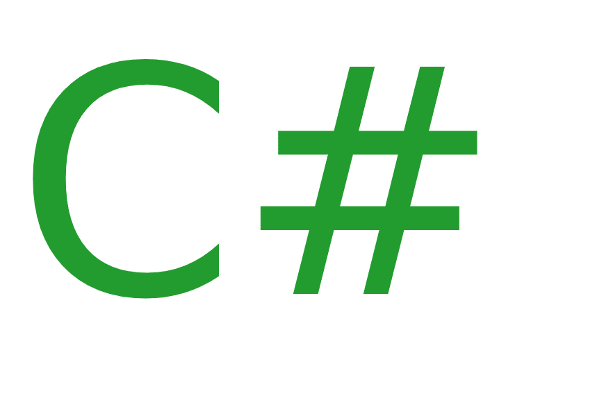

# c# 有趣的事实

> 原文:[https://www . geesforgeks . org/interior-facts-about-c-sharp/](https://www.geeksforgeeks.org/interesting-facts-about-c-sharp/)

[C# ](https://www.geeksforgeeks.org/introduction-to-c-sharp/) 是一种通用、现代和面向对象的编程语言，发音为“C Sharp”或“C Hash”。它是由安德斯·海尔斯伯格和他的团队领导的微软在[T3 内部开发的。NET](https://www.geeksforgeeks.org/introduction-to-net-framework/) 倡议并获得了欧洲计算机制造商协会(ECMA)和国际标准组织(ISO)的批准。C# 是公共语言基础设施的语言之一，C# 的当前版本是 7.2 版。C# 在语法上与 Java 有很多相似之处，对于有 [C](https://www.geeksforgeeks.org/c/) 、 [C++](https://www.geeksforgeeks.org/c-plus-plus/) 或 [Java](https://www.geeksforgeeks.org/java/) 知识的用户来说，很容易上手。

**这里有一些关于 C# 的令人敬畏的事实，你可能会感兴趣:**

1.  C 夏普语言的名字是由乐谱激发的。这里的锐，代表书面说明，应该使半音音高更高。
2.  微软第一次使用 C# 这个名字是在 1988 年。
3.  C# 语言的语法类似于 C 风格的家族，如 Java、C、C++。
4.  C# 语言适合为嵌入式系统编写应用程序。
5.  C# 语言有利于开发游戏。Unity(商业游戏引擎的大多数领导者)也用它来开发游戏。
6.  C# 语言包含支持泛型和模板的最高级别。
7.  C# 支持国际化。
8.  C# 语言用于开发网页、安卓应用等。
9.  C# 和 XAML 是开发视窗商店应用程序的主要语言。
10.  C# 语言有本机垃圾收集。