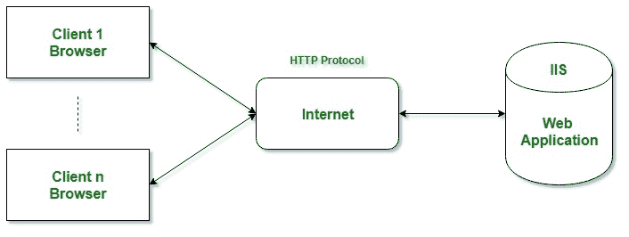

# ASP.NET 简介

> 原文:[https://www.geeksforgeeks.org/introduction-to-asp-net/](https://www.geeksforgeeks.org/introduction-to-asp-net/)

ASP.NET 是一个由微软设计和开发的网络应用框架。ASP.NET 是开源的[的子集。NET Framework](https://www.geeksforgeeks.org/introduction-to-net-framework/) 和经典 ASP 的继承者(**A**active**S**erver**P**ages)。的 1.0 版。NET 框架，它于 2002 年 1 月首次发布。因此，一个问题浮现在脑海:在 2002 年之前，我们使用哪种技术来开发 web 应用程序和服务？答案是**经典 ASP** 。所以之前。NET 和 ASP.NET 有*经典 ASP* 。

ASP.NET 是建立在公共语言运行时之上的，它允许程序员使用任何语言来执行它的代码。NET 语言(C#、VB 等)。).它是专门为使用 HTTP 和 web 开发人员创建动态网页、web 应用程序、网站和 web 服务而设计的，因为它提供了 HTML、CSS 和 JavaScript 的良好集成。

。NET Framework 用于创建各种应用程序和服务，如控制台、网络和窗口等。但是 ASP.NET 只用于创建网络应用程序和网络服务。这就是为什么我们把 ASP.NET 称为。NET 框架。

下表说明了 ASP.NET 版本历史:

| 年 | 版本 |
| --- | --- |
| **2002** | **1.0** |
| **2003** | **1.1** |
| **2005** | **2.0** |
| **2006** | **3.0** |
| **2007** | **3.5** |
| **2008** | 3.5 SP1 |
| **2010** | **4.0** |
| **2012** | **4.5** |
| **2013** | **4.5.1** |
| **2014** | **4.5.2** |
| **2015** | **4.6** |
| **2015** | **4.6.1** |
| **2016** | **4.6.2** |
| **2017** | **4.7** |
| **2017** | **4.7.1** |

**注:【2015 年版本 *5 RC1* 来了，后来这个从 ASP.NET 分离出来，变成了一个新项目叫**ASP.NET 核心 1.0 版本**有了一些进步。**

#### 什么是网络应用？

网络应用程序是仅安装在网络服务器上的应用程序，用户可以使用网络浏览器访问该应用程序，如微软互联网浏览器、谷歌浏览器、Mozilla FireFox、苹果 Safari 等。还有一些其他的技术，比如 Java、PHP、Perl、Ruby on Rails 等等。可用于开发网络应用程序。Web 应用程序提供了跨平台特性。用户只需要一个网络浏览器就可以访问网络应用程序。使用。NET 框架或其子集需要在服务器端的**微软互联网信息服务(IIS)** 下执行。IIS 的工作是向客户端浏览器提供 web 应用程序生成的 HTML 代码结果，客户端浏览器启动请求，如下图所示。

**不要在 ASP.NET、ASP.NET 核心、ASP.NET MVC 等术语上混淆**。ASP(活动服务器页面)支持很多开发模型，如下所示:

*   **经典 ASP** :是微软开发的第一个服务器端脚本语言。
*   **ASP.NET**:是 web 开发框架，是经典 ASP 的继承者。ASP.NET 4.6 是最新版本。
*   **ASP.NET 芯**:2015 年 11 月，微软发布了后来被分离的 5.0 版 ASP.NET，被称为 ASP.NET 芯。此外，它被认为是 ASP.NET 的一个重要的重新设计，具有开源和跨平台的特点。在这个版本之前，ASP.NET 只被认为是 Windows 版本。
*   **ASP.NET 网络表单**:这些是事件驱动的应用模型，不被认为是新 ASP.NET 核心的一部分。这些用于提供服务器端事件和控件来开发 web 应用程序。
*   **ASP.NET MVC**:是可以和新的 ASP.NET 核心合并的模型-视图-控制器应用模型。它被用来建立动态网站，因为它提供了快速的发展。
*   **ASP.NET 网页**:这些是可以合并到 ASP.NET 芯的单页应用。
*   **ASP.NET API**:是 Web 应用编程接口(API)。

另外，为了创建网络应用程序，ASP.NET 提供了 3 种开发风格，分别是 ASP.NET 网页、ASP.NET MVC、网络表单。

#### 为什么是 ASP.NET？

ASP.NET 在开发商中受欢迎有很多原因。下面列出了一些原因:

**延伸。NET 框架:**ASP.NET 是。NET 框架，因为它扩展了。NET 框架和一些开发网络应用的库和工具。它给。NET Framework 是用于常见 web 模式的*库，如 MVC* 、*编辑器扩展*、*处理 web 请求的基础框架*和*网页模板语法，如 Razor* 等。

**性能:**比市面上其他可用的 web 框架都要快。

**后端代码:**在 ASP.NET 的帮助下，你可以用 [C# ](https://www.geeksforgeeks.org/csharp-programming-language/) 编写数据访问和任何逻辑的后端代码。

**动态网页:**在 ASP.NET，Razor 提供了借助 C# 和 HTML 开发动态网页的语法。ASP.NET 可以与 [JS(JavaScript)](https://www.geeksforgeeks.org/javascript-tutorial/) 集成，它还包括了像 SPA(单页应用)的 React 和 Angular 这样的框架。)

**支持不同的操作系统:**可以在 Windows、Linux、Docker、MacOS 上开发执行 ASP.NET 应用。Visual Studio 提供了构建工具。NET 应用不同的操作系统。