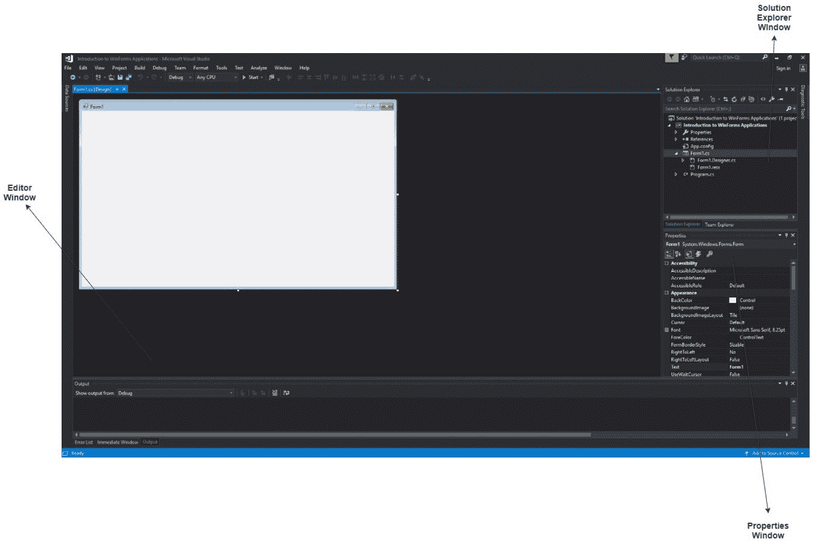

# c# Windows 窗体应用程序简介

> 原文:[https://www . geesforgeks . org/introduction-to-c-sharp-windows-forms-applications/](https://www.geeksforgeeks.org/introduction-to-c-sharp-windows-forms-applications/)

Windows 窗体是一个捆绑在*中的图形用户界面类库。网络框架*。它的主要目的是提供一个更容易的界面来开发桌面、平板电脑、个人电脑的应用程序。它也被称为 **WinForms** 。使用窗口窗体或 WinForms 开发的应用程序被称为运行在台式计算机上的**窗口窗体应用程序**。WinForms 只能用于开发 Windows 窗体应用程序，而不能用于开发 web 应用程序。WinForms 应用程序可以包含不同类型的控件，如标签、列表框、工具提示等。

#### 使用 Visual Studio 2017 创建 Windows 窗体应用程序

*   First, open the Visual Studio then Go to **File -> New -> Project** to create a new project and then select the language as *Visual C#* from the left menu. Click on *Windows Forms App(.NET Framework)* in the middle of current window. After that give the project name and Click **OK**.

    

    这里的解决方案就像一个容器，包含程序可能需要的项目和文件。

*   After that following window will display which will be divided into three parts as follows:
    1.  **编辑器窗口或主窗口:**在这里，您将处理表单和代码编辑。您可以注意到表单的布局现在是空白的。您将双击表单，然后它将打开该表单的代码。
    2.  **解决方案资源管理器窗口:**用于在解决方案中的所有项目之间导航。例如，如果您将从该窗口中选择一个文件，则特定信息将显示在属性窗口中。
    3.  **属性窗口:**该窗口用于在解决方案资源管理器中更改所选项目的不同属性。此外，您可以更改将添加到表单中的组件或控件的属性。

    

    您也可以通过将其设置为默认值来重置窗口布局。要设置默认布局，请转到 Visual Studio 菜单中的**窗口- >重置窗口布局**。

*   Now **to add the controls to your WinForms application** go to **Toolbox** tab present in the extreme left side of Visual Studio. Here, you can see a list of controls. To access the most commonly used controls go to **Common Controls** present in Toolbox tab.

    

*   Now drag and drop the controls that you needed on created Form. For example, if you can add TextBox, ListBox, Button etc. as shown below. By clicking on the particular dropped control you can see and change its properties present in the right most corner of Visual Studio.

    

    在上图中，您可以看到文本框被选中，其属性如文本对齐、最大长度等。在最右边的角落打开。您可以根据应用程序的需要更改其属性值。控件的代码将在后台自动添加。可以查看*表格 1。解决方案资源管理器窗口中存在的设计器. cs* 文件。

*   To run the program you can use an **F5 key** or **Play button** present in the toolbar of Visual Studio. To stop the program you can use pause button present in the ToolBar. You can also run the program by going to **Debug->Start Debugging** menu in the menubar.

    