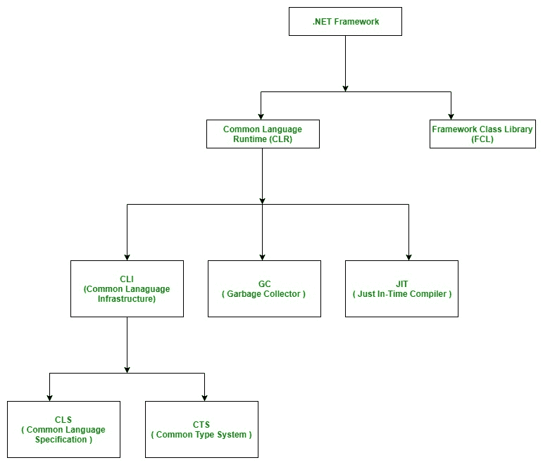

# 简介。NET 框架

> 原文:[https://www . geesforgeks . org/introduction-to-net-framework/](https://www.geeksforgeeks.org/introduction-to-net-framework/)

**。NET** 是微软设计开发的软件框架。的第一个版本。Net 框架是 2002 年出现的 1.0。简单来说，就是一个虚拟机，用来编译执行像[c#](https://www.geeksforgeeks.org/introduction-to-c/)VB.Net 等不同语言编写的程序。

它用于开发基于表单的应用程序、基于网络的应用程序和网络服务。上有多种编程语言。网络平台，VB.Net 和 [C#](https://www.geeksforgeeks.org/introduction-to-c/) 是最常见的。它用于为 Windows、电话、web 等构建应用程序。它提供了很多功能，也支持行业标准。

。NET Framework 支持 60 多种编程语言，其中 11 种编程语言由微软设计开发。其余 [**非微软语言**](https://bitbucket.org/brianritchie/wiki/wiki/.NET%20Languages) 支持。NET 框架，但不是由微软设计和开发的。

**微软设计开发的 11 种编程语言为:**

*   C#。网
*   VB.NET
*   C++。网
*   J #。网
*   F#。网
*   JSCRIPT.NET
*   WINDOWS POWERSHELL
*   铁红宝石
*   铁蟒
*   C OMEGA
*   ASML(抽象状态机语言)

### 的主要组成部分。NET 框架

[**【公共语言运行库】**](https://www.geeksforgeeks.org/common-language-runtime-clr-in-c/) **:** 公共语言运行库是的基本和虚拟机组件。NET 框架。中的运行时环境。NET Framework，它运行代码，并通过提供各种服务(如远程处理、线程管理、类型安全、内存管理、健壮性等)来帮助简化开发过程..基本上，它负责管理。NET 程序，无论任何。NET 编程语言。它还有助于管理代码，因为以运行时为目标的代码称为托管代码，不以运行时为目标的代码称为非托管代码。

**框架类库(FCL):** 它是可与 CLR 集成的可重用的、面向对象的类库和方法等的集合。也称为程序集。它就像 C/C++中的头文件和 java 中的包。安装。NET 框架基本上是把 CLR 和 FCL 安装到系统中。下面是的概述。NET 框架

### 就是。NET 应用程序平台依赖还是平台独立？

*操作系统架构和 CPU 架构的结合*被称为平台。平台相关意味着编程语言代码将只在特定的操作系统上运行。一*。NET 应用程序依赖于平台*是因为。NET 框架，它只能在基于 Windows 的操作系统上运行。那个。Net 应用程序是独立于平台的，也是因为 *Mono 框架*。使用 Mono 框架。Net 应用程序可以在任何操作系统上运行，包括窗口。Mono 框架是 [**Novell 公司**](https://www.microfocus.com/novell/) 开发的第三方软件，现在是 [**微焦点公司**](https://www.microfocus.com/novell/) 的一部分。这是一个付费的框架。

**的发布历史。NET 框架及其与不同 Windows 版本的兼容性**

<figure class="table">

| 。NET 版本 | CLR 版本 | 

开发工具

 | Windows 支持 |
| --- | --- | --- | --- |
| **1.0** | One | Visual Studio。网 | XP SP1 |
| **1.1** | One point one | Visual Studio。NET 2003 | XP SP2， SP3 |
| **2.0** | Two | Visual Studio 2005 | 不适用的 |
| **3.0** | Two | 表情混合 | 展望 |
| **3.5** | Two | Visual Studio 2008 | 7, 8, 8.1, 10 |
| **4.0** | four | Visual Studio 2010 | 不适用的 |
| **4.5** | four | Visual Studio 2012 | eight |
| **4.5.1** | four | Visual Studio 2013 | Eight point one |
| **4.5.2** | four | 不适用的 | 不适用的 |
| **4.6** | four | Visual Studio 2015 | 10 v1507 |
| **4.6.1** | four | Visual Studio 2015 更新 1 | 10 v1511 |
| **4.6.2** | four | 不适用的 | 10 v1607 |
| **4.7** | four | Visual Studio 2017 | 10 v1703 |
| **4.7.1** | four | Visual Studio 2017 | 10 v1709 |
| **4.7.2** | four | Visual Studio 2017 | 10v 1803 |

</figure>

**要点:**

*   Visual Studio 是用于设计和开发的开发工具。NET 应用程序。对于使用 Visual Studio，用户必须首先安装。NET 框架在系统上的应用。
*   在 Windows 操作系统的旧版本中，如 XP SP1、SP2 或 SP3。NET 框架与安装介质集成在一起。
*   Windows 8、8.1 或 10 不提供预安装的 3.5 或更高版本。NET 框架。因此，高于 3.5 的版本必须从 Windows 安装介质或按需从互联网安装。Windows update 将给出安装的建议。NET 框架。