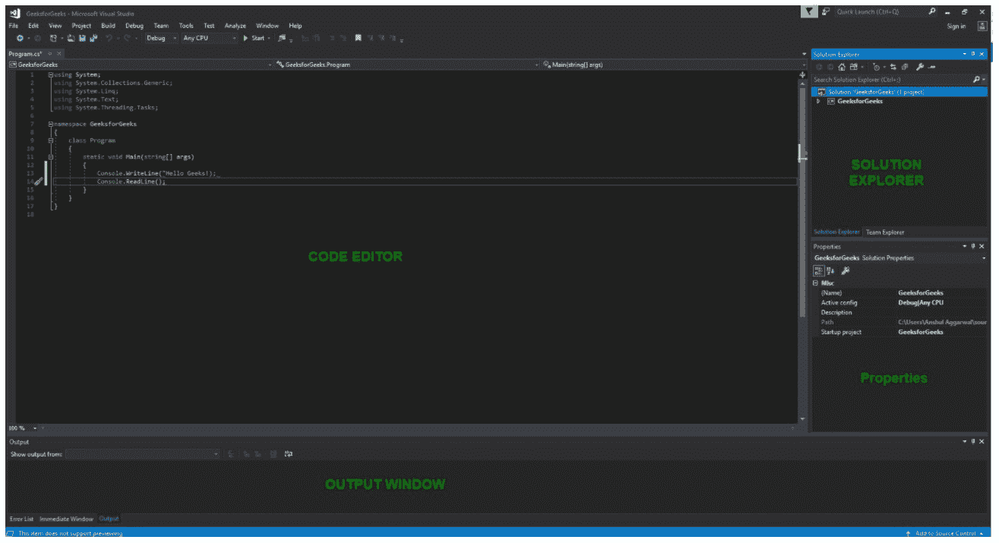
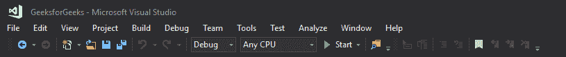
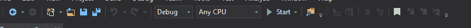

# Visual Studio 简介

> 原文:[https://www . geesforgeks . org/introduction-to-visual studio/](https://www.geeksforgeeks.org/introduction-to-visual-studio/)

Visual Studio 是微软开发的**集成开发环境(IDE)** ，用于开发 GUI(图形用户界面)、控制台、web 应用、web 应用、移动应用、云、Web 服务等。在这个集成开发环境的帮助下，您可以创建托管代码和本机代码。它使用微软软件开发软件的各种平台，如视窗商店、微软 Silverlight 和视窗应用编程接口等。它不是特定于语言的 IDE，因为您可以使用它来用 C#、C++、VB(Visual Basic)、Python、JavaScript 和许多其他语言编写代码。它支持 36 种不同的编程语言。它不仅适用于苹果电脑，也适用于视窗系统。

**Visual Studio 的演进:**VS(Visual Studio)第一版于 1997 年发布，命名为 Visual Studio 97，版本号为 5.0。Visual Studio 的最新版本是 2017 年 3 月 7 日发布的 15.0。它也被称为 Visual Studio 2017。被支持的*。最新 Visual Studio 中的 Net Framework 版本*是 3.5 到 4.7。旧版本的 Visual Studio 支持 Java，但最新版本不支持 Java 语言。

##### Visual Studio 版本

微软 Visual Studio 有以下 3 个版本:

**1。社区:**是 2014 年公布的**免费**版本。*其他版本均付费*。这包含类似于专业版的功能。使用这个版本，任何个人开发者都可以开发自己的免费或付费应用，如*。网络应用*，网络应用等等。在企业组织中，这个版本有一些限制。例如，如果您的组织拥有超过 250 台电脑，并且年收入超过 100 万美元，则不允许您使用此版本。在非企业组织中，最多五个用户可以使用此版本。它的主要目的是提供生态系统(访问成千上万的扩展)和语言(您可以用 C#、VB、F#、C++、HTML、JavaScript、Python 等进行编码。)支持。

**2。专业:**是 Visual Studio 的商业版。它有 Visual Studio 2010 和更高版本。它提供了对 XML 和 XSLT 编辑的支持，并包括像服务器资源管理器这样的工具以及与微软 SQL Server 的集成。微软提供此版本的免费试用，试用期过后，用户必须付费才能继续使用。它的主要目的是提供灵活性(用于构建任何应用程序类型的专业开发人员工具)、生产力(强大的功能，如 CodeLens，可提高您团队的生产力)、协作(敏捷项目规划工具、图表等)。)和订户优势，如微软软件，以及 Azure、Pluralsight 等。

**3。企业:**它是一个集成的端到端解决方案，适用于任何规模的团队，具有苛刻的质量和规模需求。微软提供此版本的 90 天免费试用，试用期过后，用户必须付费才能继续使用。这个版本的主要好处是它具有高度的可伸缩性，并提供高质量的软件。

#### Visual Studio 2017 入门

*   首先，您必须下载并安装 Visual Studio。具体可参考 **[下载安装 Visual Studio 2017](https://www.geeksforgeeks.org/setting-environment-c/)** 。别忘了选择。VS 2017 安装期间的 NET 核心工作负载。如果你忘记了那么你必须 **[修改](https://tutorials.visualstudio.com/vs-get-started/customizing#installing-additional-languages-and-tools)** 的安装。
*   You can see a number of tool windows when you will open the Visual Studio and start writing your first program as follows:

    

    1.  **代码编辑器:**用户写代码的地方。
    2.  **输出窗口:**这里 Visual Studio 显示输出、编译器警告、错误消息和调试信息。
    3.  **解决方案资源管理器:**显示用户当前正在处理的文件。
    4.  **属性:**它将给出关于当前项目的选定部分的附加信息和上下文。
*   用户也可以从**视图**菜单中选择窗口，根据需要添加窗口。在 Visual Studio 中，工具窗口是可自定义的，因为用户可以添加更多窗口，删除现有的打开窗口，或者移动窗口以达到最佳效果。
*   **Visual Studio 中的各种菜单:**用户可以在 Visual Studio 的顶屏找到很多菜单，如下图所示
    
    1.  创建、打开和保存项目命令包含在**文件**菜单中。
    2.  搜索、修改、重构代码命令包含在**编辑**菜单中。
    3.  **查看**菜单用于打开 Visual Studio 中的附加工具窗口。
    4.  **项目**菜单用于在项目中添加一些文件和依赖项。
    5.  要更改设置，通过扩展向 Visual Studio 添加功能，并使用**工具**菜单访问可以使用的各种 Visual Studio 工具。
*   下面的菜单被称为**工具栏**，它提供了对最常用命令的快速访问。您可以通过转到**视图→自定义**
     来添加和删除命令

**注:**

*   Visual Studio 中对不同编程语言的支持是通过使用一个特殊的 **VSPackage** 来增加的，该 VSPackage 被称为*语言服务*。
*   当您将安装 Visual Studio 时，编码为 VSPackage 的功能将作为服务提供。
*   Visual Studio IDE 提供了三种不同类型的服务，分别是**解决方案**、**软件外壳**和**软件外壳**。
*   解决方案服务用于提供在 Visual Studio 中枚举解决方案和项目的功能。
*   服务用于提供用户界面功能，如工具栏、标签等。
*   SvsShell 服务用于处理 VSPackages 的注册。