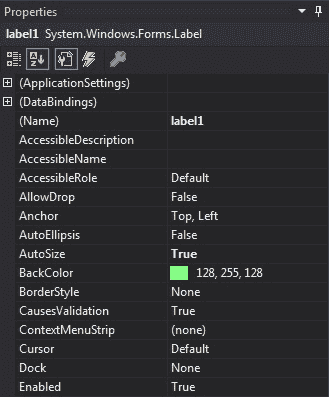
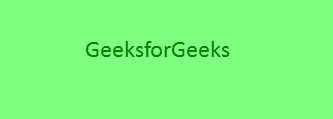

# c# 中的标签

> 原文:[https://www.geeksforgeeks.org/label-in-c-sharp/](https://www.geeksforgeeks.org/label-in-c-sharp/)

在 Windows 窗体中，Label 控件用于在窗体上显示文本，它不参与用户输入或鼠标或键盘事件。标签是一个类，在系统下定义。窗体命名空间。在 windows 窗体中，可以通过两种不同的方式创建标签:

**1。设计时:**使用以下步骤创建标签控件是最简单的方法:

*   **第一步:**创建如下图所示的窗口表单:
    **Visual Studio->File->New->Project->windows formpp**
    
*   **步骤 2:** 从工具箱中拖动标签控件，并将其放到窗口窗体上。您可以根据需要在 windows 窗体上的任何位置放置一个 Label 控件。
    T3】
*   **Step 3:** After drag and drop you will go to the properties of the Label control to set the properties of the Label according to your need.
    

    **输出:**
    

**2。运行时:**比上面的方法稍微复杂一点。在此方法中，您可以使用标签类设置创建自己的标签控件。创建动态标签的步骤:

*   **步骤 1:** 使用标签类提供的标签()构造函数创建标签。

    ```cs
    // Creating label using Label class
    Label mylab = new Label();

    ```

*   **步骤 2:** 创建标签后，设置标签类提供的标签属性。

    ```cs
    // Set the text in Label
    mylab.Text = "GeeksforGeeks";

    // Set the location of the Label
    mylab.Location = new Point(222, 90);

    // Set the AutoSize property of the Label control
    mylab.AutoSize = true;

    // Set the font of the content present in the Label Control
    mylab.Font = new Font("Calibri", 18);

    // Set the foreground color of the Label control
    mylab.ForeColor = Color.Green;

    // Set the padding in the Label control
     mylab.Padding = new Padding(6);

    ```

*   **Step 3:** And last add this Label control to form using Add() method.

    ```cs
    // Add this label to the form
    this.Controls.Add(mylab);

    ```

    **示例:**

    ```cs
    using System;
    using System.Collections.Generic;
    using System.ComponentModel;
    using System.Data;
    using System.Drawing;
    using System.Linq;
    using System.Text;
    using System.Threading.Tasks;
    using System.Windows.Forms;

    namespace WindowsFormsApp18 {

    public partial class Form1 : Form {

        public Form1()
        {
            InitializeComponent();
        }

        private void Form1_Load(object sender, EventArgs e)
        {

            // Creating and setting the label
            Label mylab = new Label();
            mylab.Text = "GeeksforGeeks";
            mylab.Location = new Point(222, 90);
            mylab.AutoSize = true;
            mylab.Font = new Font("Calibri", 18);
            mylab.ForeColor = Color.Green;
            mylab.Padding = new Padding(6);

            // Adding this control to the form
            this.Controls.Add(mylab);
        }
    }
    }
    ```

    **输出:**
    

#### 标签控件的重要属性

| 财产 | 描述 |
| **自动化** | 此属性用于设置一个值，该值指示是否自动调整标签控件的大小以显示其全部内容。 |
| **[后场](https://www.geeksforgeeks.org/how-to-set-the-background-color-of-the-label-in-c-sharp/)** | 此属性用于设置标签控件的背景色。 |
| **背景影像** | 此属性用于设置标签控件的背景图像。 |
| **[边框样式](https://www.geeksforgeeks.org/how-to-style-the-border-of-label-in-c-sharp/)** | 此属性用于设置标签控件的边框样式。 |
| **平板式** | 此属性用于设置标签控件的平面样式外观。 |
| **[字体](https://www.geeksforgeeks.org/how-to-set-the-font-of-the-content-present-in-the-label-in-c-sharp/)** | 此属性用于设置标签控件显示的文本的字体。 |
| **字体高度** | 此属性用于设置标签控件的字体高度。 |
| **[前景](https://www.geeksforgeeks.org/how-to-set-the-foreground-color-of-the-label-in-c-sharp/)** | 此属性用于设置标签控件的前景色。 |
| **高度** | 此属性用于设置标签控件的高度。 |
| **图像** | 此属性用于设置标签上显示的图像。 |
| **[地点](https://www.geeksforgeeks.org/how-to-set-the-location-of-the-label-in-c-sharp/)** | 此属性用于设置标签控件左上角相对于其窗体左上角的坐标。 |
| **名称** | 此属性用于设置标签控件的名称。 |
|  | 此属性用于在标签控件中设置填充。 |
| **[大小](https://www.geeksforgeeks.org/how-to-set-the-size-of-the-label-in-c-sharp/)** | 此属性用于设置标签控件的高度和宽度。 |
| **文字** | 此属性用于设置与此标签控件关联的文本。 |
| **文字配体** | 此属性用于设置标签中文本的对齐方式。 |
| **[可见](https://www.geeksforgeeks.org/how-to-set-the-visibility-of-the-label-in-c-sharp/)** | 此属性用于设置一个值，该值指示是否显示控件及其所有子控件。 |
| **宽度** | 此属性用于设置标签控件的宽度。 |