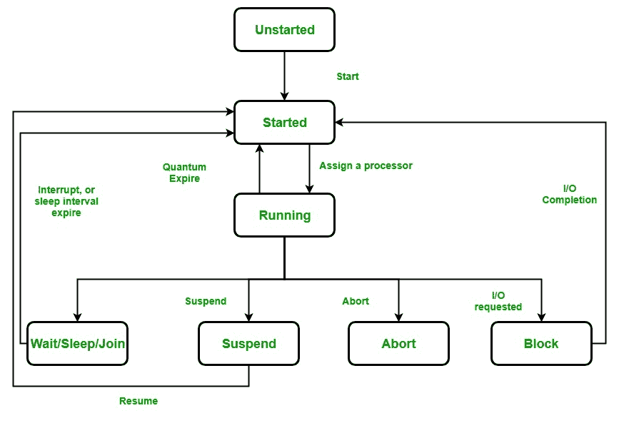

# c#中线程的生命周期和状态

> 原文:[https://www . geeksforgeeks . org/c-sharp 中线程的生命周期和状态/](https://www.geeksforgeeks.org/lifecycle-and-states-of-a-thread-in-c-sharp/)

C#中的线程在任何时间点都处于以下任何一种状态。线程在任何时刻都只处于所示状态之一:

**流程图:**



线程的生命周期

1.  **未启动状态:**当线程类的一个实例被创建时，它处于未启动状态，意味着当线程处于这种状态时，线程还没有开始运行。或者换句话说 *Start()* 方法不叫。

```
Thread thr = new Thread(); 
```

1.  这里，*和*处于未启动状态。
2.  **可运行状态:**准备运行的线程被移动到可运行状态。在这种状态下，线程可能实际上正在运行，也可能随时准备运行。线程调度器的责任是给线程运行的时间。或者换句话说，调用 *Start()* 方法。

3.  **运行状态:**正在运行的线程。或者换句话说，线程得到了处理器。
4.  **不可运行状态:**不可执行的线程，因为
    *   调用 Sleep()方法。
    *   调用 Wait()方法。
    *   由于输入/输出请求。
    *   调用了 Suspend()方法。
5.  **Dead 状态:**当线程完成任务后，则线程进入 Dead、终止、中止状态。

在 C#中实现线程状态

在 C#中，要获取线程的当前状态，使用 thread 类提供的 *ThreadState* 或 *IsAlive* 属性。
**语法:**

```
public ThreadState ThreadState{ get; }
```

**或**T2

```
public bool IsAlive { get; }
```

线程类提供不同类型的方法来实现线程的状态。

*   Sleep()方法用于将线程的当前执行暂时挂起指定的毫秒数，以便其他线程可以获得启动执行的机会，或者可能获得 CPU 进行执行。
*   Join()方法用于使所有调用线程等待直到主线程，即被连接的线程完成其工作。
*   Abort()方法用于中止线程。
*   调用 Suspend()方法来挂起线程。
*   调用 Resume()方法来恢复挂起的线程。
*   Start()方法用于将线程发送到可运行状态。

**例:**

## C#

```
// C# program to illustrate the
// states of the thread
using System;
using System.Threading;

public class MyThread {

    // Non-Static method
    public void thread()
    {
        for (int x = 0; x < 2; x++) {
            Console.WriteLine("My Thread");
        }
    }
}

public class ThreadExample {

    // Main method
    public static void Main()
    {

        // Creating instance for
        // mythread() method
        MyThread obj = new MyThread();

        // Creating and initializing
        // threads Unstarted state
        Thread thr1 = new Thread(new ThreadStart(obj.thread));

        Console.WriteLine("ThreadState: {0}",
                          thr1.ThreadState);

        // Running state
        thr1.Start();
        Console.WriteLine("ThreadState: {0}",
                           thr1.ThreadState);

        // thr1 is in suspended state
        thr1.Suspend();
        Console.WriteLine("ThreadState: {0}",
                           thr1.ThreadState);

        // thr1 is resume to running state
        thr1.Resume();
        Console.WriteLine("ThreadState: {0}",
                          thr1.ThreadState);
    }
}
```

**输出:**

```
ThreadState: Unstarted
ThreadState: Running
ThreadState: SuspendRequested
ThreadState: Running
My Thread
My Thread
```

**说明:**上例展示了 *thr1* 线程的不同状态。通过使用螺纹类的*螺纹状态*属性来确定*螺纹的这些状态。另外，我们使用 *Suspend()* 和 *Resume()* 方法来暂停线程的当前执行，并使用 *Resume* 方法来恢复挂起的线程。*