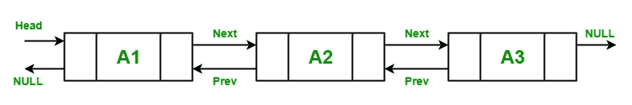

# c#中链表的实现

> 原文:[https://www . geesforgeks . org/link-list-implementation-in-c-sharp/](https://www.geeksforgeeks.org/linked-list-implementation-in-c-sharp/)

一个 **[链表](https://www.geeksforgeeks.org/linked-list-set-1-introduction/)** 是一个线性数据结构，它把元素存储在非连续的位置。链表中的元素使用指针相互链接。或者换句话说，LinkedList 由节点组成，其中每个节点都包含一个数据字段和对列表中下一个节点的引用(链接)。
在 C#中，链表是集合的泛型类型，在**系统中定义。集合.通用**命名空间。它是一个*双链表*，因此，每个节点向前指向下一个节点，向后指向上一个节点。它是一个动态的集合，根据你的程序的需要而增长。它还提供了快速插入和移除元素。



**要点:**

*   LinkedList 类实现了*I collection<T>T1、*IEnumerable<T>T3、*ireadonlyccollection<T>T5、 *ICollection* 、 *IEnumerable* 、*IDeserializationCallback*和 *ISerializable* 接口。***
*   它还支持枚举器。
*   您可以删除节点并将其重新插入到同一个列表或另一个列表中，这样就不会在堆上分配额外的对象。
*   链接列表<t>对象中的每个节点都属于链接列表节点<t>类型。</t></t>
*   它不支持链接、拆分、循环或其他可能使列表处于不一致状态的功能。
*   如果链接列表为空，则第一个和最后一个属性包含空值。
*   链接列表的容量是链接列表可以容纳的元素数量。
*   在链接列表中，允许存储相同类型的重复元素。

#### 如何创建链接列表？

链接列表类有 3 个构造函数，用于创建如下链接列表:

*   **LinkedList():** 这个构造函数用来创建一个空的 LinkedList 类的实例。
*   **LinkedList(IEnumerable):** 此构造函数用于创建 LinkedList 类的实例，该实例包含从指定的 IEnumerable 复制的元素，并且具有足够的容量来容纳复制的元素数量。
*   **LinkedList(SerializationInfo，StreamingContext):** 此构造函数用于创建 linked list 类的实例，该实例可通过指定的 SerializationInfo 和 StreamingContext 进行序列化。

让我们看看如何使用 *LinkedList()* 构造函数创建一个 LinkedList:

**第一步:**包含*系统。集合。通用*命名空间在您的程序中借助*使用*关键字:

```cs
using System.Collections.Generic;
```

**步骤 2:** 使用如下所示的 LinkedList 类创建一个 LinkedList:

> 链表<type_of_linkedlist>linklist _ name =新链表<type_of_linkedlist>()；</type_of_linkedlist></type_of_linkedlist>

**步骤 3:** LinkedList 提供了 4 种不同的方法来添加节点，这些方法是:

*   **AddAfter:** 此方法用于在 LinkedList 中的现有节点后添加新的节点或值。
*   **AddBefore:** 此方法用于在 LinkedList 中的现有节点之前添加新的节点或值。
*   **[添加第一个](https://www.geeksforgeeks.org/c-adding-new-node-or-value-at-the-start-of-linkedlistt/) :** 这个方法用于在链表的开始处添加一个新的节点或值。
*   **[添加最后一个](https://www.geeksforgeeks.org/c-adding-new-node-or-value-at-the-end-of-linkedlistt/) :** 这个方法用于在链表的末尾添加一个新的节点或值。

**第 4 步:**使用 foreach 循环或 for 循环访问 LinkedList 的元素。如下例所示。

**示例:**

```cs
// C# program to illustrate how 
// to create a LinkedList
using System;
using System.Collections.Generic;

class GFG {

    // Main Method
    static public void Main()
    {

        // Creating a linkedlist
        // Using LinkedList class
        LinkedList<String> my_list = new LinkedList<String>();

        // Adding elements in the LinkedList
        // Using AddLast() method
        my_list.AddLast("Zoya");
        my_list.AddLast("Shilpa");
        my_list.AddLast("Rohit");
        my_list.AddLast("Rohan");
        my_list.AddLast("Juhi");
        my_list.AddLast("Zoya");

        Console.WriteLine("Best students of XYZ university:");

        // Accessing the elements of 
        // LinkedList Using foreach loop
        foreach(string str in my_list)
        {
            Console.WriteLine(str);
        }
    }
}
```

**Output:**

```cs
Best students of XYZ university:
Zoya
Shilpa
Rohit
Rohan
Juhi
Zoya

```

#### 如何从链接列表中删除元素？

在链接列表中，允许从链接列表中删除元素。LinkedList <t>类提供了 5 种不同的方法来移除元素，这些方法是:</t>

*   **[Clear()](https://www.geeksforgeeks.org/c-removing-all-nodes-from-linkedlistt/) :** 此方法用于从链表中移除所有节点。
*   **[移除(链接列表节点)](https://www.geeksforgeeks.org/c-removing-the-specified-node-from-the-linkedlistt/) :** 此方法用于从链接列表中移除指定的节点。
*   **[移除(T)](https://www.geeksforgeeks.org/c-removing-first-occurrence-of-specified-value-from-linkedlistt/) :** 此方法用于从链接列表中移除指定值的第一次出现。
*   **[RemoveFirst()](https://www.geeksforgeeks.org/c-removing-the-node-at-the-start-of-the-linkedlistt/) :** 此方法用于删除链表开头的节点。
*   **[RemoveLast()](https://www.geeksforgeeks.org/c-removing-the-node-at-the-start-of-the-linkedlistt/) :** 此方法用于删除链表末尾的节点。

**示例:**

```cs
// C# program to illustrate how to
// remove elements from LinkedList
using System;
using System.Collections.Generic;

class GFG {

    // Main Method
    static public void Main()
    {

        // Creating a linkedlist
        // Using LinkedList class
        LinkedList<String> my_list = new LinkedList<String>();

        // Adding elements in the LinkedList
        // Using AddLast() method
        my_list.AddLast("Zoya");
        my_list.AddLast("Shilpa");
        my_list.AddLast("Rohit");
        my_list.AddLast("Rohan");
        my_list.AddLast("Juhi");
        my_list.AddLast("Zoya");

        // Inital number of elements
        Console.WriteLine("Best students of XYZ "+
                         "university initially:");

        // Accessing the elements of 
        // Linkedlist Using foreach loop
        foreach(string str in my_list)
        {
            Console.WriteLine(str);
        }

        // After using Remove(LinkedListNode)
        // method
        Console.WriteLine("Best students of XYZ"+
                         " university in 2000:");

        my_list.Remove(my_list.First);

        foreach(string str in my_list)
        {
            Console.WriteLine(str);
        }

        // After using Remove(T) method
        Console.WriteLine("Best students of XYZ"+
                         " university in 2001:");

        my_list.Remove("Rohit");

        foreach(string str in my_list)
        {
            Console.WriteLine(str);
        }

        // After using RemoveFirst() method
        Console.WriteLine("Best students of XYZ"+
                         " university in 2002:");

        my_list.RemoveFirst();

        foreach(string str in my_list)
        {
            Console.WriteLine(str);
        }

        // After using RemoveLast() method
        Console.WriteLine("Best students of XYZ"+
                         " university in 2003:");

        my_list.RemoveLast();

        foreach(string str in my_list)
        {
            Console.WriteLine(str);
        }

        // After using Clear() method
        my_list.Clear();
        Console.WriteLine("Number of students: {0}",
                                     my_list.Count);
    }
}
```

**Output:**

```cs
Best students of XYZ university initially:
Zoya
Shilpa
Rohit
Rohan
Juhi
Zoya
Best students of XYZ university in 2000:
Shilpa
Rohit
Rohan
Juhi
Zoya
Best students of XYZ university in 2001:
Shilpa
Rohan
Juhi
Zoya
Best students of XYZ university in 2002:
Rohan
Juhi
Zoya
Best students of XYZ university in 2003:
Rohan
Juhi
Number of students: 0

```

#### 如何检查链接列表中元素的可用性？

在链表中，可以使用 [Contains(T)](https://www.geeksforgeeks.org/c-check-if-a-value-is-in-linkedlistt/) 方法检查给定值是否存在。此方法用于确定链接列表中是否有值。

**示例:**

```cs
// C# program to illustrate how 
// to check whether the given 
// element is present or not 
// in the LinkedList
using System;
using System.Collections.Generic;

class GFG {

    // Main Method
    static public void Main()
    {

        // Creating a linkedlist
        // Using LinkedList class
        LinkedList<String> my_list = new LinkedList<String>();

        // Adding elements in the Linkedlist
        // Using AddLast() method
        my_list.AddLast("Zoya");
        my_list.AddLast("Shilpa");
        my_list.AddLast("Rohit");
        my_list.AddLast("Rohan");
        my_list.AddLast("Juhi");

        // Check if the given element
        // is available or not
        if (my_list.Contains("Shilpa") == true) 
        {
            Console.WriteLine("Element Found...!!");
        }
        else 
        {
            Console.WriteLine("Element Not found...!!");
        }
    }
}
```

**Output:**

```cs
Element Found...!!

```