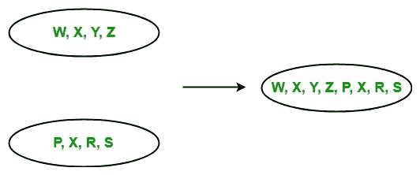

# LINQ |连接运算符|连接

> 原文:[https://www . geesforgeks . org/linq-concation-operator-concat/](https://www.geeksforgeeks.org/linq-concatenation-operator-concat/)

串联是将一个序列附加到另一个序列中的过程。在 LINQ，连接操作只包含一个称为 Concat 的运算符。它用于追加两个相同类型的序列或集合，并返回一个新的序列或集合。

*   它不支持 C# 和 VB.NET 语言中的查询语法。
*   它支持 C# 和 VB.NET 语言中方法语法。
*   它同时出现在可查询类和可枚举类中。
*   它通过使用延迟执行来实现。
*   它允许重复元素。

如下图所示，这里两个相同类型的序列连接成一个序列。



**例 1:**

```cs
// C# program to concatenate the
// given sequences
using System;
using System.Linq;

class GFG {

    static public void Main()
    {

        // Data source
        char[] sequence1 = {'p', 'q', 'r', 's', 'y', 'z'};
        char[] sequence2 = {'p', 'm', 'o', 'e', 'c', 'z'};

        // Display the sequences
        Console.WriteLine("Sequence 1 is: ");

        foreach(var s1 in sequence1)
        {
            Console.WriteLine(s1);
        }

        Console.WriteLine("Sequence 2 is: ");

        foreach(var s2 in sequence2)
        {
            Console.WriteLine(s2);
        }

        // Concatenate the given array
        // Using Concat function
        var result = sequence1.Concat(sequence2);

        Console.WriteLine("New Sequence:");
        foreach(var val in result)
        {
            Console.WriteLine(val);
        }
    }
}
```

**Output:**

```cs
Sequence 1 is: 
p
q
r
s
y
z
Sequence 2 is: 
p
m
o
e
c
z
New Sequence:
p
q
r
s
y
z
p
m
o
e
c
z

```

**例 2:**

```cs
// C# program to print the major 
// language of the employees
using System;
using System.Linq;
using System.Collections.Generic;

// Employee details
public class Employee1 {

    public int emp_id1
    {
        get;
        set;
    }

    public string emp_name1
    {
        get;
        set;
    }
    public string emp_lang1
    {
        get;
        set;
    }
}

// Employee details
public class Employee2 {

    public int emp_id2
    {
        get;
        set;
    }

    public string emp_name2
    {
        get;
        set;
    }
    public string emp_lang2
    {
        get;
        set;
    }
}

class GFG {

    // Main method
    static public void Main()
    {
        List<Employee1> emp1 = new List<Employee1>() {

            new Employee1() {emp_id1 = 209, emp_name1 = "Anjita",
                                               emp_lang1 = "C#"},

            new Employee1() {emp_id1 = 210, emp_name1 = "Soniya",
                                                emp_lang1 = "C"},

            new Employee1() {emp_id1 = 211, emp_name1 = "Rohit",
                                            emp_lang1 = "Java"},

        };

        List<Employee2> emp2 = new List<Employee2>() {

            new Employee2() {emp_id2 = 219, emp_name2 = "Anita",
                                           emp_lang2 = "Scala"},

            new Employee2() {emp_id2 = 223, emp_name2 = "Manya",
                                          emp_lang2 = "Python"},

            new Employee2() {emp_id2 = 266, emp_name2 = "Rohan",
                                            emp_lang2 = "Ruby"},

        };

        // Query to concatenate the major
        // languages of the employees of 
        // two different departments
        // Using Concat method
        var res = emp1.Select(e => e.emp_lang1).Concat(emp2.Select(e => e.emp_lang2));

        Console.WriteLine("Major Languages Used are: ");

        foreach(var val in res)
        {
            Console.WriteLine(val);
        }
    }
}
```

**Output:**

```cs
Major Languages Used are: 
C#
C
Java
Scala
Python
Ruby

```