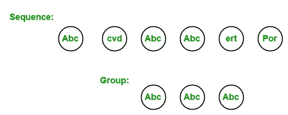

# LINQ |分组运算符|分组依据

> 原文:[https://www . geesforgeks . org/linq-group-operator-group by/](https://www.geeksforgeeks.org/linq-grouping-operator-groupby/)

在 LINQ，分组操作符选择包含公共属性的序列或集合的元素，并在一个组中为它们服务。或者换句话说，我们可以说分组运算符基于给定的键返回元素组。该组保存在一个特殊类型的集合中，该集合实现了 IGrouping <tkey telement="">接口，其中 TKey 是创建组的密钥，TElement 是与分组密钥值对等的元素的集合。例如，一个序列包含 6 个元素，即 *Abc、cvd、Abc、Abc、ert、Por、*。现在，我们需要一个包含该序列中所有 *Abc* 的组。所以 *Abc* 是我们创建另一个包含 3 个 Abc 的组的关键。如下图所示:</tkey>



标准查询运算符包含 **2** 种不同类型的分组运算符:

1.  **基团**
2.  **托勒密**

#### 分组运算符

GroupBy 运算符的工作类似于 SQL GroupBy 子句。它用于从给定的序列或集合中返回共享公共属性或键的元素组。每个组由 IGrouping <tkey telement="">对象表示。</tkey>

**要点:**

*   它支持 C#和 VB.Net 语言中查询语法。如例 1 所示。
*   您也可以在 C#查询中将 into 与 GroupBy 一起使用。into 关键字允许您继续查询，并可以执行更多的查询操作。或者换句话说，它是一个临时标识符，允许您执行额外的查询操作。
*   您也可以在 VB.Net 使用“分组”和“分组”。
*   LINQ 查询以帮助 Select 或 Groupby 子句结束。
*   它还可以支持 C#和 VB.Net 语言中的方法语法。如例 2 所示。
*   它同时出现在可查询类和可枚举类中。在这些类中，GroupBy 方法以八种不同的类型重载。
*   它通过使用延迟执行来实现。
*   键值可以是任何类型，如字符串、int、float、anonymous、bool 等。取决于用户的要求。
*   此运算符返回的组可以包含零个或多个与键值匹配的元素。

**例 1:**

```
// C# program to divide the employees
// in groups according to their salary
using System;
using System.Linq;
using System.Collections.Generic;

// Employee details
public class Employee {

    public int emp_id
    {
        get;
        set;
    }

    public string emp_name
    {
        get;
        set;
    }

    public string emp_gender
    {
        get;
        set;
    }

    public string emp_hire_date
    {
        get;
        set;
    }

    public int emp_salary
    {
        get;
        set;
    }
}

class GFG {

    // Main method
    static public void Main()
    {
        List<Employee> emp = new List<Employee>() {

            new Employee() {emp_id = 209, emp_name = "Anjita", emp_gender = "Female",
                                    emp_hire_date = "12/3/2017", emp_salary = 20000},

            new Employee() {emp_id = 210, emp_name = "Soniya", emp_gender = "Female",
                                    emp_hire_date = "22/4/2018", emp_salary = 30000},

            new Employee() {emp_id = 211, emp_name = "Rohit", emp_gender = "Male",
                                  emp_hire_date = "3/5/2016", emp_salary = 40000},

            new Employee() {emp_id = 212, emp_name = "Supriya", emp_gender = "Female",
                                      emp_hire_date = "4/8/2017", emp_salary = 40000},

            new Employee() {emp_id = 213, emp_name = "Anil", emp_gender = "Male",
                                emp_hire_date = "12/1/2016", emp_salary = 40000},

            new Employee() {emp_id = 214, emp_name = "Anju", emp_gender = "Female",
                                  emp_hire_date = "17/6/2015", emp_salary = 50000},
        };

        // Query to divide the employees
        // in the groups according to 
        // their salary using GroupBy 
        // operator in query syntax
        var res = from e in emp
                    group e by e.emp_salary;

        foreach(var val in res)
        {

            // Here salary is the key value
            Console.WriteLine("Group By Salary: {0}", val.Key);

            // Display name of the employees
            // Inner collection according to
            // the key value
            foreach(Employee e in val)
            {
                Console.WriteLine("Employee Name: {0}",
                                           e.emp_name);
            }
        }
    }
}
```

**Output:**

```
Group By Salary: 20000
Employee Name: Anjita
Group By Salary: 30000
Employee Name: Soniya
Group By Salary: 40000
Employee Name: Rohit
Employee Name: Supriya
Employee Name: Anil
Group By Salary: 50000
Employee Name: Anju

```

**例 2:**

```
// C# program to divide the employees
// in the groups according to their
// language
using System;
using System.Linq;
using System.Collections.Generic;

// Employee details
public class Employee {

    public int emp_id
    {
        get;
        set;
    }

    public string emp_name
    {
        get;
        set;
    }

    public string emp_gender
    {
        get;
        set;
    }

    public string emp_hire_date
    {
        get;
        set;
    }

    public int emp_salary
    {
        get;
        set;
    }
    public string emp_lang
    {
        get;
        set;
    }
}

class GFG {

    // Main method
    static public void Main()
    {
        List<Employee> emp = new List<Employee>() {

            new Employee() {emp_id = 209, emp_name = "Anjita", emp_gender = "Female",
                 emp_hire_date = "12/3/2017", emp_salary = 20000, emp_lang = "Ruby"},

            new Employee() {emp_id = 210, emp_name = "Soniya", emp_gender = "Female",
                 emp_hire_date = "22/4/2018", emp_salary = 30000, emp_lang = "Java"},

            new Employee() {emp_id = 211, emp_name = "Rohit", emp_gender = "Male",
               emp_hire_date = "3/5/2016", emp_salary = 40000, emp_lang = "Perl"},

            new Employee() {emp_id = 212, emp_name = "Supriya", emp_gender = "Female",
                     emp_hire_date = "4/8/2017", emp_salary = 40000, emp_lang = "Java"},

            new Employee() {emp_id = 213, emp_name = "Anil", emp_gender = "Male",
               emp_hire_date = "12/1/2016", emp_salary = 40000, emp_lang = "C#"},

            new Employee() {emp_id = 214, emp_name = "Anju", emp_gender = "Female",
                 emp_hire_date = "17/6/2015", emp_salary = 50000, emp_lang = "C#"},
        };

        // Query to divide the employees in 
        // the groups according to their 
        // language using GroupBy method in
        // the method syntax
        var res = emp.GroupBy(e => e.emp_lang);

        foreach(var val in res)
        {

            // Here language is the key value
            Console.WriteLine("Group By Language: {0}", val.Key);

            // Display name of the employees
            // Inner collection according to
            // the key value
            foreach(Employee e in val)
            {
                Console.WriteLine("Employee Name: {0}", e.emp_name);
            }
        }
    }
}
```

**Output:**

```
Group By Language: Ruby
Employee Name: Anjita
Group By Language: Java
Employee Name: Soniya
Employee Name: Supriya
Group By Language: Perl
Employee Name: Rohit
Group By Language: C#
Employee Name: Anil
Employee Name: Anju

```