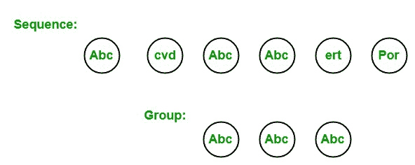

# LINQ |分组运算符| ToLooKUp

> 原文:[https://www . geesforgeks . org/linq-group-operator-tolookup/](https://www.geeksforgeeks.org/linq-grouping-operator-tolookup/)

在 LINQ，分组操作符选择包含公共属性的序列或集合的元素，并在一个组中为它们服务。或者换句话说，我们可以说分组运算符基于给定的键返回元素组。该组保存在一个特殊类型的集合中，该集合实现了 IGrouping <tkey telement="">接口，其中 TKey 是创建组的密钥，TElement 是与分组密钥值对等的元素的集合。例如，一个序列包含 *6* 元素，即 *Abc* 、 *cvd* 、 *Abc* 、 *Abc* 、 *ert* 、 *Por* ，现在我们想要一个包含该序列中所有 *Abc* 的组。所以 *Abc* 是我们创建另一个包含 *3* Abc 的组的关键。如下图所示:</tkey>



标准查询运算符包含两种不同类型的分组运算符:

1.  **基团**
2.  **托勒密**

#### 查找运算符

ToLookup 运算符用于基于键选择器功能将元素放入查找<tkey telement="">中。这里，LookUp <tkey telement="">是一对多字典。ToLookup 操作符的工作方式与 GroupBy 操作符非常相似。</tkey></tkey>

**要点:**

*   它不支持 C#和 VB.Net 语言中的查询语法。
*   它支持 C#和 VB.Net 语言中方法语法。
*   它只出现在可枚举类中。
*   它有四种不同的重载类型。
*   如果源或键选择符为空，它将引发 ArgumentNullException。
*   它是通过使用立即执行来实现的。

**示例:**

```cs
// C# program to divide the employees in 
// groups according to their gender
using System;
using System.Linq;
using System.Collections.Generic;

// Employee details
public class Employee {

    public int emp_id
    {
        get;
        set;
    }

    public string emp_name
    {
        get;
        set;
    }

    public string emp_gender
    {
        get;
        set;
    }

    public string emp_hire_date
    {
        get;
        set;
    }

    public int emp_salary
    {
        get;
        set;
    }
}

class GFG {

    // Main method
    static public void Main()
    {
        List<Employee> emp = new List<Employee>() {

            new Employee() {emp_id = 209, emp_name = "Anjita", emp_gender = "Female",
                                    emp_hire_date = "12/3/2017", emp_salary = 20000},

            new Employee() {emp_id = 210, emp_name = "Soniya", emp_gender = "Female",
                                    emp_hire_date = "22/4/2018", emp_salary = 30000},

            new Employee() {emp_id = 211, emp_name = "Rohit", emp_gender = "Male",
                                  emp_hire_date = "3/5/2016", emp_salary = 40000},

            new Employee() {emp_id = 212, emp_name = "Supriya", emp_gender = "Female",
                                      emp_hire_date = "4/8/2017", emp_salary = 40000},

            new Employee() {emp_id = 213, emp_name = "Anil", emp_gender = "Male",
                                emp_hire_date = "12/1/2016", emp_salary = 40000},

            new Employee() {emp_id = 214, emp_name = "Anju", emp_gender = "Female",
                                  emp_hire_date = "17/6/2015", emp_salary = 50000},
        };

        // Query to divide the employees
        // in the groups according to 
        // their gender Using the 
        // ToLookup method
        var res = emp.ToLookup(e => e.emp_gender);

        foreach(var val in res)
        {
            // Here salary is the key value
            Console.WriteLine("Group By Gender: {0}", val.Key);

            // Display name of the employees
            foreach(Employee e in val)
            {
                Console.WriteLine("Employee Name: {0}", e.emp_name);
            }
        }
    }
}
```

**Output:**

```cs
Group By Gender: Female
Employee Name: Anjita
Employee Name: Soniya
Employee Name: Supriya
Employee Name: Anju
Group By Gender: Male
Employee Name: Rohit
Employee Name: Anil

```