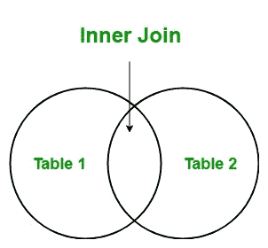

# LINQ |加入(内部加入)

> 原文:[https://www.geeksforgeeks.org/linq-join-inner-join/](https://www.geeksforgeeks.org/linq-join-inner-join/)

在 LINQ，Join 运算符用于将两个数据源集成到一个共享一些共同属性的数据源中。例如，在银行中，经理有两个列表，第一个列表包含个人详细信息，另一个列表包含房屋贷款详细信息。现在，经理想创建一个列表，其中包含那些接受房屋贷款的人的名字，他们属于同一个地方，所以他使用 join 子句来创建这种类型的列表。
join 子句总是取两个数据源，呈现数据源的元素必须包含一些属性，这样才能与其他数据源进行比较。联接子句的结果取决于所使用的联接子句的类型。最常见的连接类型有:

1.  **内部连接**
2.  **交叉连接**
3.  **左外连接**
4.  **团体加入**

#### 内部连接

在 LINQ，内部联接用于提供一个结果，该结果只包含第一个数据源中在第二个数据源中只出现一次的那些元素。如果第一个数据源的元素没有匹配的元素，那么它就不会出现在结果数据集中。这里的连接和内部连接是一样的。



**要点:**

*   join 子句执行的所有连接都是等价连接。
*   It support query syntax in both C# and VB.Net languages.

    **语法:**

    ```
    join … in … 
    on … equals …

    ```

*   它支持 C#和 VB.Net 语言中方法语法。这里，join 方法以两种不同的方式重载:
    1.  **加入< TOuter、TInner、TKey、tre sult>(IEnumerable<TOuter>、IEnumerable < TInner >、Func < TOuter、TKey >、Func < TInner、TKey >、Func < TOuter、TInner、TResult > ):** 此方法允许您根据给定的匹配关键字关联两个序列的元素。这里，默认的相等比较器用于比较键。
    2.  **加入< TOuter、TInner、TKey、tre sult>(IEnumerable<TOuter>、IEnumerable < TInner >、Func < TOuter、TKey >、Func < TInner、TKey >、Func < TOuter、TInner、TResult >、iequality comparer<TKey>):**这个方法可以让你关联两个元素指定的 IEqualityComparer < T >用于比较按键。
*   可查询类和可枚举类中都存在联接方法。
*   连接的工作类似于 SQL 中的内部连接。
*   join 子句根据指定的关键字使用 equals 关键字比较数据源，这里 *==* 无效。

**例 1:**

```
// C# program to illustrate the concept
// of inner join in Query Syntax
using System;
using System.Linq;
using System.Collections.Generic;

// Employee details
public class Employee1 {

    public int emp_id
    {
        get;
        set;
    }

    public string emp_name
    {
        get;
        set;
    }
    public string emp_lang
    {
        get;
        set;
    }
}

// Employee department details
public class Employee2 {

    public int emp_id
    {
        get;
        set;
    }

    public string emp_dept
    {
        get;
        set;
    }
    public int emp_salary
    {
        get;
        set;
    }
}

class GFG {

    // Main method
    static public void Main()
    {
        List<Employee1> emp1 = new List<Employee1>() {

            new Employee1() {emp_id = 300, emp_name = "Anu",
                                           emp_lang = "C#"},

            new Employee1() {emp_id = 301, emp_name = "Mohit",
                                              emp_lang = "C"},

            new Employee1() {emp_id = 302, emp_name = "Sona",
                                          emp_lang = "Java"},

            new Employee1() {emp_id = 303, emp_name = "Lana",
                                          emp_lang = "Java"},

            new Employee1() {emp_id = 304, emp_name = "Lion",
                                            emp_lang = "C#"},

            new Employee1() {emp_id = 305, emp_name = "Ramona",
                                             emp_lang = "Java"},

        };

        List<Employee2> emp2 = new List<Employee2>() {

            new Employee2() {emp_id = 300, emp_dept = "Designing",
                                              emp_salary = 23000},

            new Employee2() {emp_id = 301, emp_dept = "Developing",
                                               emp_salary = 40000},

            new Employee2() {emp_id = 302, emp_dept = "HR",
                                       emp_salary = 50000},

            new Employee2() {emp_id = 303, emp_dept = "Designing",
                                              emp_salary = 60000},

        };

        // Query to find the name and
        // the salary of the employees
        // Using Inner Join
        var res = from e1 in emp1
                    join e2 in emp2
                        on e1.emp_id equals e2.emp_id
                            select new 
                            {
                                Emp_Name = e1.emp_name,
                                Emp_Salary = e2.emp_salary
                            };

        // Display result
        Console.WriteLine("Employee and their Salary: ");
        foreach(var val in res)
        {
            Console.WriteLine("Employee Name: {0} Salary: {1}",
                                 val.Emp_Name, val.Emp_Salary);
        }
    }
}
```

**Output:**

```
Employee and their Salary: 
Employee Name: Anu Salary: 23000
Employee Name: Mohit Salary: 40000
Employee Name: Sona Salary: 50000
Employee Name: Lana Salary: 60000

```

**例 2:**

```
// C# program to illustrate the concept
// of inner join in Method Syntax
using System;
using System.Linq;
using System.Collections.Generic;

// Employee details
public class Employee1 {

    public int emp_id
    {
        get;
        set;
    }

    public string emp_name
    {
        get;
        set;
    }
    public string emp_lang
    {
        get;
        set;
    }
}

// Employee department details
public class Employee2 {

    public int emp_id
    {
        get;
        set;
    }

    public string emp_dept
    {
        get;
        set;
    }
    public int emp_salary
    {
        get;
        set;
    }
}

class GFG {

    // Main method
    static public void Main()
    {
        List<Employee1> emp1 = new List<Employee1>() {

            new Employee1() {emp_id = 300, emp_name = "Anu",
                                           emp_lang = "C#"},

            new Employee1() {emp_id = 301, emp_name = "Mohit",
                                              emp_lang = "C"},

            new Employee1() {emp_id = 302, emp_name = "Sona",
                                          emp_lang = "Java"},

            new Employee1() {emp_id = 303, emp_name = "Lana",
                                          emp_lang = "Java"},

            new Employee1() {emp_id = 304, emp_name = "Lion",
                                            emp_lang = "C#"},

            new Employee1() {emp_id = 305, emp_name = "Ramona",
                                            emp_lang = "Java"},

        };

        List<Employee2> emp2 = new List<Employee2>() {

            new Employee2() {emp_id = 300, emp_dept = "Designing",
                                              emp_salary = 23000},

            new Employee2() {emp_id = 301, emp_dept = "Developing",
                                               emp_salary = 40000},

            new Employee2() {emp_id = 302, emp_dept = "HR",
                                       emp_salary = 50000},

            new Employee2() {emp_id = 303, emp_dept = "Designing",
                                              emp_salary = 60000},

        };

        // Query to find the name and
        // the department of the employees
        // Using Join Method
        var res = emp1.Join(emp2,
                            e1 => e1.emp_id,
                            e2 => e2.emp_id,
                            (e1, e2) => new {
                                EmployeeName = e1.emp_name,
                                EmployeeDepartment = e2.emp_dept });

        // Display result
        Console.WriteLine("Employee Name and their Department:");
        foreach(var val in res)
        {
            Console.WriteLine("Employee Name: {0} Department: {1}",
                         val.EmployeeName, val.EmployeeDepartment);
        }
    }
}
```

**Output:**

```
Employee Name and their Department:
Employee Name: Anu Department: Designing
Employee Name: Mohit Department: Developing
Employee Name: Sona Department: HR
Employee Name: Lana Department: Designing

```