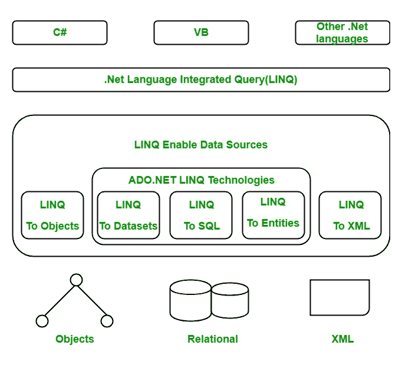

# LINQ(语言综合查询)

> 原文:[https://www . geesforgeks . org/linq-language-integrated-query/](https://www.geeksforgeeks.org/linq-language-integrated-query/)

LINQ 被称为**语言综合查询**，在*引进。NET 3.5* 和 Visual Studio 2008。LINQ 的美在于它提供了*的能力。NET* 语言(如 [C# ](https://www.geeksforgeeks.org/csharp-programming-language/) 、VB.NET 等。)生成查询以从数据源检索数据。例如，程序可以从学生记录或访问员工记录等获取信息。在过去的几年中，这种类型的数据存储在与应用程序分开的数据库中，您需要学习不同类型的查询语言来访问这种类型的数据，如 SQL、XML 等。此外，您不能使用 C# 语言或任何其他*创建查询。NET* 语言。

为了克服这类问题，微软开发了 LINQ。它给 C# 或*增加了一个，更多的能量。NET* 语言来为任何 LINQ 兼容的数据源生成查询。最棒的是创建查询所用的语法是相同的无论使用哪种类型的数据源都意味着在关系数据库中创建查询数据的语法与创建存储在数组中的查询数据的语法相同没有必要使用 SQL 或任何其他 *non-。NET* 语言机制。您还可以将 LINQ 与 SQL、XML 文件、ADO.NET、web 服务以及任何其他数据库一起使用。

在 C# 中，LINQ 出现在*系统中。Linq* 命名空间。它提供支持 LINQ 查询的不同类型的类和方法。在此命名空间中:

*   可枚举类保存标准查询操作符，这些操作符对执行 *IEnumerable < T >* 的对象进行操作。
*   可查询类保存标准的查询操作符，这些操作符对执行 *IQueryable < T >* 的对象进行操作。

#### LINQ 建筑

LINQ 的建筑是三层建筑。其中最顶层包含语言扩展，最底层包含数据源，这些数据源通常是实现 IEnumerable <t>或 IQueryable <t>泛型接口的对象。LINQ 的建筑如下图所示:</t></t>

#### 我们为什么要用 LINQ？

现在我们知道为什么 LINQ 被创造，或者为什么我们使用 LINQ。以下几点解释了我们为什么使用 LINQ。

*   创建 LINQ 背后的主要目的是，在 C# 3.0 之前，我们使用 for 循环、foreach 循环或委托遍历集合来查找特定的对象，但是使用这些方法查找对象的缺点是，您需要编写大量代码来查找更耗时的对象，并使您的程序可读性降低。所以为了克服这些问题，LINQ 提出了。它在几行中执行相同的操作，使您的代码更易读，并且您可以在其他程序中使用相同的代码。
*   它还在编译时提供完整的类型检查，它帮助我们在运行时检测错误，这样我们就可以轻松地删除它们。
*   LINQ 是它比 SQL 简单、有序、高级的语言
*   您也可以将 LINQ 用于 C# 数组和集合。它给你一个有效解决旧问题的新方向。
*   在 LINQ 的帮助下，您可以轻松地处理任何类型的数据源，如 XML、SQL、实体、对象等。单个查询可以处理任何类型的数据库，不需要学习不同类型的语言。
*   LINQ 支持查询表达式、隐式类型变量、对象和集合初始值设定项、匿名类型、扩展方法和 Lambda 表达式。

#### LINQ 的优势

*   用户不需要为不同类型的数据源或数据格式学习新的查询语言。
*   它增加了代码的可读性。
*   查询可以重用。
*   它在编译时提供对象的类型检查。
*   它为泛型集合提供智能感知。
*   它可以用于数组或集合。
*   LINQ 支持过滤，排序，排序，分组。
*   它使调试变得容易，因为它与 C# 语言集成在一起。
*   它提供了简单的转换，这意味着您可以轻松地将一种数据类型转换为另一种数据类型，就像将 SQL 数据转换为 XML 数据一样。