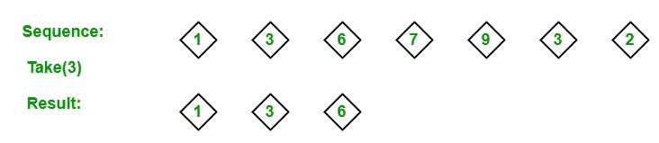

# LINQ |分区符|取

> 原文:[https://www.geeksforgeeks.org/linq-partition-operator-take/](https://www.geeksforgeeks.org/linq-partition-operator-take/)

在 LINQ，分区运算符用于将给定的序列分成两部分，而无需对元素进行排序，并返回其中一部分。标准查询运算符支持 **4** 种不同类型的分区运算符:

1.  **跳过**
2.  **滑行同时**
3.  **取**
4.  **趁**

#### 带操作员

Take 运算符用于从序列开始返回指定数量的相邻元素。或者换句话说，我们可以说它从第一个项目开始返回指定数量的项目。如下例所示:

[](https://media.geeksforgeeks.org/wp-content/uploads/20190527120610/take-operator.jpg)

**要点:**

*   它不支持 C#和 VB.Net 语言中的查询语法。但是您可以使用 Take 方法来查询变量，或者您可以将查询包装在括号中，然后调用 Take 方法。如*例 2* 所示。
*   它支持 C#和 VB.Net 语言中方法语法。
*   它同时出现在可查询类和可枚举类中。
*   它通过使用延迟执行来实现。
*   如果源为空，它将引发 ArgumentNullException。

**例 1:**

```
// C# program to illustrate the
// concept of Taking operator
using System;
using System.Linq;

class GFG {

    // Main Method
    static public void Main()
    {

        // Data source
        int[] sequence = {45, 67, 89,
                     13, 56, 76, 67};

        // Query which picks starting 5 ordered
        // elements from the given sequence
        // Using Take method
        var result = sequence.OrderBy(s => s).Take(5);

        Console.WriteLine("New Sequence: ");

        // Display new sequence
        foreach(var val in result)
        {
            Console.WriteLine(val);
        }
    }
}
```

**Output:**

```
New Sequence: 
13
45
56
67
67

```

**例 2:**

```
// C# program to find the names
// of the first 4 employees
using System;
using System.Linq;
using System.Collections.Generic;

// Employee details
public class Employee {

    public int emp_id
    {
        get;
        set;
    }
    public string emp_name
    {
        get;
        set;
    }
    public string emp_gender
    {
        get;
        set;
    }
    public string emp_hire_date
    {
        get;
        set;
    }
    public int emp_salary
    {
        get;
        set;
    }
}

public class GFG {

    // Main method
    static public void Main()
    {

        List<Employee> emp = new List<Employee>() {

            new Employee() {emp_id = 209, emp_name = "Anjita", emp_gender = "Female",
                                    emp_hire_date = "12/3/2017", emp_salary = 20000},

            new Employee() {emp_id = 210, emp_name = "Soniya", emp_gender = "Female",
                                    emp_hire_date = "22/4/2018", emp_salary = 30000},

            new Employee() {emp_id = 211, emp_name = "Rohit", emp_gender = "Male",
                                  emp_hire_date = "3/5/2016", emp_salary = 40000},

            new Employee() {emp_id = 212, emp_name = "Anu", emp_gender = "Female",
                                  emp_hire_date = "4/8/2017", emp_salary = 80000},

            new Employee() {emp_id = 213, emp_name = "Anil", emp_gender = "Male",
                                emp_hire_date = "12/1/2016", emp_salary = 60000},

            new Employee() {emp_id = 214, emp_name = "Anju", emp_gender = "Female",
                                  emp_hire_date = "17/6/2015", emp_salary = 50000},
        };

        // Query to find the names 
        // of the first 4 employees
        // Using Take method
        var res = (from e in emp
                   select e.emp_name)
                   .Take(4);

        foreach(var val in res)
        {
            Console.WriteLine("Employee Name: {0}", val);
        }
    }
}
```

**Output:**

```
Employee Name: Anjita
Employee Name: Soniya
Employee Name: Rohit
Employee Name: Anu

```