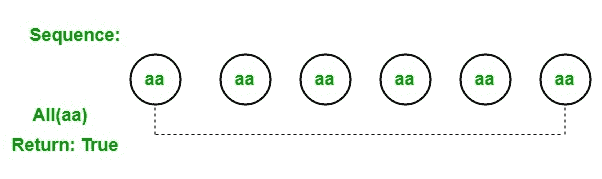

# LINQ |量词运算符|全部

> 原文:[https://www.geeksforgeeks.org/linq-quantifier-operator-all/](https://www.geeksforgeeks.org/linq-quantifier-operator-all/)

在 LINQ，量词运算符用于返回一个布尔值，该值表明某些或所有元素是否满足给定条件。标准查询运算符支持 3 种不同类型的量词运算符:

1.  **全部**
2.  **任意**
3.  **包含**

#### 所有操作员

*All* 运算符用于检查序列中的每个元素，如果所有元素都满足给定的条件，那么它将返回 true。否则，返回 false。例如，我们有一个序列，即 *aa，aa，aa，aa* 。为了检查序列的所有元素是否都是“ *aa* ”我们使用了 all 运算符，该运算符检查给定序列中存在的每个元素，并返回 true，因为给定序列中存在的所有元素都满足给定条件。



**要点:**

*   它不支持 C#和 VB.Net 语言中的查询语法。
*   它支持 C#和 VB.Net 语言中方法语法。
*   它同时存在于*可查询*和*可枚举*类中。
*   如果给定的源或给定的条件为空，它将抛出 *ArgumentNullException* 。
*   它不返回值，而是返回真或假。
*   该操作员的返回类型为*系统。布尔*。

**例 1:**

```
// C# program to illustrate the
// use of All operator
using System;
using System.Linq;
using System.Collections.Generic;

class GFG {

    static public void Main()
    {

        // Data source
        int[] sequence1 = {112, 44, 55, 66,
                              77, 777, 56};

        string[] sequence2 = {"aa", "aa", "aa",
                             "aa", "aa", "aa"};

        // Check the sequence1 contain
        // all element as 77
        // Using All operator
        var result1 = sequence1.All(seq => seq == 77);

        Console.WriteLine("Is the given sequence contain"+
                     " all element as 77 : {0}", result1);

        // Check the sequence2 contain
        // all element as aa
        // Using All operator
        var result2 = sequence2.All(seq => seq == "aa");

        Console.WriteLine("Is the given sequence contain"+
                   " all element as 'aa' : {0}", result2);
    }
}
```

**Output:**

```
Is the given sequence contain all element as 77 : False
Is the given sequence contain all element as 'aa' : True

```

**例 2:**

```
// C# program to check in the employee present
// in the company are all female employee
using System;
using System.Linq;
using System.Collections.Generic;

// Employee details
public class Employee {

    public int emp_id
    {
        get;
        set;
    }

    public string emp_name
    {
        get;
        set;
    }

    public string emp_gender
    {
        get;
        set;
    }

    public string emp_hire_date
    {
        get;
        set;
    }

    public int emp_salary
    {
        get;
        set;
    }
}

class GFG {

    // Main method
    static public void Main()
    {
        List<Employee> emp = new List<Employee>() {

            new Employee() {emp_id = 209, emp_name = "Anjita", emp_gender = "Female",
                                    emp_hire_date = "12/3/2017", emp_salary = 20000},

            new Employee() {emp_id = 210, emp_name = "Soniya", emp_gender = "Female",
                                    emp_hire_date = "22/4/2018", emp_salary = 30000},

            new Employee() {emp_id = 211, emp_name = "Rohit", emp_gender = "Male",
                                  emp_hire_date = "3/5/2016", emp_salary = 40000},

            new Employee() {emp_id = 212, emp_name = "Supriya", emp_gender = "Female",
                                      emp_hire_date = "4/8/2017", emp_salary = 40000},

            new Employee() {emp_id = 213, emp_name = "Anil", emp_gender = "Male",
                                emp_hire_date = "12/1/2016", emp_salary = 40000},

            new Employee() {emp_id = 214, emp_name = "Anju", emp_gender = "Female",
                                  emp_hire_date = "17/6/2015", emp_salary = 50000},
        };

        // Query to check in the employee present
        // in the company are all female employee
        // Using All method
        var res = emp.All(e => e.emp_gender == "Female");

        Console.WriteLine("Is all the employees are female?: {0}", res);
    }
}
```

**Output:**

```
Is all the employees are female?: False

```