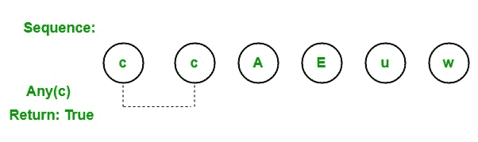

# LINQ |量词运算符|任意

> 原文:[https://www.geeksforgeeks.org/linq-quantifier-operator-any/](https://www.geeksforgeeks.org/linq-quantifier-operator-any/)

在 LINQ，量词运算符用于返回一个布尔值，该值表明某些或所有元素是否满足给定条件。标准查询运算符支持 3 种不同类型的量词运算符:

1.  **全部**
2.  **任意**
3.  **包含**

#### 任何操作员

Any 运算符用于检查序列或集合中的任何元素是否满足给定的条件。如果一个或多个元素满足给定的条件，那么它将返回 true。如果任何元素不满足给定的条件，那么它将返回 false。



*   它以两种不同的类型重载:
    *   **任意<源> (IEnumerable <源> ):** 此方法用于检查序列是否包含任何元素。
    *   **Any<t source>(IEnumerable<t source>，Func < TSource，Boolean > ):** 此方法用于检查序列中的任意元素是否满足条件。
*   它通常与 where 子句一起使用。
*   它不支持 C#和 VB.Net 语言中的查询语法。
*   它支持 C#和 VB.Net 语言中方法语法。
*   它同时出现在可查询类和可枚举类中。
*   如果给定的源为空，它将引发 ArgumentNullException。
*   它不返回值，而是返回真或假。
*   该操作员的返回类型为*系统。布尔*。

**例 1:**

```
// C# program to illustrate the
// use of Any operator
using System;
using System.Linq;
using System.Collections.Generic;

class GFG {

    // Main Method
    static public void Main()
    {

        // Data source
        int[] sequence1 = {34, 56, 77, 88,
                          99, 10, 23, 46};

        string[] sequence2 = {"aa", "oo", "gg",
                             "ww", "jj", "uu"};

        char[] sequence3 = {'c', 'c', 'A',
                                'E', 'u'};

        // Check the sequence1 if it 
        // contain any element as 10
        // Using Any operator
        var result1 = sequence1.Any(seq => seq == 10);

        Console.WriteLine("Is the given sequence "+
           "contain element as 10 : {0}", result1);

        // Check the sequence2 if it 
        // contain any element as "oo"
        // Using Any operator
        var result2 = sequence2.Any(seq => seq == "oo");

        Console.WriteLine("Is the given sequence "+
          "contain element as 'oo' : {0}", result2);

        // Check the sequence3 if it 
        // contain any element as 'c'
        // Using Any operator
        var result3 = sequence3.Any(seq => seq == 'c');

        Console.WriteLine("Is the given sequence "+
          "contain element as 'c' : {0}", result3);
    }
}
```

**Output:**

```
Is the given sequence contain element as 10 : True
Is the given sequence contain element as 'oo' : True
Is the given sequence contain element as 'c' : True

```

**例 2:**

```
// C# program to check the list 
// contain employee data or not
using System;
using System.Linq;
using System.Collections.Generic;

// Employee details
public class Employee { }

class GFG {

    // Main method
    static public void Main()
    {
        List<Employee> emp = new List<Employee>() { };

        // Query to check this list 
        // contain employee data or not
        // Using Any operator
        var res = emp.Any();

        Console.WriteLine("Is the list contain "+
                    "employees data?: {0}", res);
    }
}
```

**Output:**

```
Is the list contain employees data?: False

```