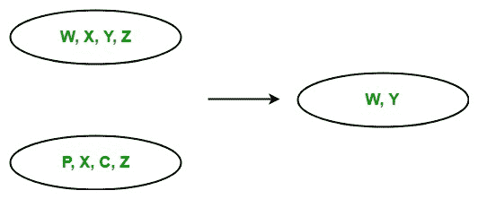

# LINQ |集合操作员|除了

> 原文:[https://www.geeksforgeeks.org/linq-set-operator-except/](https://www.geeksforgeeks.org/linq-set-operator-except/)

在 LINQ，集合运算符是查询表达式中基于相同或不同集合或序列或集合中等价元素的存在或不存在来返回结果集的运算符。标准查询运算符包含以下集合运算符:

1.  **工会**
2.  **相交**
3.  **除了**
4.  **不同**

#### 除了操作员

“除”运算符返回集合差。或者换句话说，我们可以说它返回包含第二个集合或集合中没有出现的元素的集合或集合。



*   它不支持 C#和 VB.Net 语言中的[查询语法](https://www.geeksforgeeks.org/linq-query-syntax/)。但是您可以对查询变量使用 Except 方法，或者您可以将查询包装在括号中，然后调用 Except 方法。
*   它支持 C#和 VB.Net 语言中方法语法。
*   它同时出现在可查询类和可枚举类中。
*   它通过使用延迟执行来实现。
*   当您处理复杂类型的集合时，必须使用 IEqualityComparer 接口，否则，Except 方法将给出不正确的结果。

**例 1:**

```cs
// C# program to find the difference
// of the given sequences
using System;
using System.Linq;

class GFG {

    static public void Main()
    {

        // Data source
        char[] sequence1 = {'m', 'q', 'o', 's', 'y', 'a'};
        char[] sequence2 = {'p', 't', 'r', 's', 'y', 'z'};

        // Display the sequences
        Console.WriteLine("Sequence 1 is: ");

        foreach(var s1 in sequence1)
        {
            Console.WriteLine(s1);
        }

        Console.WriteLine("Sequence 2 is: ");

        foreach(var s2 in sequence2)
        {
            Console.WriteLine(s2);
        }

        // Get the difference of the given 
        // sequences Using Except function
        var result = sequence1.Except(sequence2);

        Console.WriteLine("New Sequence: ");

        foreach(var val in result)
        {
            Console.WriteLine(val);
        }
    }
}
```

**Output:**

```cs
Sequence 1 is: 
m
q
o
s
y
a
Sequence 2 is: 
p
t
r
s
y
z
New Sequence: 
m
q
o
a

```

**例 2:**

```cs
// C# program to find the languages which is 
// not known by employees of the Department 2
using System;
using System.Linq;
using System.Collections.Generic;

// Employee details
// Department 1
public class Employee1 {

    public int emp_id1
    {
        get;
        set;
    }

    public string emp_name1
    {
        get;
        set;
    }
    public string emp_lang1
    {
        get;
        set;
    }
}

// Employee details
// Department 2
public class Employee2 {

    public int emp_id2
    {
        get;
        set;
    }

    public string emp_name2
    {
        get;
        set;
    }
    public string emp_lang2
    {
        get;
        set;
    }
}

public class GFG {

    // Main method
    static public void Main()
    {
        List<Employee1> emp1 = new List<Employee1>() {

            new Employee1() {emp_id1 = 209, emp_name1 = "Anjita",
                                               emp_lang1 = "C#"},

            new Employee1() {emp_id1 = 210, emp_name1 = "Soniya",
                                                emp_lang1 = "C"},

            new Employee1() {emp_id1 = 211, emp_name1 = "Rohit",
                                            emp_lang1 = "Java"},

        };

        List<Employee2> emp2 = new List<Employee2>() {

            new Employee2() {emp_id2 = 290, emp_name2 = "Anjita",
                                               emp_lang2 = "C#"},

            new Employee2() {emp_id2 = 212, emp_name2 = "MaMa",
                                         emp_lang2 = "Python"},

            new Employee2() {emp_id2 = 233, emp_name2 = "Rima",
                                           emp_lang2 = "Java"},

        };

        // Query to find the languages that is not
        // known by employees of the department 2
        // Using Except method
        var res = emp1.Select(e => e.emp_lang1).Except(emp2.Select(e => e.emp_lang2));

        Console.WriteLine("Language: ");

        foreach(var val in res)
        {
            Console.WriteLine(val);
        }
    }
}
```

**Output:**

```cs
Language: 
C

```