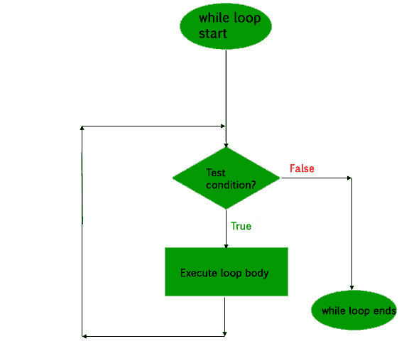

# c# 中的循环

> 原文:[https://www.geeksforgeeks.org/loops-in-c-sharp/](https://www.geeksforgeeks.org/loops-in-c-sharp/)

在编程语言中，循环是一种多次执行一条语句或一组语句的方式，具体取决于执行语句时要评估的条件的结果。结果条件应该为真，以便在循环中执行语句。

循环主要分为两类:
**入口控制循环:**循环体开头出现待测条件的循环称为**入口控制循环**。**而循环**和循环**为入口控制循环。**

**1。while 循环**在循环开始时给出测试条件，执行所有语句，直到给定的布尔条件满足，当条件变为假时，控制将从 while 循环中退出。

**语法:**

```cs
while (boolean condition)
{
   loop statements...
}
```

**流程图:**


**示例:**

```cs
// C# program to illustrate while loop
using System;

class whileLoopDemo
{
    public static void Main()
    {
        int x = 1;

        // Exit when x becomes greater than 4
        while (x <= 4)
        {
            Console.WriteLine("GeeksforGeeks");

            // Increment the value of x for
            // next iteration
            x++;
        }
    }
}
```

**输出:**

```cs
GeeksforGeeks
GeeksforGeeks
GeeksforGeeks
GeeksforGeeks

```

**2。for 循环**
for 循环具有与 while 循环相似的功能，但语法不同。当循环语句的执行次数事先已知时，for 循环是优选的。循环变量的初始化、测试条件以及循环变量的递增/递减在 for 循环中一行完成，从而提供了一种更短、更易于调试的循环结构。

```cs
for (loop variable initialization ; testing condition; 
                              increment / decrement)
{    
    // statements to be executed
}
```

**流程图:**


**1。循环变量初始化:**控制循环的第一个表达式/变量在这里初始化。这是 for 循环的起点。可以使用已经声明的变量，也可以声明一个变量，只限于局部循环。
T3】2。测试条件:执行循环语句的测试条件。它用于测试循环的退出条件。它必须返回一个布尔值**真或假**。当条件变为假时，控制将退出循环，并等待循环结束。
**3。递增/递减:**循环变量根据要求递增/递减，然后控制再次转移到测试条件。

**注意:**当 for 循环开始时，初始化部分只评估一次。

**示例:**

```cs
// C# program to illustrate for loop.
using System;

class forLoopDemo
{
    public static void Main()
    {
        // for loop begins when x=1
        // and runs till x <=4
        for (int x = 1; x <= 4; x++)
            Console.WriteLine("GeeksforGeeks");
    }
}
```

**输出:**

```cs
GeeksforGeeks
GeeksforGeeks
GeeksforGeeks
GeeksforGeeks

```

**退出控制回路:**回路主体末端存在测试条件的回路称为**退出控制回路**。**边做边做**是一个出口控制回路。
**注意:**在退出受控循环中，循环体将被评估至少一次，因为测试条件出现在循环体的末端。

**1。do-while 循环**
do while 循环类似于 while 循环，唯一的区别是它在执行语句后检查条件，也就是说它肯定会执行一次循环体，因为它在执行语句后检查条件。

**语法:**

```cs
do
{
    statements..
}while (condition);

```

**流程图:**


**示例:**

```cs
// C# program to illustrate do-while loop
using System;

class dowhileloopDemo
{
    public static void Main()
    {
        int x = 21;
        do
        {
            // The line will be printed even
            // if the condition is false
            Console.WriteLine("GeeksforGeeks");
            x++;
        }
        while (x < 20);
    }
}
```

**输出:**

```cs
GeeksforGeeks
```

**无限循环:**
测试条件不评估为假的循环倾向于永远执行语句，直到使用外力来结束它，因此它们被称为无限循环。

**示例:**

```cs
// C# program to demonstrate infinite loop
using System;

class infiniteLoop
{
    public static void Main()
    { 
        // The statement will be printed
        // infinite times
        for(;;)
        Console.WriteLine("This is printed infinite times");
    }
}
```

**输出:**

```cs
This is printed infinite times
This is printed infinite times
This is printed infinite times
This is printed infinite times
This is printed infinite times
This is printed infinite times
This is printed infinite times
..........
```

**嵌套循环:**
当循环出现在其他循环中时，称为嵌套循环。

**示例:**

```cs
// C# program to demonstrate nested loops
using System;

class nestedLoops
{
    public static void Main()
    {
        // loop within loop printing GeeksforGeeks
       for(int i = 2; i < 3; i++)
             for(int j = 1; j < i; j++)
                 Console.WriteLine("GeeksforGeeks");
    }
}
```

**输出:**

```cs
GeeksforGeeks
```

**continue 语句:**
continue 语句用于在一定条件下跳过循环的执行部分，将流程移到下一个上升部分。
**流程图:**


**示例:**

```cs
// C# program to demonstrate continue statement
using System;

class demoContinue
{
    public static void Main()
    {    
        // GeeksforGeeks is printed only 2 times
        // because of continue statement
        for(int i = 1; i < 3; i++)
        {
            if(i == 2)
              continue;

            Console.WriteLine("GeeksforGeeks"); 
        }
    }
}  
```

**输出:**

```cs
GeeksforGeeks
```