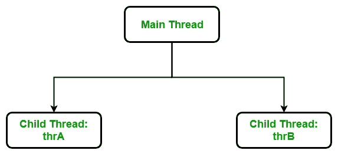

# c# 中的主线程

> 原文:[https://www.geeksforgeeks.org/main-thread-in-c-sharp/](https://www.geeksforgeeks.org/main-thread-in-c-sharp/)

C# 为多线程编程提供内置支持。多线程程序包含两个或多个可以并发运行的部分。这种程序的每个部分被称为*线程*，每个线程定义一个单独的执行路径。

**Main Thread**

当 C# 程序启动时，一个线程立即开始运行。这通常被称为我们程序的主线。

**属性:**

*   它是创建其他“*子*”线程的线程。
*   通常，它必须是最后一个完成执行的线程，因为它执行各种关闭操作。



**示例:**

```cs
// C# program to illustrate the working
//  of main thread and child thread
using System;
using System.Threading;

public class GFG {

    // Main thread
    static public void Main()
    {
        Console.WriteLine("Welcome to the Main thread");

        // Child threads
        Thread thrA = new Thread(childthread);
        Thread thrB = new Thread(childthread);
        thrA.Start();
        thrB.Start();
    }

    public static void childthread()
    {
        Console.WriteLine("Welcome to the Child thread");
    }
}
```

**输出:**

```cs
Welcome to the Main thread
Welcome to the Child thread
Welcome to the Child thread

```

**说明:**以上程序只有一个线程，称为*主*线程。主线程和其他线程一样工作，但是它是自动启动的，你不需要任何`Start()`方法来启动主线程的执行。 *thrA* 和 *thrB* 都是主螺纹的子螺纹。第一个主线程在那个子线程开始工作后开始工作。

**How to access Main thread?**

要访问主线程，需要*线程类对象*引用它。您可以使用线程类的 *CurrentThread* 属性来创建它。它将返回对使用它的线程的引用。所以当你在主线程中使用 *CurrentThread* 属性时，你会得到主线程的引用。之后，您将像控制另一个线程一样控制主线程。

**示例:**

```cs
// C# program to illustrate
// how to access main thread
using System;
using System.Threading;

public class GFG {

    // Main Method
    static public void Main()
    {
        Thread thr;

        // Get the reference of main Thread
        // Using CurrentThread property
        thr = Thread.CurrentThread;

        // Display the name of 
        // the main Thread
        if (thr.Name == null) {

            Console.WriteLine("Main thread does not have name");
        }

        else {

            Console.WriteLine("The name of main "+
                      "thread is: {0}", thr.Name);
        }

        Console.WriteLine();

        // Display the priority of main thread
        Console.WriteLine("The priority of main"+
                " thread is: {0}", thr.Priority);

        // Set the name of main thread
        thr.Name = "Main Thread";
        Console.WriteLine();

        // Display the name of main thread
        Console.WriteLine("The name of main "+
                  "thread is: {0}", thr.Name);
    }
}
```

**输出:**

```cs
Main thread does not have name

The priority of main thread is: Normal

The name of main thread is: Main Thread

```

**Deadlocking by using Main Thread**

我们可以通过只使用 Main 线程来创建死锁，即只使用一个线程。下面的 C# 程序演示了这一点。

**示例:**

```cs
// C# program to demonstrate deadlock
// using the Main thread
using System;
using System.Threading;

public class GFG {

    // Main Method
    public static void Main()
    {

        try {

            Console.WriteLine("Enter into DEADLOCK!!");

            Thread.CurrentThread.Join();

            // the following statement
            // will never execute
            Console.WriteLine("This statement will never execute");
        }

        catch (ThreadInterruptedException e) {
            e.ToString();
        }
    }
}
```

**输出:**

```cs
Enter into DEADLOCK!!
```

**运行时错误:**

> 由于服务器负载过重或使用睡眠功能，超过了最大实时限制

**解释:**语句“`Thread.currentThread().join()`”，会告诉主线程等待这个线程(即*等待自身*死亡。因此，主线程等待自己死亡，这只是一个死锁。