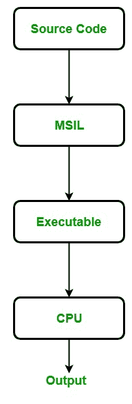
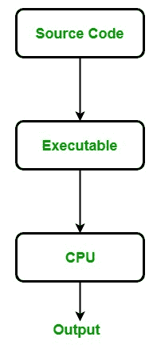

# 中的托管代码和非托管代码。NET

> 原文:[https://www . geesforgeks . org/托管代码和非托管代码在网络中/](https://www.geeksforgeeks.org/managed-code-and-unmanaged-code-in-net/)

#### 什么是托管代码？

一种代码，其目的是让托管运行时环境的服务像[中的](https://www.geeksforgeeks.org/introduction-to-net-framework/)**[CLR(公共语言运行时)](https://www.geeksforgeeks.org/common-language-runtime-clr-in-c-sharp/)** 一样执行。NET 框架被称为**托管代码**。它总是由托管运行时环境实现，而不是由操作系统直接执行。托管运行时环境提供不同类型的服务，如垃圾收集、类型检查、异常处理、边界检查等。在没有程序员干预的情况下自动编码。它还为代码提供内存分配、类型安全等。应用程序是用 Java、C#、VB.Net 等语言编写的。总是针对运行时环境服务来管理执行，用这些类型的语言编写的代码称为托管代码。

就……而言。NET 框架中，编译器总是用中间语言(MSIL)编译托管代码，然后创建一个可执行文件。当程序员运行可执行程序时，那么 CLR 的[适时编译器](https://www.geeksforgeeks.org/what-is-just-in-time-jit-compiler-in-dot-net/)会以特定于底层架构的本机代码编译中间语言。这里，这个过程发生在托管运行时执行环境下，因此这个环境负责代码的工作。托管代码的执行如下图所示，源代码是用的任何语言编写的。NET 框架。

托管代码还提供了平台独立性，因为当托管代码编译成中间语言时，JIT 编译器会在特定于体系结构的指令中编译这种中间语言。

**使用托管代码有什么好处？**

*   它提高了应用程序的安全性，就像当您使用运行时环境时，它会自动检查内存缓冲区以防止缓冲区溢出。
*   它自动实现垃圾收集。
*   它还提供运行时类型检查/动态类型检查。
*   它还提供引用检查，这意味着它检查引用是否指向有效的对象，并检查它们是否重复。

**托管代码有哪些缺点？**

托管语言的主要缺点是不允许直接分配内存，或者无法获得 CPU 架构的低级访问权限。

#### 什么是非托管代码？

由操作系统直接执行的代码称为**非托管代码**。它总是针对处理器架构，并且依赖于计算机架构。当这些代码被编译时，它总是倾向于得到一个特定的体系结构，并且总是在那个平台上运行，换句话说，每当你想要为不同的体系结构执行相同的代码时，你必须根据那个体系结构重新编译那个代码。它总是编译成特定于架构的本机代码。
在非托管代码中，内存分配、类型安全、安全性等由开发人员管理。因此，出现了几个与内存相关的问题，如缓冲区溢出、内存泄漏、指针覆盖等。非托管代码的可执行文件通常是二进制映像，即直接加载到内存中的 x86 代码。用 VB 6.0、C、C++等编写的应用程序总是在非托管代码中。非托管代码的执行如下图所示:

**使用非托管代码有什么好处？**

*   它为程序员提供了低级别的访问。
*   它还提供了对硬件的直接访问。
*   它允许程序员绕过托管代码框架使用的一些参数和限制。

**非托管代码有哪些缺点？**

*   它不为应用程序提供安全性。
*   由于对内存分配的访问，出现了与内存相关的问题，如内存缓冲区溢出等。
*   错误和异常也由程序员处理。
*   它不关注垃圾收集。