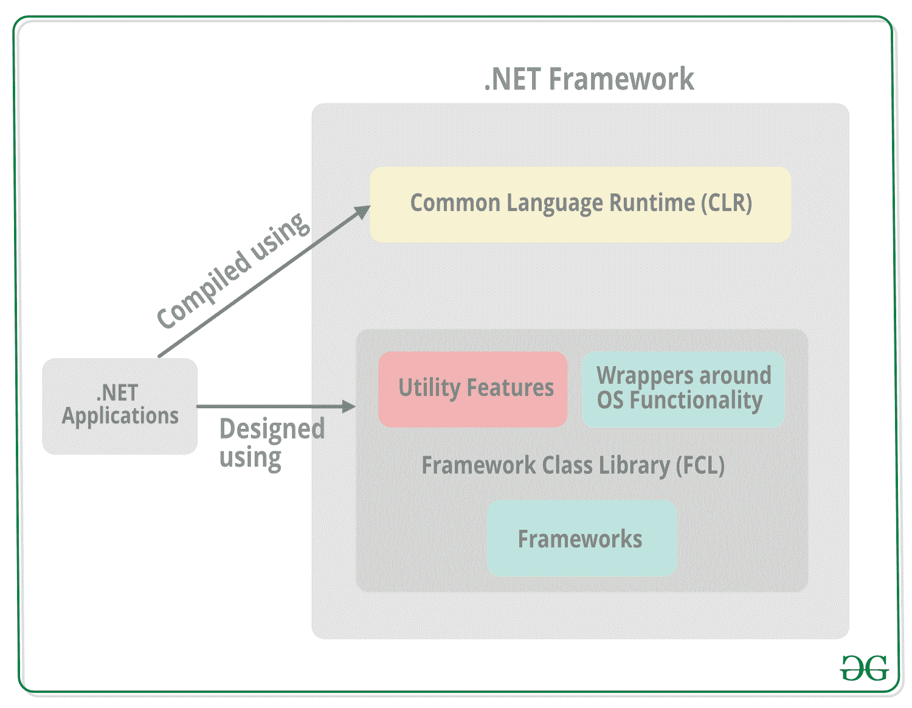

# 。NET 框架类库(FCL)

> 原文:[https://www . geesforgeks . org/net-framework-class-library-fcl/](https://www.geeksforgeeks.org/net-framework-class-library-fcl/)

框架类库或 FCL 在 [**中提供系统功能。NET 框架**](https://www.geeksforgeeks.org/introduction-to-net-framework/) 因为它有各种类、数据类型、接口等。执行多种功能并构建不同类型的应用程序，如桌面应用程序、web 应用程序、移动应用程序等。框架类库与的[公共语言运行时(CLR)](https://www.geeksforgeeks.org/common-language-runtime-clr-in-c-sharp/) 集成在一起。NET 框架，并由所有。NET 语言如[**【c#**](https://www.geeksforgeeks.org/csharp-programming-language/)、F#、Visual Basic。NET 等。

#### 框架类库中的类别

框架类库的功能可以大致分为**三个**类别，即*中编写的实用特性。NET* 、*封装了操作系统功能*和*框架*。这些类别并不是严格定义的，有许多类别可能适合一个以上的类别。

框架-类-库-FCL 点-网

框架类库中类别的详细信息如下:

*   **实用功能:**FCL 的实用功能包括列表、栈、队列、字典等各种集合类。以及用于更多样操作的类，如正则表达式的 Regex 类。
*   **围绕操作系统功能的包装器:**FCL 的一些特性是围绕底层 Windows 操作系统功能的包装器。这些包括使用文件系统的类、处理网络功能的类、处理控制台应用程序的输入/输出的类等。
*   **框架:**在 FCL 有各种各样的框架可以用来开发某些应用程序。例如，ASP.NET 用于开发网络应用程序，Windows Presentation Foundation(WPF)用于在 Windows 应用程序中呈现用户界面，等等。

#### 框架类库中的命名空间

框架类库中的命名空间是一组相关的类和接口，可以被所有*使用。NET 框架*语言。FCL 的一些名称空间及其描述如下:

<figure class="table">

| 命名空间 | 描述 |
| --- | --- |
| 易接近 | 辅助功能命名空间是 COM 辅助功能接口的托管包装的一部分。 |
| 微软。活动 | 微软。活动命名空间为 Windows Workflow Foundation 应用程序提供支持。 |
| 微软。CSharp | 微软。CSharp 命名空间支持 C# 源代码的编译和代码生成。 |
| 微软。JScript | 微软。JScript 命名空间支持 JScript 源代码的编译和代码生成。 |
| 微软。VisualBasic | 微软。VisualBasic 命名空间支持 VisualBasic 源代码的编译和代码生成。 |
| 系统 | 系统命名空间具有用于定义接口、数据类型、事件、事件处理程序、属性、处理异常等的基类。 |
| 系统。活动 | 系统。活动命名空间使用各种类来处理窗口工作流基础中活动的创建和处理。 |
| 系统。收集 | 系统。集合命名空间有多个标准的、专用的和通用的集合对象，这些对象是使用各种类型定义的。 |
| 系统。配置 | 系统。配置命名空间使用各种类型处理配置数据。这可能包括机器或应用程序配置文件中的数据。 |
| 系统。数据 | 系统。数据命名空间使用不同的类访问和管理来自不同来源的数据。 |
| 系统。图画 | 系统。绘图命名空间处理 GDI+基本图形功能。各种子名称空间还处理矢量图形功能、高级图像功能等。 |
| 系统。全球化 | 系统。全球化名称空间处理语言、国家、使用的日历、日期的格式模式等。使用不同的类。 |
| System.IO | 系统。IO 名称空间支持 IO，如数据读/写成流、数据压缩、使用命名管道通信等。使用各种类型。 |
| 系统。Linq | 系统。Linq 命名空间支持使用各种类型的语言集成查询(LINQ)。 |
| 系统。媒体 | 系统。媒体命名空间处理声音文件，并使用各种类访问系统提供的声音。 |
| System.Net | System.Net 命名空间为网络协议、网络资源缓存策略、撰写和发送电子邮件等提供了接口。使用不同的类。 |
| 系统。反射 | 系统。反射命名空间给出了加载的方法、类型、字段等的托管视图。它还可以动态地创建和调用类型。 |
| 系统。安全 | 系统。安全命名空间具有。NET 安全系统和权限。子命名空间提供身份验证、加密服务等。 |
| 系统。穿线 | 系统。线程命名空间允许使用各种类型的多线程编程。 |
| XamlGeneratedNamespace | XamlGeneratedNamespace 具有编译器生成的类型，这些类型不直接从代码中使用。 |

</figure>