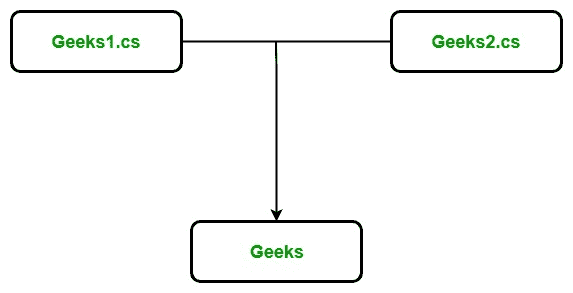

# c#中的分部类

> 原文:[https://www.geeksforgeeks.org/partial-classes-in-c-sharp/](https://www.geeksforgeeks.org/partial-classes-in-c-sharp/)

分部类是 C#的一个特殊特性。它提供了一种特殊的能力，可以将单个类的功能实现到多个文件中，并且在编译应用程序时，所有这些文件都被合并到单个类文件中。分部类是通过使用 ***【分部】*** 关键字创建的。这个关键字对于将方法、接口或结构的功能分割成多个文件也很有用。

**语法:**

```cs
public partial Clas_name  
{
        // code
}

```

**重要点:**

*   当您想要将类、方法、接口或结构的功能性剁成多个文件时，那么您应该使用 *partial* 关键字，并且所有文件都必须在编译时可用，以创建最终文件。
*   *部分*修饰符只能立即出现在像结构、类和接口这样的关键字之前。
*   分部类定义的每个部分都应该在同一个程序集和[命名空间](https://www.geeksforgeeks.org/c-namespaces/)中，但是可以使用不同的源文件名。
*   分部类定义的每个部分都应该具有与私有、受保护等相同的可访问性。
*   如果分部类的任何部分被声明为抽象类、密封类或基类，则整个类被声明为同一类型。
*   还允许用户使用嵌套的部分类型。
*   不同的部分可能有不同的基本类型，但是最终的类型必须继承所有的基本类型。

**示例:**这里，我们取了一个名为 *Geeks* 的类，将 Geeks 类的定义拆分为两个不同的文件，分别为 Geeks1.cs 和 Geeks2.cs，如下所示:



在*极客 1.cs* 和*极客 2.cs* 中，使用 partial 关键字创建了一个分部类，每个文件包含极客类的不同功能，如下所示。

***【geeks 1 . cs】***

## C#

```cs
public partial class Geeks {
    private string Author_name;
    private int Total_articles;

    public Geeks(string a, int t)
    {
        this.Authour_name = a;
        this.Total_articles = t;
    }
}
```

***【geeks 2 . cs】***

## C#

```cs
public partial class Geeks {
    public void Display()
    {
        Console.WriteLine("Author's name is : " + Author_name);
        Console.WriteLine("Total number articles is : " + Total_articles);
    }
}
```

当我们执行上述代码时，编译器将 Geeks1.cs 和 Geeks2.cs 合并成一个文件，即 Geeks，如下所示。
***极客*** 这个职业可能包含主法。为简单起见，这里不包括 Main()方法。

## C#

```cs
public class Geeks {
    private string Author_name;
    private int Total_articles;

    public Geeks(string a, int t)
    {
        this.Authour_name = a;
        this.Total_articles = t;
    }

    public void Display()
    {
        Console.WriteLine("Author's name is : " + Author_name);
        Console.WriteLine("Total number articles is : " + Total_articles);
    }
}
```

**优势:**

*   在分部类的帮助下，多个开发人员可以在同一个类的不同文件中同时工作。
*   借助于分部类概念，您可以拆分设计代码的 UI 和业务逻辑代码来阅读和理解代码。
*   当您使用自动生成的代码时，可以将代码添加到类中，而不必像在 Visual studio 中那样重新创建源文件。
*   您还可以通过将大型类压缩成小型类来有效地维护您的应用程序。