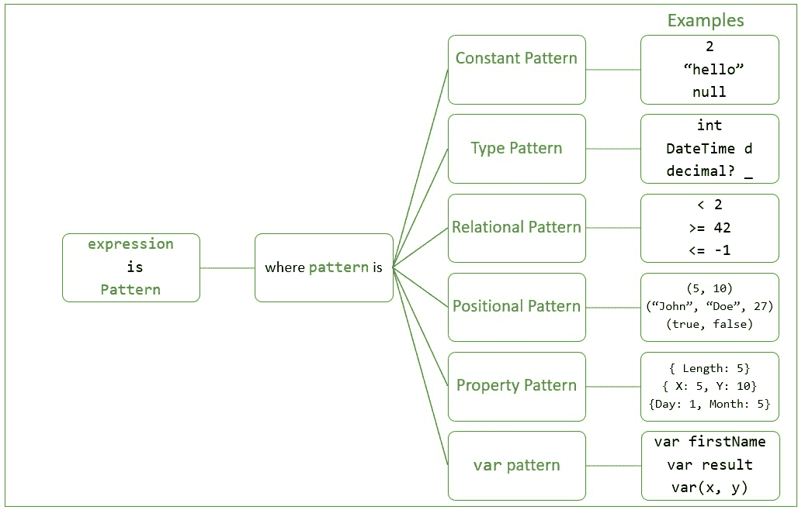

# c# 中的模式匹配

> 原文:[https://www.geeksforgeeks.org/pattern-matching-in-c-sharp/](https://www.geeksforgeeks.org/pattern-matching-in-c-sharp/)

模式匹配是一种允许测试表达式是否出现给定模式的特性。这是一个在[函数语言](https://www.geeksforgeeks.org/functional-programming-paradigm/)中更为普遍的特性。模式匹配本质上是布尔的，这意味着有两种可能的结果:要么表达式匹配模式，要么不匹配。这个特性最初是在 C# 7.0 中引入的，然后在该语言的后续版本中经历了一系列改进。

模式匹配允许如下操作:

*   类型检查(类型模式)
*   空值检查(常量模式)
*   比较(关系模式)
*   检查和比较属性值(属性模式)
*   对象解构(位置模式)，
*   使用变量创建的表达式重用( *var* 模式)

用最简单明了的语法来表达。此外，这些模式可以嵌套，并且可以包含几个子模式。也可以使用模式组合器来组合模式( ***和*** 、 ***或*** 和 ***而不是*** )。C# 允许通过三种结构进行模式匹配:

**1。** ***是*** **的符**

在 C# 7.0 之前，[是运算符](https://www.geeksforgeeks.org/c-sharp-is-operator-keyword/)的唯一目的是检查对象是否与特定类型兼容。从 C# 7.0 开始，*就是*运算符被扩展来测试表达式是否与模式匹配。

**语法:**

> 表达就是模式

**2。** ***开关*** **语句**

就像 [switch 语句](https://www.geeksforgeeks.org/switch-statement-in-c-sharp/)可以通过测试一组值的表达式来执行一个代码分支(*案例*)一样，它也可以通过测试一组模式的表达式来执行一个代码分支。

**语法:**

> 开关(表达式)
> 
> {
> 
> 案例模式 1:
> 
> //要执行的代码
> 
> //如果表达式匹配模式 1
> 
> 打破；
> 
> 案例模式 2:
> 
> //要执行的代码
> 
> //如果表达式匹配模式 2
> 
> 打破；
> 
> …
> 
> 案例模式:
> 
> //要执行的代码
> 
> //如果表达式匹配 patternN
> 
> 打破；
> 
> 默认值:
> 
> //如果表达式
> 
> //不符合上述任何模式
> 
> }

**3。** ***开关*** **表情**

也可以使用[开关表达式](https://www.geeksforgeeks.org/switch-expression-in-c-sharp-8-0/)测试一组模式，根据模式是否匹配来选择一个值。

**语法:**

> 表达式开关
> 
> {
> 
> 模式 1 = >值 1，
> 
> 模式 2 = >值 2，
> 
> …
> 
> 模式= >值，
> 
> _ = >默认值
> 
> }

### C# 支持的模式

从 C# 9 开始，该语言支持以下模式。

*   类型模式
*   关系模式
*   属性模式
*   位置模式
*   *变化*模式
*   恒定模式



C# 还支持使用以下具有模式匹配的构造:

*   变量声明
*   模式组合符(*****或*** 和 ***而非*** )**
*   **丢弃变量( <u>_</u> )**
*   **嵌套模式或子模式**

### **类型模式**

**类型模式可用于检查表达式的运行时类型是否与指定类型匹配，或者是否与该类型兼容。如果表达式(即正在匹配的值)与模式中指定的类型兼容，则匹配成功。类型模式还可以选择性地包含变量声明。如果正在测试的值与该类型匹配，那么它将被强制转换为该类型，然后被分配给该变量。模式中的变量声明将进一步描述。**

****语法:****

> **//用于 C# 9 及以上版本**
> 
> **类型名称**
> 
> **//用于 C# 7**
> 
> **类型名称变数**
> 
> **类型名称 _**

****示例:****

## **C#**

```cs
// C# program to illustrate the concept of Type Pattern
using System;

public class GFG{

static void PrintUppercaseIfString(object arg)
{
    // If arg is a string:
    // convert it to a string
    // and assign it to variable message
    if (arg is string message)
    {
        Console.WriteLine({content}quot;{message.ToUpper()}");
    }
    else
    {
        Console.WriteLine({content}quot;{arg} is not a string");
    }
}

// Driver code
static public void Main()
{
    string str = "Geeks For Geeks";
    int number = 42;
    object o1 = str;
    object o2 = number;

    PrintUppercaseIfString(o1);
    PrintUppercaseIfString(o2);
}
}
```

****Output****

```cs
GEEKS FOR GEEKS
42 is not a string
```