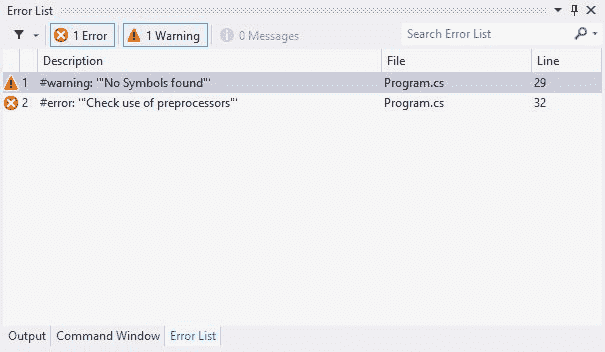
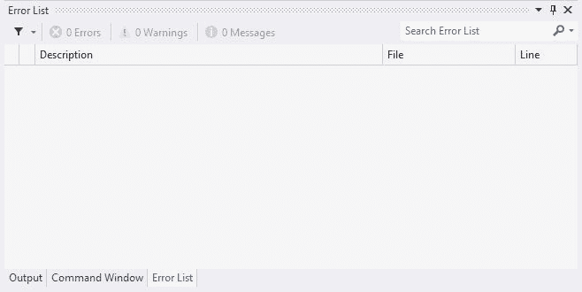

# c# 中的预处理器指令

> 原文:[https://www . geesforgeks . org/preprocessor-directions-in-c-sharp/](https://www.geeksforgeeks.org/preprocessor-directives-in-c-sharp/)

C# 中的预处理器指令告诉编译器在程序的实际编译开始之前处理给定的信息。它以一个 hashtag 符号(#)开始，由于这些预处理程序不是语句，所以末尾没有添加分号。C# 编译器没有单独的预处理器，但处理指令时就像有预处理器一样。除了预处理器指令，一行中不能有任何其他内容。

**c# 中使用的预处理程序如下:**

| 预处理程序 | 描述 |
| --- | --- |
| # 定义 | 定义符号的步骤 |
| # undef | 删除符号的任何定义 |
| # 如果 | 检查符号的计算结果是否为真 |
| # endif | 结束以# if 开头的条件指令 |
| # 否则 | 如果# if 的符号值计算为 false，则执行# else 指令语句 |
| 艾列弗 | 创建复合条件指令，如果符号值为真，则执行该指令 |
| # 错误 | 创建用户定义的错误 |
| # 警告 | 创建用户定义的警告 |
| # 行 | 修改编译器的默认行号 |
| # 地区 | 指定了可以展开或折叠的代码块 |
| # endregion | 指定区域的结尾 |
| # pragma | 为编译文件提供编译器信息 |
| # pragma 警告 | 用于启用或禁用警告 |
| # pragma 校验和 | 为源文件创建校验和 |

**示例 1:使用# define、# if、# else 和# endif** 让我们用几个例子来理解这个概念。在下面给出的代码中，我们使用*# 定义*来定义一个名为*形状*的符号。所以这意味着“*形状*评估为真。在主菜单中，我们使用 *# if* 检查*形状*是否存在。因为它确实存在，并且编译器事先知道它，所以部分 *# else* 将永远不会被执行，并且被编译器视为注释。 *# endif* 用于指示 if 终止。

```cs
// C# Program to show the use of
// preprocessor directives

// Defining a symbol shape
# define shape

using System;
using System.Collections.Generic;
using System.Linq;
using System.Text;
using System.Threading.Tasks;
using System.IO;

namespace Preprocessor {

class Program {

    static void Main(string[] args)
    {
        // Checking if symbol shape exists or not
        # if (shape)
           Console.WriteLine("Shape Exists");
        # else
           Console.WriteLine("Shape does not Exist");

       // Ending the if directive
       # endif
    }
}
}
```

**输出:**

```cs
Shape Exists
```

**例 2:使用# warning 和# define** 再考虑一个例子。在下面给出的代码中，我们特意删除了符号*形状*和*形状 _* 的定义。因为编译器找不到这些，所以它执行 *# else* 指令。在这里，我们生成用户定义的警告和错误。

```cs
// C# program to show the Removal of
// definition of shape and shape_

# undef shape_

using System;
using System.Collections.Generic;
using System.Linq;
using System.Text;
using System.Threading.Tasks;
using System.IO;

namespace preprocessor2
{
    class Program
    {
        static void Main( string[] args )
        {
            // Checking if shape exists
            # if (shape)
                Console.WriteLine("Shape Exists");

            // Or if shape_ exists
            # elif (shape_)
                Console.WriteLine("Shape_ Exists" );

            # else

            // using # warning to display message that
            // none of the symbols were found
            # warning "No Symbols found"

            // Generating user defined error
            # error "Check use of preprocessors"

            // Ending if
            # endif

        }
    }
}
```

此代码将不会编译，因为代码中存在错误。警告和错误本质上做同样的工作，但是错误将停止代码的编译过程。visual studio 将给您以下结果:



**示例 3:使用# region 和# endregion** *# region* 将一组指令定义为一个代码块，编译器会一次性编译该代码块。 *# endregion* 标志着区块的结束。下面的程序描述了同样的情况。

```cs
using System;
using System.Collections.Generic;
using System.Linq;
using System.Text;
using System.Threading.Tasks;
using System.IO;

namespace preprocessor3
{
    class Program
    {
        static void Main( string[] args )
        {
            char ch = 'y';

            // Using # region to define a block of code
            # region
            if (ch == 'y' || ch == 'Y')
                Console.WriteLine( "Value of ch is 'y'" );
            else
                Console.WriteLine( "Value of ch is unknown" );

            // Ends the region
            # endregion
        }
    }
}
```

**Output:**

```cs
Value of ch is 'y'

```

**示例 4:使用# pragma 警告和# pragma 校验和**在下面的代码中，我们使用 *# pragma* 警告禁用来禁用所有警告。在 main 内部，我们生成一个用户定义的警告来检查它是否已经被禁用。并且 *# pragma* 校验和用于帮助文件的调试。

```cs
// C# program to Disables all warnings

# pragma warning disable

using System;
using System.Collections.Generic;
using System.Linq;
using System.Text;
using System.Threading.Tasks;

namespace Preprocessor4 {

class GFG {

    static void Main(string[] args)
    {
        // Creating a warning
        # warning "This is disabled"

        // Checksum is used for debugging 
        // the file in consideration
        # pragma checksum "Program.cs"
    }
}
}
```

上述代码的错误列表:

