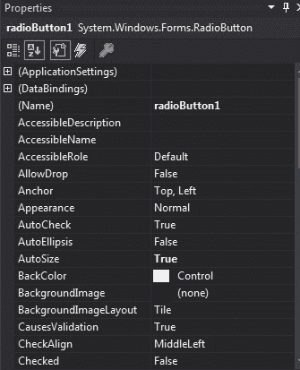
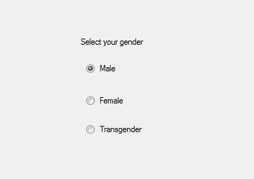
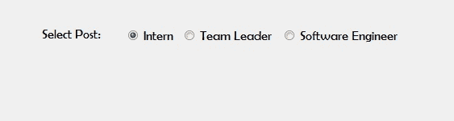

# c# 中的单选按钮

> 原文:[https://www.geeksforgeeks.org/radiobutton-in-c-sharp/](https://www.geeksforgeeks.org/radiobutton-in-c-sharp/)

在 Windows 窗体中，单选按钮控件用于从选项组中选择一个选项。例如，从给定的列表中选择您的性别，因此您将在三个选项中仅选择一个选项，如男性或女性或变性者。在 C# 中，RadioButton 是一个类，在*系统下定义。Windows.Forms* 命名空间。在单选按钮中，您可以显示文本、图像或两者，当您选择一组中的一个单选按钮时，其他单选按钮会自动清除。您可以通过两种不同的方式创建单选按钮:
**1。设计时:**这是创建单选按钮控件最简单的方法，如以下步骤所示:

*   **第一步:**创建如下图所示的窗口表单:
    T3】Visual Studio->File->New->Project->windows formapp


*   **步骤 2:** 从工具箱中拖动 RadioButton 控件，并将其放到 windows 窗体上。您可以根据需要在 windows 窗体上的任何位置放置一个 RadioButton 控件。


*   **第三步:**拖放后，您将转到 RadioButton 控件的属性，根据您的要求修改 RadioButton 控件。



*   **输出:**



**2。运行时:**比上面的方法稍微复杂一点。在这个方法中，您可以在 RadioButton 类的帮助下以编程方式创建一个 RadioButton。以下步骤显示了如何动态创建单选按钮:

*   **步骤 1:** 使用 RadioButton 类提供的 radio button()构造函数创建单选按钮。

```cs
// Creating radio button
RadioButton r1 = new RadioButton();
```

*   **步骤 2:** 创建 RadioButton 后，设置 RadioButton 类提供的 RadioButton 的属性。

```cs
// Set the AutoSize property 
r1.AutoSize = true;

// Add text in RadioButton
r1.Text = "Intern";

// Set the location of the RadioButton
r1.Location = new Point(286, 40);

// Set Font property 
r1.Font = new Font("Berlin Sans FB", 12);
```

*   **第 3 步:**最后使用 add()方法将这个 RadioButton 控件添加到表单中。

```cs
// Add this radio button to the form
this.Controls.Add(r1);
```

*   **示例:**

## c sharp . c sharp . c sharp . c sharp

```cs
using System;
using System.Collections.Generic;
using System.ComponentModel;
using System.Data;
using System.Drawing;
using System.Linq;
using System.Text;
using System.Threading.Tasks;
using System.Windows.Forms;

namespace WindowsFormsApp24 {

public partial class Form1 : Form {

    public Form1()
    {
        InitializeComponent();
    }

    private void RadioButton2_CheckedChanged(object sender,
                                               EventArgs e)
    {
    }

    private void Form1_Load(object sender, EventArgs e)
    {
        // Creating and setting label
        Label l = new Label();
        l.AutoSize = true;
        l.Location = new Point(176, 40);
        l.Text = "Select Post:";
        l.Font = new Font("Berlin Sans FB", 12);

        // Adding this label to the form
        this.Controls.Add(l);

        // Creating and setting the
        // properties of the RadioButton
        RadioButton r1 = new RadioButton();
        r1.AutoSize = true;
        r1.Text = "Intern";
        r1.Location = new Point(286, 40);
        r1.Font = new Font("Berlin Sans FB", 12);

        // Adding this label to the form
        this.Controls.Add(r1);

        // Creating and setting the
        // properties of the RadioButton
        RadioButton r2 = new RadioButton();
        r2.AutoSize = true;
        r2.Text = "Team Leader";
        r2.Location = new Point(356, 40);
        r2.Font = new Font("Berlin Sans FB", 12);
        // Adding this label to the form
        this.Controls.Add(r2);

        // Creating and setting the
        // properties of the RadioButton
        RadioButton r3 = new RadioButton();
        r3.AutoSize = true;
        r3.Text = "Software Engineer";
        r3.Location = new Point(480, 40);
        r3.Font = new Font("Berlin Sans FB", 12);

        // Adding this label to the form
        this.Controls.Add(r3);
    }
}
}
```

*   **输出:**



#### 重要属性

。radiobutton-table {边框-折叠:折叠；宽度:100%；} .radiobutton-table td {边框:1px 实心# 5fb962 文本对齐:向左！重要；填充:8px} .radiobutton-table th {边框:1px 实心# 5fb962 填充:8px} .radiobutton-table tr>th{背景色:# c6ebd9 垂直对齐:中间；} .radio button-table tr:n-child(奇数){背景色:# ffffff}

<figure class="table">

| 财产 | 描述 |
| [**外观**](https://www.geeksforgeeks.org/how-to-set-the-appearance-of-radiobutton-in-c-sharp/) | 此属性用于设置决定单选按钮外观的值。 |
| **汽车尾翼** | 此属性用于设置一个值，该值指示单击单选按钮控件时，“选中”值和单选按钮控件的外观是否自动更改。 |
| **自动化** | 此属性用于设置一个值，该值指示单选按钮控件是否根据其内容调整大小。 |
| [**后场**](https://www.geeksforgeeks.org/how-to-set-the-background-color-of-the-radiobutton-in-c-sharp/) | 此属性用于设置单选按钮控件的背景色。 |
| **检查校准** | 此属性用于设置单选按钮的复选框部分的位置。 |
| [**勾选**](https://www.geeksforgeeks.org/how-to-set-the-radiobutton-to-checked-state-in-c-sharp/) | 此属性用于设置一个值，该值指示是否选中单选按钮控件。 |
| [**字体**](https://www.geeksforgeeks.org/how-to-set-the-font-of-the-radiobutton-in-c-sharp/) | 此属性用于设置单选按钮控件显示的文本的字体。 |
| [**前景**](https://www.geeksforgeeks.org/how-to-set-the-foreground-color-of-the-radiobutton-in-c-sharp/) | 此属性用于设置单选按钮控件的前景色。 |
| [**地点**](https://www.geeksforgeeks.org/how-to-set-the-location-of-the-radiobutton-in-c-sharp/) | 此属性用于设置 RadioButton 控件左上角相对于其窗体左上角的坐标。 |
| [**名称**](https://www.geeksforgeeks.org/how-to-set-the-name-of-the-radiobutton-in-c-sharp/) | 此属性用于设置单选按钮控件的名称。 |
| [](https://www.geeksforgeeks.org/how-to-set-the-padding-of-the-radiobutton-in-c-sharp/) | 此属性用于设置单选按钮控件中的填充。 |
| **文字** | 此属性用于设置与此单选按钮控件关联的文本。 |
| [文字体](https://www.geeksforgeeks.org/how-to-set-the-alignment-of-the-text-in-radiobutton-in-c-sharp/) | 此属性用于设置单选按钮控件上文本的对齐方式。 |
| [**可见**](https://www.geeksforgeeks.org/how-to-set-the-visibility-of-the-radiobutton-in-c-sharp/) | 此属性用于设置一个值，该值指示是否显示单选按钮控件及其所有子控件。 |

</figure>

#### 重要事件

<figure class="table">

| 事件 | 描述 |
| **点击** | 单击单选按钮控件时会发生此事件。 |
| **检查已更改的** | 当“已检查”属性的值更改时，会发生此事件。 |
| **外观已更改** | 当“外观”属性值更改时，会发生此事件。 |
| **双击** | 当用户双击单选按钮控件时，会发生此事件。 |
| **离开** | 当输入焦点离开单选按钮控件时，会发生此事件。 |
| **慕容克** | 当鼠标单击单选按钮控件时，会发生此事件。 |
| **鼠标点击** | 当用户用鼠标双击单选按钮控件时，会发生此事件。 |
| **鼠标悬停** | 当鼠标指针停留在单选按钮控件上时，会发生此事件。 |
| moueleve | 当鼠标指针离开单选按钮控件时，会发生此事件。 |

</figure>