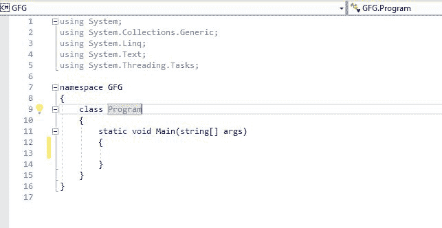

# 在 C#中设置环境

> 原文:[https://www.geeksforgeeks.org/setting-environment-c-sharp/](https://www.geeksforgeeks.org/setting-environment-c-sharp/)

**先决条件**:**[c#入门](https://www.geeksforgeeks.org/introduction-to-c/)**
C#是一种通用、现代、面向对象的编程语言，发音为**“C 锐”**。它是由微软开发的，由安德斯·海尔斯伯格和他的团队领导。Net 倡议，并获得了欧洲计算机制造商协会(ECMA)和国际标准组织(ISO)的批准。C#是公共语言基础设施的语言之一，C#的当前版本是 7.2 版。C#在语法上与 Java 非常相似，对于具有 C、C++或 Java 知识的用户来说很容易。

**c#环境设置过程中涉及的基本组件**

1.  **.Net Framework**
    The .NET Framework is a platform for building, deploying, and running Web Services and applications. To run C# applications or any program, it requires installing a .NET Framework component on the system. .NET also supports a lot of programming languages like Visual Basic, Visual C++, etc. And C# is one of the common languages which is included in the .NET Framework. It is consist of two basic components:
    *   **公共语言运行时(CLR):** 该。NET Framework 包含一个运行代码的运行时环境，称为 CLR。它提供服务来简化开发过程。
    *   **框架类库(FCL):** 它是一个提供对系统功能的访问的类、值类型和接口的库。

    在视窗操作系统中。默认情况下安装. NET Framework。去了解更多。NET 框架版本，点击[。NET 框架版本。微软文档的](https://docs.microsoft.com/en-us/dotnet/framework/migration-guide/versions-and-dependencies)。

2.  **Visual Studio IDE**
    微软提供了一款名为 Visual Studio 的 IDE(集成开发环境)工具，使用 C#、VB(Visual Basic)等不同编程语言开发应用。为了商业目的安装和使用 Visual Studio，它必须从微软购买许可证。出于学习(非商业)目的，微软提供了免费的 Visual Studio 社区版。

**为 Windows 设置 C#环境的步骤**

**第一步:**下载 **[**Visual Studio 社区版**](https://www.visualstudio.com/downloads/)**

**第二步:**运行**。exe** 文件并按照说明在系统上安装 Visual Studio Community Version。

**第三步:**选择**。网络桌面开发**从选项中选择，点击右下角安装，如下图:

**第四步:**打开后会提示首次登录。登录步骤是可选的，因此可以跳过。

**第五步:**对话框只第一次出现，要求选择开发设置和颜色主题。选择所需选项后，单击如下所示的启动 Visual Studio 选项:

 。

**第 6 步:**使用 C#创建新的控制台应用程序，**转到文件–>新建–>项目**如下所示

**第七步:**选择 Console App，写下项目名称，选择保存项目文件的位置路径，然后点击确定，如下图。

**第 8 步:**点击确定后，一个预定义的模板就会出现，并开始编写 C#代码。

