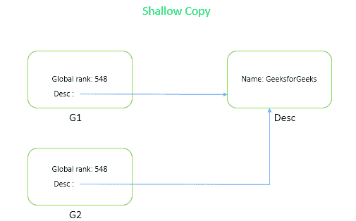
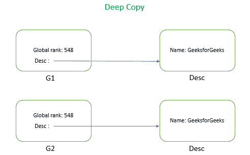

# c#中的浅拷贝和深拷贝

> 原文:[https://www . geeksforgeeks . org/c-sharp 中的浅拷贝和深拷贝/](https://www.geeksforgeeks.org/shallow-copy-and-deep-copy-in-c-sharp/)

一般来说，当我们试图将一个对象复制到另一个对象时，这两个对象将共享相同的内存地址。通常，我们使用赋值运算符，=，来复制引用，而不是对象，除非有*值类型*字段。这个操作符总是复制引用，而不是实际的对象。*举例:*假设 *G1* 指内存地址 *5000* 那么 *G2* 也会指 5000。因此，如果改变存储在地址 *5000* 的数据值，那么 *G1* 和 *G2* 将显示相同的数据。

```
Geeks G1 = new Geeks();

// Copy the instance using 
// '=' operator
Geeks G2 = G1;

```

**浅复制:**创建新对象，然后将当前对象的*值类型*字段复制到新对象。但当数据为*引用类型*时，则仅复制引用，而不复制被引用对象本身。因此，原始对象和克隆对象是指同一个对象。当您看到浅层副本的代码和图表时，概念会更加清晰。



**注:**在上图中`Global Rank`是*值类型*字段，因此它创建该字段的副本并将其存储在不同的位置，但名称`(Desc)`是*引用类型*字段，因此它指向旧的或主内存位置。

**示例:**在这里，如果您要更改*值类型*，那么它将在 c2 和 c1 上工作，不受影响，但是在*参考类型*中，任何更改都将影响 c1 和 c2。

```
// C# program to illustrate the 
// concept of Shallow Copy
using System;

class Example {

// Main Method
static void Main(string[] args)
{

    Company c1 = new Company(548, "GeeksforGeeks",
                                  "Sandeep Jain");

    // Performing Shallow copy                      
    Company c2 = (Company)c1.Shallowcopy(); 

    Console.WriteLine("Before Changing: ");

    // Before changing the value of
    // c2 GBRank and CompanyName
    Console.WriteLine(c1.GBRank);
    Console.WriteLine(c2.GBRank);
    Console.WriteLine(c2.desc.CompanyName);
    Console.WriteLine(c1.desc.CompanyName);

    // changing the value of c2 GBRank
    // and CompanyName
    c2.GBRank = 59;
    c2.desc.CompanyName = "GFG";

    Console.WriteLine("\nAfter Changing: ");

    // After changing the value of 
    // c2 GBRank and CompanyName
    Console.WriteLine(c1.GBRank);
    Console.WriteLine(c2.GBRank);
    Console.WriteLine(c2.desc.CompanyName);
    Console.WriteLine(c1.desc.CompanyName);
}
}

class Company 
{

    public int GBRank;
    public CompanyDescription desc;

    public Company(int gbRank, string c,
                               string o)
    {
        this.GBRank = gbRank;
        desc = new CompanyDescription(c, o);
    }

    // method for cloning object
    public object Shallowcopy()
    {
        return this.MemberwiseClone();
    }

    // method for cloning object
    public Company DeepCopy()
    {
        Company deepcopyCompany = new Company(this.GBRank,
                            desc.CompanyName, desc.Owner);
        return deepcopyCompany;
    }
}

class CompanyDescription 
{

    public string CompanyName;
    public string Owner;
    public CompanyDescription(string c, string o)
    {
        this.CompanyName = c;
        this.Owner = o;
    }
}
```

**Output:**

```
Before Changing: 
548
548
GeeksforGeeks
GeeksforGeeks

After Changing: 
548
59
GFG
GFG

```

**深度复制:**是创建一个新对象，然后将当前对象的字段复制到新创建的对象中，以制作内部引用类型的完整副本的过程。如果指定的字段是值类型，则将执行该字段的逐位复制。如果指定的字段是引用类型，则执行引用对象的新副本。



**注意:**在上图中`The Global Rank`是*值类型*字段，因此它会创建该字段的副本并将其存储在不同的位置。名称(`Desc`)是*引用类型*字段，因此在深度拷贝中有一个引用类型字段的克隆，它也将存储在不同的位置。

**例:**这里字段类型不管是*值类型*还是*引用类型*。深度复制会复制整个数据，并将其存储在不同的内存位置，因此如果我们更改 c2，c1 也不会受到影响，反之亦然。

```
// C# program to demonstrate the
// concept of Deep copy
using System;

namespace ShallowVSDeepCopy {

class Program {

    // Main Method
    static void Main(string[] args)
    {
        Company c1 = new Company(548, "GeeksforGeeks",
                                      "Sandeep Jain");
        // Performing Deep copy                             
        Company c2 = (Company)c1.DeepCopy(); 

        Console.WriteLine("Before Changing: ");

        // Before changing the value of 
        // c2 GBRank and CompanyName
        Console.WriteLine(c1.GBRank);
        Console.WriteLine(c2.GBRank);
        Console.WriteLine(c2.desc.CompanyName);
        Console.WriteLine(c1.desc.CompanyName);

        Console.WriteLine("\nAfter Changing: ");

        // changing the value of c2 
        // GBRank and CompanyName
        c2.GBRank = 59;
        c2.desc.CompanyName = "GFG";

        // After changing the value of
        // c2 GBRank and CompanyName
        Console.WriteLine(c1.GBRank);
        Console.WriteLine(c2.GBRank);
        Console.WriteLine(c2.desc.CompanyName);
        Console.WriteLine(c1.desc.CompanyName);
    }
}

class Company {

    public int GBRank;
    public CompanyDescription desc;

    public Company(int gbRank, string c, 
                               string o)
    {
        this.GBRank = gbRank;
        desc = new CompanyDescription(c, o);
    }

    // method for cloning object
    public object Shallowcopy()
    {
        return this.MemberwiseClone();
    }

    // method for cloning object
    public Company DeepCopy()
    {
        Company deepcopyCompany = new Company(this.GBRank,
                           desc.CompanyName, desc.Owner);

        return deepcopyCompany;
    }
}

class CompanyDescription {

    public string CompanyName;
    public string Owner;
    public CompanyDescription(string c, 
                             string o)
    {
        this.CompanyName = c;
        this.Owner = o;
    }
}
}
```

**Output:**

```
Before Changing: 
548
548
GeeksforGeeks
GeeksforGeeks

After Changing: 
548
59
GFG
GeeksforGeeks

```